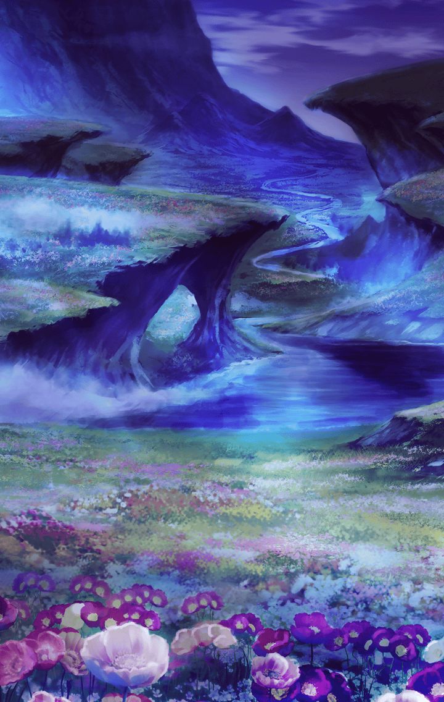

[View script in lisp](../scripts/4100213.txt)

３人が作った花火は
夜空に大きな花を咲かせていた

**【あなる】**
…きれい

**【つるこ】**
ほんと…きれいね

**【めんま】**
あなる、つるこ

**【めんま】**
めんまね…

**【めんま】**
お別れするの、悲しくないよ

**【あなる&つるこ】**
…………

**【めんま】**
それよりね
大好きなあなるとつるこが
泣くほうが悲しいな

**【あなる】**
！！

**【つるこ】**
めんま…

**【めんま】**
大丈夫だよ。めんまがいなくなっても
２人は大丈夫！
だって…

**【めんま】**
"超平和バスターズ"だから！！

**【あなる&つるこ】**
っ！！

**【めんま】**
平和を守るのが
"超平和バスターズ"でしょ？
だから、めんま…戦うの！

**【めんま】**
超平和バスターズはずーーーっと、
ずーーーっと　なかよし！！
…そうでしょ？

**【あなる】**
…めんま

**【めんま】**
だから、まためんまのおねがい…
かなえてね

**【めんま】**
せっかくまた会えたんだもん
めんま、今度は
みんなの役に立ちたいの

**【つるこ】**
めんま…

そっと差し出されるめんまの手
あなるとつるこは、
その手を優しく握った

**【あなる&つるこ】**
…あ

次の瞬間、
３人の体は不思議な光で
包まれた

**【あなる&つるこ】**
きゃっ！

それはまさしく、
彼女達が新たなるスキルに
目覚めた瞬間だった

**【あなる】**
…わかってたよ
ずっと一緒にいられないことくらい

**【つるこ】**
私達も…強くならなきゃね…
めんまみたいに

**【あなる】**
うん、そうだね…

「わ〜っ！きれいな花火だな〜！」
と、マスターの声が

**【めんま】**
あ〜、マスター！
見て、見て！
あれが私達の必殺技だよ！

え？
花火が？
…と尋ねるマスター

**【つるこ】**
いいえ、そうじゃなくて…

**【あなる】**
３人で力を合わせることが…
私達の必殺技なの！！

選択肢:
- ３人の技…なんて名前なの？ → [select_label_01](#select_label_01)へ
- そっか…必殺技、できたんだね → [select_label_02](#select_label_02)へ
- キレイな必殺技だね → [select_label_03](#select_label_03)へ

３人で力を合わせることが…
私達の必殺技なの！！

#### select_label_01:
 → [select_label_end](#select_label_end)へ

**【めんま】**
それはね…

#### select_label_02:
 → [select_label_end](#select_label_end)へ

**【めんま】**
うん！
名前はね…

#### select_label_03:
 → [select_label_end](#select_label_end)へ

**【めんま】**
名前知りたい？
必殺技の名前はね…

#### select_label_end:

**【めんま】**
せーの！

**【めんま&あなる&つるこ】**
『超平和バスターズ』！！

その声は、
空に吸い込まれるように
響いて消えた

**【あなる】**
私達は戦う
残された時間を精一杯

**【つるこ】**
もう二度と後悔しないように
めんまに胸を張っていられるように

**【あなる&つるこ】**
私達は戦う
懸命に生きる
あの日見た花のように