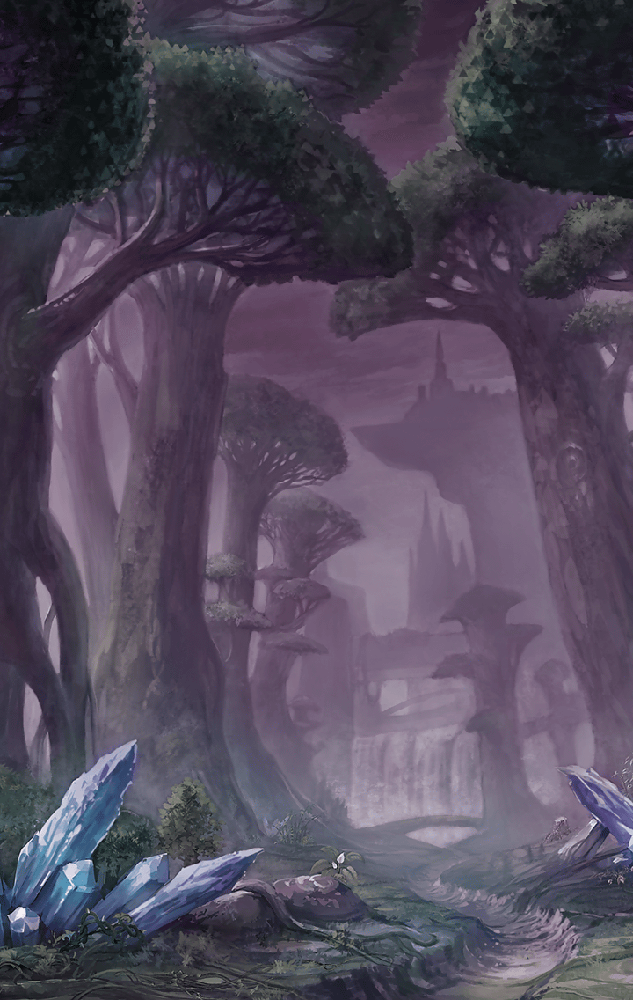

413022011 育成クエスト 未分類 憂国の情景　ロンゴミアント編 憂国の情景　-ロンゴミアント編- 1 - 獣の邂逅 ロンゴミアントEP1 「獣の邂逅」戦闘前

[View script in lisp](../scripts/413022011.txt)

【ロンゴミアント】
囮、ですか？

ケイオスリオン兵隊長の言葉に
ロンゴミアントは首を傾げた

【ケイオスリオン兵】
そうだ
ナディア姫がトレイセーマに
監禁されていることは知ってるな？

【ロンゴミアント】
ええ、承知していますわ

【ケイオスリオン兵】
そのナディア姫を手に入れるべく、
トレイセーマに斬ル姫を
潜入させることが決まった

【ケイオスリオン兵】
手に入れるとは語弊があるか、
「招待」するためにな…はははっ

【ロンゴミアント】
そのための囮ということですね
ですが、よいのですか？

【ロンゴミアント】
囮ということは、
我々がナディア姫を
手に入れられるわけでは…

【ケイオスリオン兵】
ふんっ、
向こうが勝手にこっちに
つれてきてくれるんだ

【ケイオスリオン兵】
ナディア姫が
ケイオスリオンに入ってから
ゆっくり奪えばいい

【ケイオスリオン兵】
そのためなら少しばかり
協力するぐらい問題ない

【ケイオスリオン兵】
口ごたえなどせず、
家畜は家畜らしく命令に
従えばいい

【ロンゴミアント】
…わかりました
では任務に向かいます

【ロンゴミアント】
もうすぐ目的地ですか…

トレイセーマの国境付近の森―
今日は風もなく、
やけに森の中は静かだった

【ロンゴミアント】
私が前に出ますので、
皆さんは後方から援護を

【ケイオスリオン兵】
けっ！
誰がお前の前に出るかよ

【ロンゴミアント】
ええ。ええ
それがいいです

【ロンゴミアント】
この身に宿る殺戮の技法…
それが体を熱くさせる
もっと…もっと血を、と

【ロンゴミアント】
さて…

【トレイセーマ兵】
異常ありません！

【トレイセーマ隊長】
よし
このまま警戒態勢を維持
決して誰も通すな！

【トレイセーマ兵】
はっ！

森から見える国境付近には、
想定どおりトレイセーマの部隊が
警戒にあたっていた

【ロンゴミアント】
ふふっ、ふふふふっ…
弱い者が群れてるだけですから、
余裕ですねぇっ！！

【トレイセーマ隊長】
敵襲―！！
迎撃せよ！
伝令は付近の味方に救援要請を！

【ロンゴミアント】
ふふふふっ…囮の役目
ひとまず果たせそうですねぇ

そんなことを考えながら、
ロンゴミアントを先頭に
ケイオスリオン軍は敵へ突っ込んだ

Next: [413022012](413022012.md)

[Back to index](index.md)
