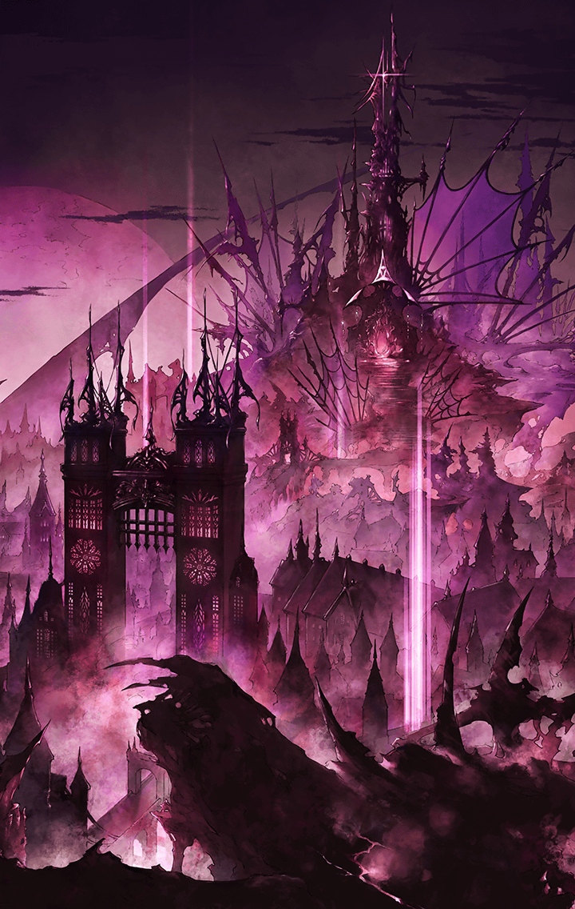

**【グリモワール】**
世界が終わる日が来ても
ワタシは高みの見物するんだから

幻獣国トレイセーマ首都
グライヒハイトにて
謀反

厳正な管理国家であるトレイセーマ…
謀反人はその秩序を守るはずの
帝王直属オーダーキラーズが一人…

ムラマサ・獣刻・ヤマタノオロチ

同じくオーダーキラーズであり
姉でもあるマサムネを退け
ムラマサは逃走
同時に起きた天使国ハルモニア軍の
グライヒハイト侵攻も重なり
国内は混乱

首都に潜伏していたとされる
理想郷への「鍵」がひとつ
カシウスもまた…

当のムラマサと共に
風のように行方を消した

**【グリモワール】**
ざまあないじゃない

自国の惨状を味方兵より聞き
早急な帰還を要請される彼女

高台より
眼下に拡がる悪魔国
ケイオスリオンの王都を見下ろし…

**【グリモワール】**
却下

**【トレイセーマ兵】**
しかし、同じオーダーキラーズの
あなたが帰らず
誰が謀反人を止めると…！？

**【トレイセーマ兵】**
き、貴様もウロボロス様の命で
動いているのだろう…？

**【グリモワール】**
ワタシ
ウロボロスに従う気もないから

**【グリモワール】**
ワタシは
ワタシが正しいと思ったことをするの

グリモワールは
ケイオスリオン王都の周囲で
止むことなく続く戦を見やり、呟く

**【グリモワール】**
…気に入らないの

**【グリモワール】**
死者の怒りをいたずらに増やす
この国が

**【グリモワール】**
さすがは悪魔の国

**【グリモワール】**
………理不尽よ

グリモワールは視線を
地から天へ
曇った空を見上げる

**【グリモワール】**
臥して待ったの
この時を

**【グリモワール】**
極め付けを用意してるんだから

**【グリモワール】**
…邪魔をしたら
誰であろうと容赦はしないわ

**【グリモワール】**
ウロボロスだろうと
自分の国のヒトだろうとね

静かな怒りをたたえた
グリモワールの眼が
味方兵に向けられる

彼女の足元からはジリジリとした
高熱の魔力がたゆたい
纏う炎のスカートがはためく

それにより彼女は
実際の身の丈よりも遥かに巨大に
その姿を浮かび上がらせる

**【トレイセーマ兵】**
…ッ！！

**【グリモワール】**
獣の躾けは
こうしなくちゃあ

**【グリモワール】**
マサムネも
なっさけない

溜息をひとつ吐くと
彼女は炎を収める

**【グリモワール】**
もういーい…？
読書の続きをしてもいいかしら

グリモワールはその場に腰を下ろす

直前の迫力とは打って変わって
小さな体躯でちょこんと座り
読書にいそしむ

**【グリモワール】**
何かヘン…ッ！？

あっけに取られた味方兵達に
改めてメンチを切ると
彼女は再びページを開く

**【グリモワール】**
えっと…？
確か“第三章"から───