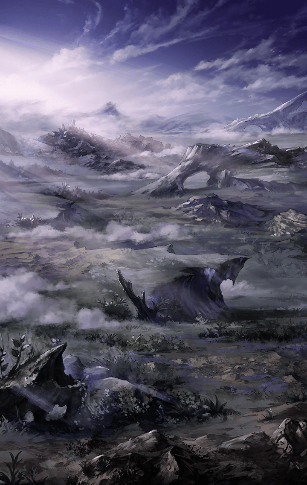

[View script in lisp](../scripts/414021031.txt)

**【フェイルノート】**
また敗けたの？

フェイルノートが
意地の悪い笑みを浮かべる

ケイオスリオン国王選抜総武会
決勝トーナメント当日

フェイルノート陣営は
ありったけの兵員約４０００を率い
決戦会場へ向かっていた

もちろん、昨夜しぶしぶ
その配下に加わったアスカロンもまた
表情を曇らせ、ついてきている

**【フェイルノート】**
あは。当たりね？

**【アスカロン】**
な、なんの話ですか

**【フェイルノート】**
まあ？　昨晩王都内で
あれだけの雄たけびを聞けばね
予想も付くわよ

**【アスカロン】**
…

**【フェイルノート】**
…
「勝てない」って思ってる

**【アスカロン】**
勝てませんでした

**【フェイルノート】**
あなただけじゃあね

**【アスカロン】**
え？

**【フェイルノート】**
的に当てるには不足がある

**【アスカロン】**
私に、不足が

**【フェイルノート】**
あなたに、じゃない
嫉妬に、よ

**【アスカロン】**
？？？

思わず首をかしげるアスカロン

**【実況者】**
ケイオスリオンの新たな王は誰か！？

**【実況者】**
全悪魔人の皆々様
長らくお待たせ致しました！

**【実況者】**
“ケイオスリオン国王選抜総武会”
決勝トーナメント第一回戦！
まもなく開始となります！

**【実況者】**
第一回戦目のカードは
シユウ有する陣営と
大穴フェイルノート率いる陣営！

**【実況者】**
既にフェイルノート陣営は
戦場に到着済み！

**【実況者】**
なお、フェイルノートの元には
先日のサバイバル戦で惜しくも
敗北したアスカロンが属しているとか

**【アスカロン】**
ううっ

**【実況者】**
優勝最有力候補に対する
謎の軍師と負け越し斬ル姫！
目が離せません！

**【アスカロン】**
うううううっ！

アスカロンはもはや涙目である

しかし、そのアスカロンの涙は
間もなく消える

**【実況者】**
おっとォッ！
シユウ陣営も戦場に着いたようです！

**【実況者】**
さすがは優勝最有力！
お聞きください！　この歓声！

**【実況者】**
フェイルノート陣営を
迎えた時とはケタが違う！
これが勝負前からの勝者か！？

ケタが違うのは
歓声の量だけではなかった

**【フェイルノート】**
………っ

フェイルノートは一瞬
思わず言葉を失う

**【フェイルノート】**
………冗談でしょ…？

遠く荒野の向こう
シユウ陣営の兵が
戦場を埋め尽くしている

**【実況者】**
シユウ陣営、その数
３５０００！

**【実況者】**
対するフェイルノート陣営
４０００！
まさに、まさに───！

**【フェイルノート】**
───ケタ違い

フェイルノートから
いつもの余裕の色が消える

**【実況者】**
敗色！
濃厚ォォ！！

**【実況者】**
みんな！　どちらに勝つか
賭けた賭けたーッ！

**【実況者】**
ケイオスリオンの勝敗予想賭博は
公営ギャンブルです！
安心してお賭けくださいネ！

**【フェイルノート】**
お、おかしい
こんなの、おかしいじゃない…！

**【アスカロン】**
…聞いたことがあります

**【フェイルノート】**
だって、サバイバル戦でも
兵を削り合って
ただでさえ連戦続きなはずなのに…

**【アスカロン】**
カルマキラーズとして
得た話ですが

**【フェイルノート】**
…なに

**【アスカロン】**
ここ数年シユウは
前大会優勝でその力を期待されてか
ある任務を請け負っていました

**【アスカロン】**
シユウ自身は闘いの任を受けるだけ
裏で何が行われているか
恐らく知らされてはいないでしょうが

**【フェイルノート】**
ケイオスリオン国内での
争いの傍らで何を…？

**【アスカロン】**
“イミテーション狩り”

**【アスカロン】**
隣接する天使国ハルモニアを中心に
大国へ流入する難民
“イミテーション”を浚う

**【アスカロン】**
私は、単純に国内の闘争続きで
減り続ける民の数、国力を補填する
その為の進軍だと思っていたのですが

**【フェイルノート】**
そのイミテーション達を
そのままシユウ陣営が戦力として
投入している…？

**【アスカロン】**
恐らく、イミテーション達には
もはや悪魔の血がギアハックされ
“闘争心”を埋め込まれ…

**【フェイルノート】**
国家間の戦争を
国内で私物化しているっていうの…？
しかも特定の斬ル姫に肩入れをして？

**【フェイルノート】**
ルシファーの、思惑なの…？

**【アスカロン】**
力ある者、特に暴虐を武器とする者を
自らの元まで招く為か…
真意は、わかりません…

静まりかえるフェイルノート陣営

闘争と暴虐が支配する国にあっても
死への恐怖はあり
敗北の惨めさも知っている

勝利する為に争うのだ
勝ち目のない争いなど…

誰もが
誰かが口を開くのを待っていた

「逃げましょう」
「白旗をあげましょう」
「また次回の大会に賭けましょう」

口火を切ったのは

**【フェイルノート】**
………ふふ

小さな統率者

**【フェイルノート】**
挑み甲斐があるじゃない

**【アスカロン】**
え…？

**【フェイルノート】**
“ジャイアント・キリング”
なんでしょ

強気な口調
震える声

**【フェイルノート】**
聞きなさい！

フェイルノートは
引き連れた寡兵に
声を張り上げる

**【フェイルノート】**
私達は
逃げる！

**【アスカロン】**
ンッ！？
エエッ！？

ざわつく兵士達

**【フェイルノート】**
アスカロン
あなたは単独行動

**【アスカロン】**
えっ？

**【フェイルノート】**
あなたを敵陣中央に送り込む
方法は逃げながら伝えるわ

**【フェイルノート】**
敵本陣で、敵将を叩きなさい

**【アスカロン】**
敵将…シユウを…！？

**【フェイルノート】**
…
「勝てない」…？

**【アスカロン】**
…

**【フェイルノート】**
あなたは駒よ、アスカロン

**【アスカロン】**
何度も何度も…！

**【フェイルノート】**
今のあなたはザコ
チェスで言えば
最下級のポーン-先兵-の駒

**【アスカロン】**
ううっ！
言い方ってものがあるでしょう！？

**【フェイルノート】**
でもね、ポーンは敵地に入ってこそ

**【アスカロン】**
ポーンじゃ、勝てません…！

**【フェイルノート】**
チェスじゃあ
取られた駒は
二度と使えない…

**【フェイルノート】**
…というワケでもないって
知ってる？

**【アスカロン】**
なんですか、こんな時に…！

**【フェイルノート】**
敵地の最奥、王の間で

**【フェイルノート】**
ポーンはクイーンに成るのよ？

**【アスカロン】**
…！

**【フェイルノート】**
ポーンがクイーンに成る時にね

**【フェイルノート】**
敵地に辿り着いたポーンの駒は
取られてしまった
クイーンの駒と交換するの

**【アスカロン】**
…！

**【フェイルノート】**
盤面にクイーンが返り咲く

**【フェイルノート】**
その力を
取り戻すの

**【アスカロン】**
…フェイルノート…！

**【フェイルノート】**
さあ？
動いてくれる？

**【フェイルノート】**
クイーン？

**【シユウ】**
うごけないって
どういうことだ？

総武会決勝トーナメント
第一回戦が開始

大方の予想を裏切り
戦況は、膠着していた

**【シユウ側兵】**
試合開始直後にフェイルノート陣営が
こぞって逃げ込んだこの渓谷が
予想以上に狭く進軍が滞っている

**【シユウ側兵】**
フェイルノート兵達と闘っている
我らが先頭部隊も思いのほか
手こずっている…

**【シユウ側兵】**
まあ、この物量差
時間の問題だろうがな

シユウ陣営は渓谷に入り込み
戦線を前後に細く長く伸ばしていた
ここはシユウ陣営最後尾

渓谷の高い岸壁を見上げ
けだるそうに話す兵士

その頬に、当たる氷晶

**【シユウ】**
…あめ？

シユウが頭上を見上げる
確かに降り注ぐものを見る

**【シユウ】**
…！？

雨でもない、雪でもない

強堅な氷の刃が降り注いだ

**【シユウ側兵】**
うっ、ウワアアアアー！？
なんだっ！？　何が降ってきた！？

シユウ陣営本陣は大騒ぎとなる

その中で
静かに立ち上がる影がひとつ

**【シユウ】**
………アスカロン

**【アスカロン】**
───もう、焦りません

**【フェイルノート】**
あなたが焦り、恐れているのは
弱い味方を巻き込むこと
力なき自分が巻き込まれること

**【フェイルノート】**
巨人の呪いが大きくなるほど
あなたは力を振るえなくなった

**【フェイルノート】**
恐れてはだめ
恐れを妬みなさい

**【フェイルノート】**
妬み、そうして取り戻すの
恐れがあなたから奪った力を

**【フェイルノート】**
味方を巻き込みたくないのなら
私があなたを敵地の真ん中に送るわ

**【フェイルノート】**
万一、あなたが巨人になるのなら
私の駒が背中からあなたを射つわ

**【フェイルノート】**
嫉妬に狂ったっていい
呪いに飲まれたっていい

**【フェイルノート】**
背中を任せて
あなたの駒を指す主人に

**【フェイルノート】**
思う存分、嫉妬なさい

**【シユウ】**
いまのアスカロンなら
たのしそうだっ…！

**【アスカロン】**
シユウ・D. plug・ベルゼブブ
あなたは地獄の皇帝
今の私はただの先兵

**【アスカロン】**
忘れていました

**【アスカロン】**
相手が大きければ大きいほど
羨ましければそれだけ…

**【アスカロン】**
嫉妬の氷が私を突き動かすんです！

**【シユウ】**
うがあああああっ！

アスカロンの気迫に呼応するように
シユウは咆哮する

**【アスカロン】**
妬ましいです、あなたの力
羨ましいです、その思い切り

**【アスカロン】**
だからこそ嫉妬に沸く私がある！
だからこそ負けはしない！

**【アスカロン】**
───勝ちます！！

Next: [414021033](414021033.md)

[Back to index](index.md)
