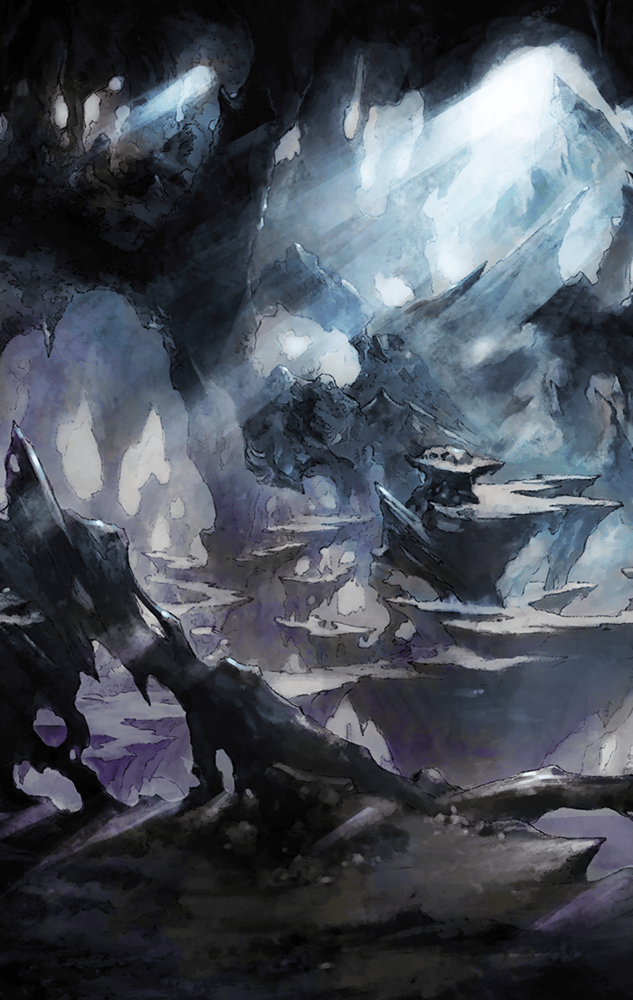

414022033

[View script in lisp](../scripts/414022033.txt)

【フライクーゲル】
揺らいでいるね？

【ロンギヌス】
なぜ、背くのです

【フライクーゲル】
カウントダウンは続いてるのかい？

【ロンギヌス】
カウントアップなら
終わらないのでは？

【フライクーゲル】
…わたしはね
愛する者には豊かでいて欲しい
と思うのさ

【ロンギヌス】
真理ですね

【フライクーゲル】
この子もそうさ

フライクーゲルが目配せすると
飛んでやってくる
翼の生えた一冊の本

【フライクーゲル】
───“生者の名簿”
名をヨハン

【フライクーゲル】
名簿の各ページには
あらゆる生者の名前が載っている

【フライクーゲル】
生者がいなくなれば
つまり、死んでしまえば
名簿のページは減っていく

【フライクーゲル】
イミテーションだろうと
斬ル姫だろうと、死んじゃえば
ヨハンが痩せこける

【フライクーゲル】
愛する者が豊かにいられない
なんて、耐えられるかい？

二人の攻防は隠れ里の外に及び
ティファレトはやっとのことで
追いつく

【ティファレト】
…フライクーゲル

【里の民】
聖女様…！
危険です、お下がりを…！

【ティファレト】
ありがとう…
でも、私は………！

【ティファレト】
…！

ティファレトは
里の民にさえ気づかれぬほど小さく
歯を噛みしめていた

【ロンギヌス】
あなたは、死を管理する天使のはず

【フライクーゲル】
だから命を慈しまなきゃって
思ったんだよ

【フライクーゲル】
彼女に口説かれてね

【ティファレト】
…！

【ロンギヌス】
そそのかされたのでは？

【フライクーゲル】
そうかもね

【ティファレト】
ええっ

【フライクーゲル】
彼女は聖女じゃあ
ないみたいだから

【フライクーゲル】
わたしはどうやら
道を踏み外したようだよ

【ロンギヌス】
戒律に背いたのです

【ロンギヌス】
一，国を愛し、繁栄を誓え
二，友を愛し、友のために戦え

【ロンギヌス】
三，友が背徳に染まる時
その友を再生せよ

【フライクーゲル】
国の繁栄の為に
民を見殺しにするのかい？

【ロンギヌス】
…！

【フライクーゲル】
友を愛せず
殺し合う民達が大勢いた

【フライクーゲル】
友が背徳に染まれば
消去しに来るのが
戒律だって？

【フライクーゲル】
笑っちゃうね

【ロンギヌス】
…

【フライクーゲル】
救う民もなく
愛してくれる人もいなく…

【フライクーゲル】
そうして独り
生きる世界なんて
空しいだけじゃないか

【フライクーゲル】
人は人らしく
人と一緒に
生きるべきなんだってさ

【フライクーゲル】
民の主は王じゃなく
民の主は民として
民主的に生きるんだ

【フライクーゲル】
そうすれば、穏やかに
過ごしていける

【フライクーゲル】
そう、彼女は望んでる

【ティファレト】
…

【フライクーゲル】
このままじゃ
国が…世界が目減りして
終わっていく

【フライクーゲル】
例えば明日
世界が終わるとしたら…

【フライクーゲル】
きみは何を望むんだい？

【ロンギヌス】
例えば明日
世界が終わるとしたら

【ロンギヌス】
最期に何をしようかと
一度は考えたこと
ありますよね

【ロンギヌス】
私はきっと
いつもと変わらぬ
…ありふれた日常を

ゆっくり
ロンギヌスは槍を下すと
ティファレトに向き直る

【ロンギヌス】
古き鎖を断ち切り
新たなる光を目指すと
そういうことなのですね？

【ティファレト】
え、あ、は、はい…！

【フライクーゲル】
話を、聞いてくれるのかい？

【ロンギヌス】
私だって
目は良いのです

【ロンギヌス】
何も
見てこなかったわけでは
ありません

【ロンギヌス】
あなたの想いを聞き
判断を…
審判を下すこととしましょう

【フライクーゲル】
…サンクス、ロンギヌス

【フライクーゲル】
横文字じゃないほうが
よかったかな？

【ロンギヌス】
………ふふ

【ロンギヌス】
あなたは、あなたらしく
応えてくだされば

【フライクーゲル】
…！

【フライクーゲル】
なら、答えは決まったね

【ロンギヌス】
…『イエス』
です

【フライクーゲル】
『イエス』！！

そうして聖なる願いは───

【フォルカス】
───だから、私はあなたに誓う

【フォルカス】
偽りの正義に染まった神の迷いを
正しい道に戻すことを…

【フォルカス】
この審判を下せし槍で
ここに誓う！

その願いは
樹の根のように
張り巡らされ───

【フォルカス】
我らの使命は
“ラグナロク”の実現のため
ハルモニアの栄光のため

【ヴァナルガンド】
ええ、我らは聖なる鎖で繋がれし仲間
いかなる困難もこの結束で乗り越え
必ずや成就いたします

【フォルカス】
鈍い音でしたが、
これが私の革命の鐘の音
あの日、聞いた鐘の音…！

【ヴァナルガンド】
西へ向かいましょう
そこに我らの力になる者が
待っています

───樹の根を通って
願いは幹へと集う

生命の樹の幹
ティファレトが象徴するは
“太陽”

太陽が沈む方角へ
太陽が待つ方角へ
その中心へ

太陽の光が
木々の間から差し込めば…

───誰しもが目を覚ます

【フォルカス】
この場所は…！？
ここは…一体

【ロンギヌス】
さあ
終焉を告げる前に懺悔を終えて…

【ロンギヌス】
“第二章”を始めましょう

【ロンギヌス】
私たちの、新たな目覚めを

【フォルカス】
ロンギヌス…！？
それに………！？

【ヴァナルガンド】
我らの力になる者が
待っていてくれたのです

【フライクーゲル】
オフコース

セイントキラーズの4人が
生命の樹に集い
二度目の目覚めを迎える

【ティファレト】
───ようこそ

【フライクーゲル】
ウェイクアップ・エンジェルス

【フライクーゲル】
アーユーレディ？

Next: [414022041](414022041.md)

[Back to index](index.md)
