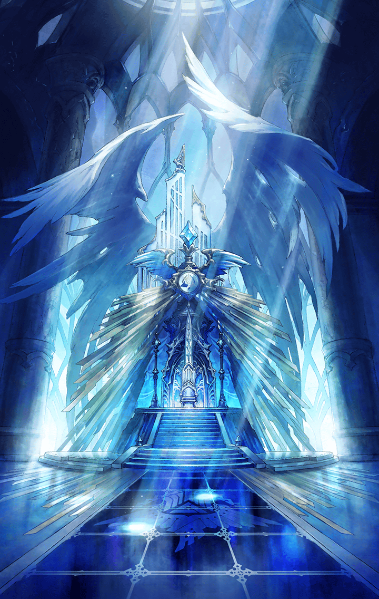

[View script in lisp](../scripts/414023060.txt)

**【ティファレト】**
その日、天使に出会いました

**【ティファレト】**
でも、視えなかったから…

**【ティファレト】**
いっぱい考えました

**【ティファレト】**
どんな姿なんだろう

**【ティファレト】**
やっぱり翼は生えているのか？
ラッパを持って？
もしかしたら服を着てなかったり？

**【ティファレト】**
お話をしてみると…

**【ティファレト】**
考えていたよりも
人らしくて
悩んだり、困ったり、怒ったり

**【ティファレト】**
だから私は笑いました

**【ティファレト】**
愛らしいなと、思って

**【ティファレト】**
…

ティファレトが目を開ける

**【ティファレト】**
………

ティファレトが見回すと…

**【フライクーゲル】**
グッド・モーニング

**【ヴァナルガンド】**
………その姿…

**【ヴァナルガンド】**
なんて、神々しい…

**【ロンギヌス】**
お似合いですね

**【ロンギヌス】**
銃なんて
フライクーゲルみたいに

**【フォルカス】**
…視えますか

セイントキラーズが
見守っていた

**【ティファレト】**
………ああ…
ああああっ………

静かに、涙を流すティファレト

**【フォルカス】**
ど、どうしました…っ？

**【ヴァナルガンド】**
やはり、どこか痛むのですか…！？

**【ティファレト】**
いえ、いいえ…！

**【ティファレト】**
初めて皆さんの姿を見ました…

**【ティファレト】**
嬉しくて…
愛おしくて………
私………っ

**【フライクーゲル】**
ご感想は？

**【ティファレト】**
あ、はい…！

自身の腕で
涙を拭うティファレト

**【ティファレト】**
皆さん………

**【ティファレト】**
…考えていたより
天使らしくないかなって

一瞬の沈黙

**【ロンギヌス】**
…ええっ？

**【ティファレト】**
翼も生えていないし

**【ヴァナルガンド】**
…私はどっちかというと
尻尾ですしねえ

**【ティファレト】**
ラッパも持っていないし

**【ロンギヌス】**
そんな常に持っては…

**【ティファレト】**
裸でもないし…

**【フライクーゲル】**
は、は、は、はだか…！？

**【フォルカス】**
破廉恥です…！主…！！

舞い上がって出た言葉に
ティファレトは口を抑える

**【ティファレト】**
ご、ごめんなさい
でも…

**【ティファレト】**
思った通りでした

**【フォルカス】**
天使らしくないと…？

**【ティファレト】**
…いいえ

**【ティファレト】**
…皆さんらしくて
愛らしいです

ティファレトは
そう言って笑った

**【フライクーゲル】**
ま
それを言うなら
今のきみのほうが

**【ティファレト】**
え？

**【フライクーゲル】**
きみのほうが
よっぽど天使だ

**【ティファレト】**
く、口説いてます？

**【フライクーゲル】**
だとしたら？

**【ティファレト】**
…もう…

**【ティファレト】**
嬉しいです

ティファレトは
真っ直ぐ、フライクーゲルを見据え
不器用にウインクをしてみせる

**【フライクーゲル】**
…ハハッ

フライクーゲルは
面食らいつつも
微笑む

**【フライクーゲル】**
───さぁ、マイ・アダム

**【フライクーゲル】**
何から始める？

**【ティファレト】**
───愛を説きます

**【ティファレト】**
皆さんと共に
目線を合わせ…

**【ティファレト】**
皆が皆らしく、人が人らしく
生きられるように

**【ティファレト】**
私の手の届く、国の端まで

**【フライクーゲル】**
…イエス

**【フライクーゲル】**
これでハッピーエンドかな？

**【フォルカス】**
この勝利は、始まりに過ぎない

**【ロンギヌス】**
ええ。まだ、終わりではない

**【ヴァナルガンド】**
国も、人も、これから…ですね

**【フォルカス】**
まだ、炎は…

フォルカスとティファレトの
目が合う

**【ティファレト】**
？

**【フォルカス】**
………いや

フォルカスは
ティファレトの瞳を覗くと
フッと微笑む

**【フォルカス】**
だが、それはこれからのことだ

**【フォルカス】**
今は、旗を掲げよう

気づけば
ティファレトの周りを
セイントキラーズが囲んでいる

**【ティファレト】**
幸せですよ？私

**【ティファレト】**
今はとても

**【ティファレト】**
こうして私を囲んでくれる
守ってくれる

**【ティファレト】**
今は、見渡せば…

**【ティファレト】**
───天使達の輪が
視えるから

**【ティファレト】**
やがて───

**【ティファレト】**
戦いは終わり…

**【ティファレト】**
遠くで
勝利の凱歌が鳴り響く

**【ティファレト】**
幸せそうな民の声
楽しそうな皆の音が踊る

**【ティファレト】**
それに混じり
聞こえた気がした

**【ティファレト】**
聞こえた気がした

**【ティファレト】**
………ラッパの音が

**【ティファレト】**
…

**【ティファレト】**
…歪んでいく

**【ティファレト】**
視えていた景色が

**【ミカエル】**
神に背く者にこそ
最後の審判が下される

**【ティファレト】**
…！

**【ミカエル】**
いずれ。その時は来る

**【ティファレト】**
だめ…

**【ミカエル】**
いずれ。間も無く
全ては白紙に戻る

**【ティファレト】**
ようやく見つけたんだ

**【ミカエル】**
全ては徒労。全ては…

**【ティファレト】**
聖なる願いを

**【ミカエル】**
全ては………

**【ティファレト】**
愛する人達を

**【ミカエル】**
───救われぬ、終焉

果たして

反旗は翻るか