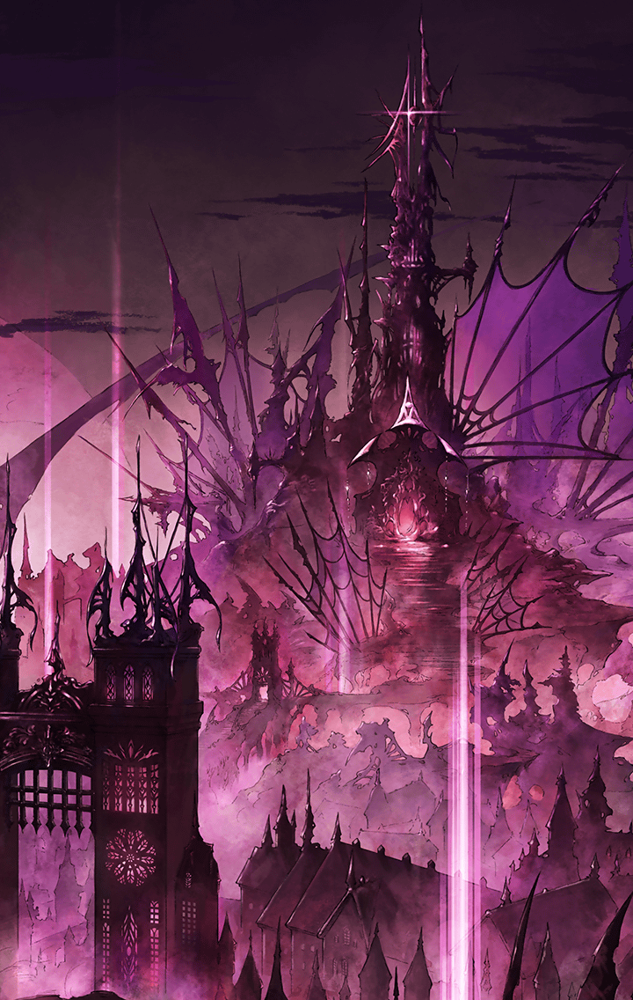

415023023 ロストラグナロク編サイド 未分類 ロストラグナロク サイドストーリー ロストラグナロク -王道往くは悪魔で姫- ストーリークエスト 3 - -王道往くは悪魔で姫- 第2話 -王道往くは悪魔で姫- 第2話 -王道往くは悪魔で姫- 第2話 戦闘後

[View script in lisp](../scripts/415023023.txt)

【パラシュ】
決めきれない…！！

【アスカロン】
はあああっ！！

【パラシュ】
以前のアスカロンなら
簡単に倒せたはずなのに…！
何が…！？

【シユウ】
うがああああああっっ！！

【パラシュ】
シユウ…！！

【シユウ】
アスカロン！！
あそびにきたぞ！！

【アスカロン】
シユウ…！
助かります！
でも遊びじゃないです！

【シユウ】
うがああああっっ！！

【アスカロン】
きゃあーっ！？
ご、ごめんなさい！
揚げ足取ってごめんなさぁーいっ！！

【パラシュ】
は、早すぎる…！

【パラシュ】
シユウは力比べにおいては
無類の強さだけれど…

【パラシュ】
手当たり次第敵を叩いていた時期と
今では比べ物にならないほど
制御された動き…！

【アスカロン】
とどめは私がっ！
シユウ！

【シユウ】
まかせてやる！
アスカロン！

【パラシュ】
ああああぁっ！？

【フェイルノート】
…命中ね

【パラシュ】
うっ、ううっ…！

【フェイルノート】
優秀でしょ？
私の駒は

【パラシュ】
…！

【フェイルノート】
力技で戦況を覆す皇帝と…

【シユウ】
ほめられた？

【フェイルノート】
私の恐れを吹き飛ばす
切り札の先兵

【アスカロン】
もちろんです

【フェイルノート】
あなたも、どう？

【パラシュ】
…なに…！？

【フェイルノート】
叶えたい望みがあるなら…
勝利を得たいなら…

【フェイルノート】
独りで闘うべきじゃない

【フェイルノート】
敗けても、弱くても
こうして強い力になれる

【フェイルノート】
私が、率いてみせる

【パラシュ】
…！

【フェイルノート】
私の駒に、なりなさい？

【パラシュ】
…

【パラシュ】
断る…！

【フェイルノート】
…どうして？

【パラシュ】
功績には褒章を
与えられた力には成果を…！

【パラシュ】
師に報いる最後の機会なんだ…！

【フェイルノート】
師…？

【アスカロン】
パラシュ…

【パラシュ】
敗けるわけにはいかないんだ
弱いままではいられないんだ
期待には、応えなきゃいけないんだ

【パラシュ】
ボクは、このままじゃ
いけないんだ

【パラシュ】
ボクの仕事は終わっていない…
まだ、理想は遠い…！

パラシュは
傷だらけの身体を持ち上げ
大斧を担ぐ

【フェイルノート】
まだ、やる気なの…？

【アスカロン】
もう、もう、やめましょう

【パラシュ】
諦めるものか…！

【パラシュ】
敵が多ければ、諦めるのか…？
敵が強ければ、やめるのか…！？
違うだろう、アスカロン、シユウ…！

【アスカロン】
…！

【シユウ】
…ちがう、ちがうよな…

【パラシュ】
闘いは、その闘争心が尽きるまで…！

【パラシュ】
ボクは、あの人の理想に
そしてそれを超える為に…！

【パラシュ】
…！？

その時、鳴り響く
晴天の霹靂

青空の下
雷鳴を鳴り響かせながら
奔放な女神が舞い降りる

【アフロディーテ】
ああっ

【アフロディーテ】
───愛
してますか？

Next: [415023031](415023031.md)

[Back to index](index.md)
