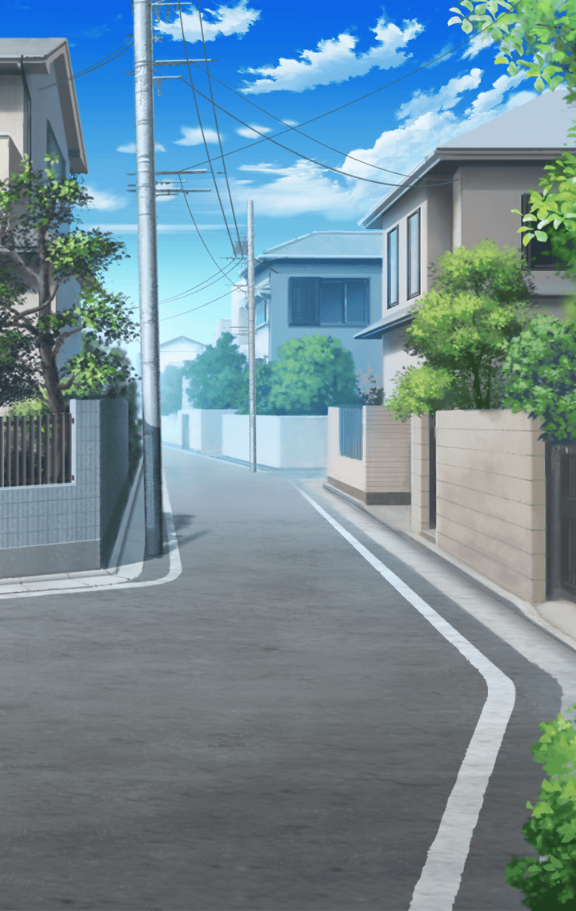

[View script in lisp](../scripts/50086204.txt)

一週間後――
前回のデートのときと
同じベンチにマスターは座っている

**【芭蕉扇】**
はい、あ・な・た…♪
あ～～ん♪

素直に口を開くマスター
あの日から何度か
芭蕉扇がこんなふうになる時がある

こんな時は流れるままに
身を任せるのが一番だと
数日前にマスターは悟った…

**【芭蕉扇】**
これはデートなのか…ですって？
ヤダあなた…照れてるの？

**【芭蕉扇】**
私たち婚約しているんですもの
毎週のデートは当然でしょ♪

来週は風邪をひこう
芭蕉扇に悪いが、
そう決心するマスター

**【芭蕉扇】**
…あれからね
従者たちには遠慮をしないようにと
言い聞かせているの

**【芭蕉扇】**
でも…なかなか
骨のある者は現れないわ
うまくいかないものね

友達探しは難航している模様
しかし芭蕉扇は
落ち込んだ様子は見せなかった

**【芭蕉扇】**
でも、あなたがかけてくれた言葉を
胸に…諦めずに探すわ

**【芭蕉扇】**
ゆっくり探せばいい
もう、俺がいるんだから…
うふふ、あなたったら♪

ゆっくり探せばいいとは
確かに言った
しかし…

もう、俺がいるんだから…
それは言っていない
確実に！

**【芭蕉扇】**
いえ、言ったわ！確かに言った！
私の腰に手を当てて…
ささやくように…

脳内補完されている
もう何を言っても
覆りそうにない…

話を変えよう！！

選択肢:
- 芭蕉扇にとって友達ってどんなもの？ → [select_label_01](#select_label_01)へ
- どうなったら友達だと思う？ → [select_label_02](#select_label_02)へ
- 友達ができたら何したい？ → [select_label_03](#select_label_03)へ

話を変えよう！！

#### select_label_01:
 → [select_label_end](#select_label_end)へ

**【芭蕉扇】**
利用し利用される関係ね！

#### select_label_02:
 → [select_label_end](#select_label_end)へ

**【芭蕉扇】**
私のために命を放り出してくれたら！

#### select_label_03:
 → [select_label_end](#select_label_end)へ

**【芭蕉扇】**
裏切らないように契約書を交わすわ！

#### select_label_end:

普通に解釈したらとんでもないことを
芭蕉扇は言っている
しかし慣れたものだ

マスターには
彼女が何を言いたいのか
わかってしまった

**【芭蕉扇】**
もちろん、これはお互い様よ？
私も友達に対して
同じことをするわ

**【芭蕉扇】**
『扇喜成幸』
マスターが困っていたら
全力で助けてあげるから

それはまさしく、
彼女が新たなるスキルに
目覚めた瞬間だった

互いに助け合う関係
それこそが、芭蕉扇の考える
友達の定義だった

**【芭蕉扇】**
マスターはもう婚約者だけれど…
元・友達として命ずるわ

**【芭蕉扇】**
私の友達作りに
全身全霊で協力すること！
いいわね！

いつも通りの強い口調
でもその笑顔には
協力せざるを得ない輝きがあった

**【芭蕉扇】**
早速だけど！

Next: [50091301](50091301.md)

[Back to index](index.md)
