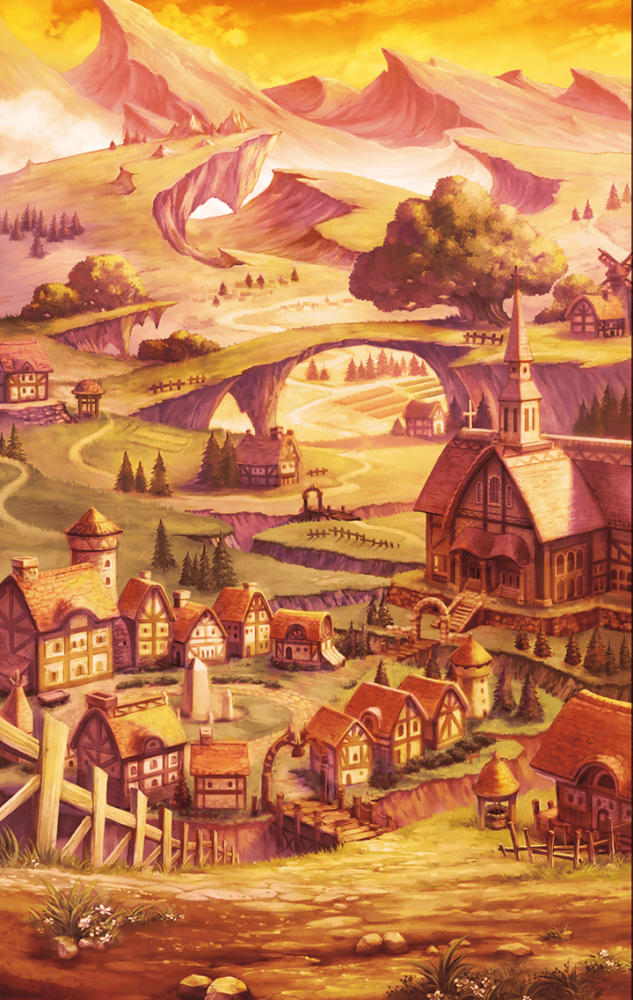

[View script in lisp](../scripts/50341211.txt)

時間がいくらあっても足りない
という言葉は
こういう時の為にあるのだろう

**【メラ】**
なあに言ってんの
時は無限でしょ？

昨日、異世界から現れ
即座にマスターの隊に加わったメラ

**【メラ】**
前に来た時はバタバタしてたからね

メラ曰く
ある事件で一度
ラグナ大陸に訪れたという

それが原因なのか
次はこちらの召喚に引き込まれ
再度この地に現れたのだと

彼女の立場からすれば
とんだ災難なように思えるが…

**【メラ】**
思い立ったら即発進！
こんな新鮮な経験ないじゃん
迷ってるくらいならやってみよー！

メラから見ればこの世界こそ異世界
彼女はこのラグナ大陸の森羅万象に
異常なほど興味を抱く

マスターはその案内役として
引っ張り回されている

**【メラ】**
隊の皆、すごい服だねえ！
構造どうなってんの！？
毎日着るの大変じゃない！？

**【メラ】**
ええっ、あなたと同じ姿のヒトと
沢山戦わなきゃダメなの！？
それヤだねえ！

**【メラ】**
ふへへ、甘いものおいひい～
食べたことないよこんなの～っ！

くるくると表情を変えながら
一喜一憂するメラ

彼女の明るさに癒されつつ
一日中引っ張り回されたマスターは
さすがに疲労困憊である

**【メラ】**
大体見終わったかなあ

鼻息を荒くしながら
辺りを見回し満足げなメラ

彼女はこう言うが
まだ紹介出来ていないキル姫もいる

町もまだ
回り切れていないように思うマスター

**【メラ】**
もう1週間くらいは見て回れたから
ある程度はね～

メラが異世界から召喚されたのは
昨日である

**【メラ】**
あれ？10日くらいだったかな？

昨日である

**【メラ】**
思い出してる時間ももったいないねっ
じゃっ、色々教えてくれてありがとう

そう言うと即
メラの体から光が放たれる

**【メラ】**
時空繰術式

**【メラ】**
…

辺りに光が溢れ
そして、晴れる

ただ僅かな時間が流れただけ
何も変わっていないように思えた

**【メラ】**
…

ただ目の前の一点においては

**【メラ】**
………久しぶり、マスター

先程の彼女とは打って変わり
酷く落胆した様子が見て取れる
そして『久しぶり』とは…？

メラは涙目で言う

**【メラ】**
やっぱり

**【メラ】**
帰れないんだ、あたし