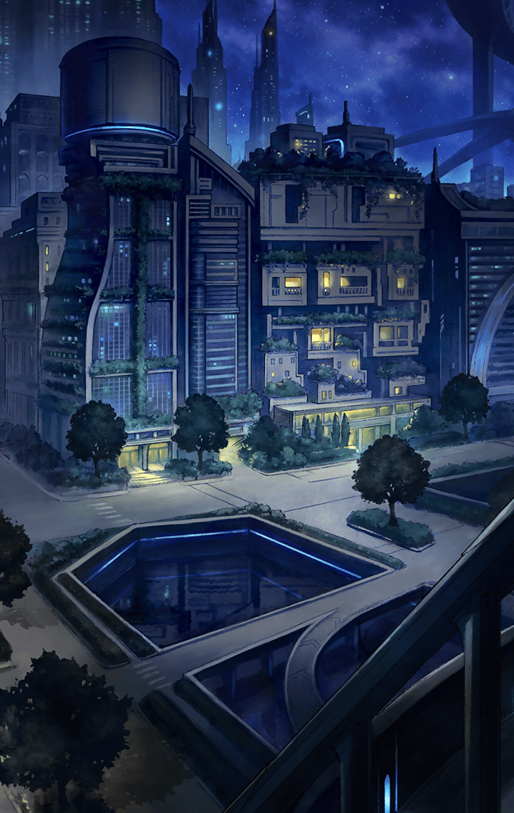

[View script in lisp](../scripts/50342212.txt)

メラにマスターが拘束された…
その情報は、またたく間に
隊全体へ伝わった

すぐさま助けようと
小屋の中に突入するキル姫達
しかし、メラは怯まず対峙する

**【メラ】**
…はぁ、どうしてみんな
そんなに頑張ろうとするの

**【メラ】**
この人は怠惰に堕ちている最中なの
邪魔しないであげてよ

**【メラ】**
面倒なことやめて、
楽しく好き勝手に
過ごそうとしてる人かもしれないよ？

**【メラ】**
それを邪魔する権利が、
あなたたちにあるの？

その言葉に怒りを露わにして
キル姫達はそれぞれの武具を構えて
にじり寄ろうとしたが…

**【メラ】**
もしこれ以上、近づこうとするなら
あなた達の大切なマスターの命は…

ないよ、とメラが口にする寸前
「僕は大丈夫だから！」
と大声をあげるマスター

これは考えあってのことだから
君たちは周りの哨戒をして欲しい…
と、次々に指示を出していく

キル姫達は半信半疑ながらも
マスターの指示を受けて
小屋から出て行った

**【メラ】**
あたしと敵対しても勝てないから
とりあえず退かせた…ってところ？

**【メラ】**
でも、いつまでそうやって
頑張ろうと思えるかな

悠然と語るメラに
それはどうかな
と強がるマスター

**【メラ】**
あなたはそう言うけど、
あの子たちは
そうじゃないかもしれないよ？

**【メラ】**
あなたの知らないところで
心が折れちゃうかもしれない
…でも、あなたにはどうしようもない

**【メラ】**
身動きが取れないんだし、
そのままでいるしかないけどね

そう言うメラの言葉に、
彼女達は負けないよ、
と静かにマスターは否定する

その縛られた手元では
メラに悟られないよう
縄に爪を立て続けていた…

マスターがメラに
拘束されている間も
魔獣の襲撃が数回あった

だが、マスターの指示しておいた
陣形が効果を発揮して
特に被害もなく退けられる

**【メラ】**
…また、撃退成功したんだ
もう、あなたが何もしなくても
この場は安泰じゃない？ 

**【メラ】**
それで、怠惰に過ごす感覚はどう？
誰かのために頑張るよりも
ずっと気楽だよね

**【メラ】**
何があっても動けないし、
外のことも分からない

**【メラ】**
外のことを気にして苦しむなら、
諦めたほうが楽になれると思うよ

メラの語りを聞いても
マスターは黙っていた

**【メラ】**
…前なら言い返してきてたのに
もう、沈黙するしかできないんだ

**【メラ】**
喋るのも面倒になっちゃった？
やっぱり、人間の意思なんて
所詮、その程度だよね…

その言葉に、マスターは
首を振って否定した

**【メラ】**
それなら、どういうつもりで
黙ってたの？

その時、ひとりのキル姫が
小屋に入ってきた

曰く、森を抜けてすぐの町が
魔獣に襲撃されている、と
そこは当初の目的とは違う町だ

そちらに寄って救援してもいいが
進行が遅れている現状、その間に
目的地の町が壊滅する恐れもある

マスターの決断が必要な状況に
キル姫達は浮足立っていた

**【メラ】**
…もうこの人には
関係ない話だよ

**【メラ】**
この人は怠惰を知ったんだよ
それでも頑張って誰かを
助けようなんて…

うん、十分怠惰を味わったよ
そう言ってマスターは
突然、立ち上がってみせた

**【メラ】**
え、どうして…
解けないように
きつく結んでいたはずなのに…

古いロープを使ったんだね
こつこつ爪で傷つけていたら
割とすぐ切れたよ、とマスター

**【メラ】**
それならどうして
切れた時に抜け出さなかったの…

その問いにマスターは微笑む

簡単だよ
メラがおすすめする怠惰を
味わっていたのさ、と

**【メラ】**
…………

続けてマスターは
怠惰に過ごすのもいいけど、
やるべきことがある、と告げた

**【メラ】**
だから、あたしに手を貸せって？
結局、従わせるんだ？

そんなつもりはないよ、と
マスターは否定する

ただ、戦いが終わるまで
ここにいてほしい、とも
告げた

**【メラ】**
はぁ？
…意味が分からない

終わった後で、ちゃんと君の
ことを知りたいんだ
怠惰仲間としてね

**【メラ】**
なにそれ
…あたしと一緒に怠惰を味わいたい
なんて、本気で言ってるの？

**【メラ】**
というか、そもそも
そこまでするなんて
全然、怠惰じゃないし…

その言葉にマスターは頷く
そして、君の絶望ときちんと
向き合いたいと言葉を続けた

**【メラ】**
意味がわからない
それであたしのことを
分かったつもり？

すぐに理解するのは難しいと思う
でも知りたいんだ、と
マスターはメラを見つめる

君と一緒に過ごす怠惰も
もっと味わってみたいしね、と
笑うマスター

**【メラ】**
へんなの…
こんな人間がいるなんて…

メラはまじまじと
マスターを見つめると
やがて、溜息混じりに言う

**【メラ】**
まあ、いいよ…

**【メラ】**
あなたは、他の人と違うみたいだし
少しだけ力を貸してあげる

その言葉にマスターは微笑んだ
力を貸してくれてありがとう
すぐに出発しよう！

マスターの一声で
隊はすぐに小屋を発った
面倒くさそうに歩くメラと共に…

**【メラ】**
はっ…！

その後
隊はそれぞれの町へ駆け付け
魔獣を退けていった

メラの活躍もあって
被害は最小限で済んだ

助けられた町の人々は
メラに感謝の言葉を口々に
告げるが…

**【メラ】**
…感謝なんていらない

彼女は冷たく言い捨てると
町の外へ去ってしまう
マスターは慌ててその背を追った

夜の草原に佇むメラ
マスターが声をかけると
虚ろな表情でこちらを向いた

**【メラ】**
…追いかけてきたんだ

感謝されても嬉しくないの
と、マスターは問う

**【メラ】**
どれだけ人を救っても
どれだけの感謝をもらっても
ただ虚しさが募るだけだから…

なら、手伝ってくれたお礼は
敢えて言わないことにするよ
と、マスター

**【メラ】**
面白いこと言うね
そういうところ、嫌いじゃないよ

これからも自分達と一緒に
ついてきてくれないかな、と

**【メラ】**
まぁ、いいよ

そうだよな…と肩を落としかけ
今なんて！と訊き返すマスター

**【メラ】**
あなたたちと行動を共にするのも
悪くなさそうだし

**【メラ】**
面倒くさいけど、
しばらくは付き合ってあげる

**【メラ】**
それじゃ、これからよろしくね

Next: [50342213](50342213.md)

[Back to index](index.md)
