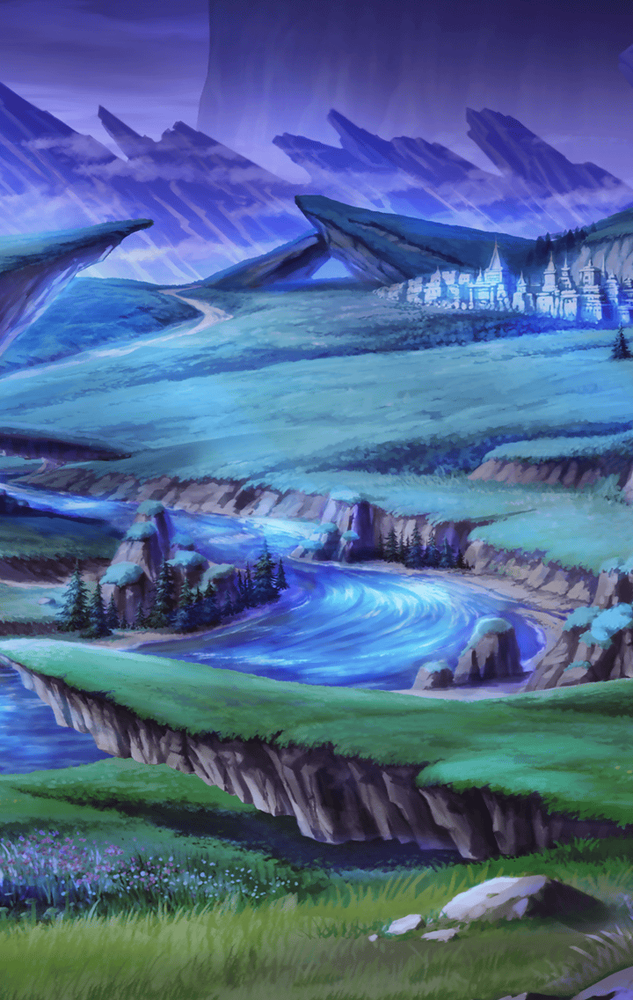

**【メラ】**
ねえ、どうしてそんなに急ぐの？
そこまで頑張ることに、
意味はあるのかな

**【メラ】**
ほら、少しくらい
休んでもいいんじゃないかな

**【メラ】**
あそこの木陰で休憩したら
きっと気持ちいいよ

マスターと行動を
共にすることになったメラだが

怠惰なほうへ
引きずり込もうとするのは
相変わらず

もはや、キル姫達も
いつもの光景だと
気にも留めなくなっていた

**【メラ】**
…へんなの

そう呟くメラに
どうしたの？
と、聞くマスター

**【メラ】**
あたしがあなたを拘束した時
余計なことしたら
命を奪うつもりでいたのに…

**【メラ】**
今、彼女達は、あたしの同行も
あなたへの接近も許している

君がそれだけ戦いで
活躍しているからだよ
と、マスターは言う

**【メラ】**
…うそ
あたしが睨まれていないのは
あなたが手回ししたからでしょ？

**【メラ】**
へんなの、って言ったのは
あなたに対して

何のこと…？
と首を傾げるマスター

**【メラ】**
あたしがあなたを拘束した時
彼女達に対して
あなたの命を盾にしようとした

**【メラ】**
でも、あなたはあたしの言葉を遮って
「僕は大丈夫だ」って叫んだ

**【メラ】**
あれは彼女達をあたしから守るための
方便だと思ってたんだけど…

**【メラ】**
実は、あたしに脅しの言葉を
言わせないためだったんだね…
でなきゃ、遮る必要はないもの

**【メラ】**
そうすることで
あたしがあなたに害をなす可能性を
彼女達から隠した

**【メラ】**
彼女達は拘束されている間
ずっとあたしを説得していたと
思ってるけど…

**【メラ】**
あなたへの殺意を見せていたら
どう思うんだろうね？
あぁ、面倒くさいな…

言い当てられたことに驚きつつ
それで、恩を感じてるってこと？
と、違和感を覚えるマスター

**【メラ】**
まさか
だからさっき、へんなの
って言ったでしょ

**【メラ】**
あたしが一緒に行くかどうかも
わからない状況で
そんな風に気を回すなんて…

もし協力してくれた時に
味方から警戒されるくらい
面倒なことはないから、とマスター

**【メラ】**
面倒なことを避けるために
面倒なことをするなんて
やっぱり変なの

そうやって頑張った後に
味わう怠惰は格別だと思うから
と、マスターは言う

メラが言う怠惰を
もっと味わってみたいからね

だから、僕も君と変わらない
と言うマスターにメラは呆れた様子

**【メラ】**
全然、違うと思うけど…
まあ…別に、どうでもいいや

**【メラ】**
あなたには他の人間みたいに
わかりやすい「支配したい」
っていう考えがないのはわかった

**【メラ】**
そんなあなたが、
もし本当に何もかもを諦めて
怠惰に堕ちちゃったとしたら…

**【メラ】**
気になって仕方ないな

**【メラ】**
…決めた

**【メラ】**
あたしの力、存分に貸してあげるよ
マスターがこの先どうなるのか、
近くで見届けるために

**【メラ】**
だから、つまんない人間になって
あたしを飽きさせたりしないでね
マスター？

そう言ってメラは
相変わらずの無表情ながら
少しだけ口元を緩めてみせるのだった
