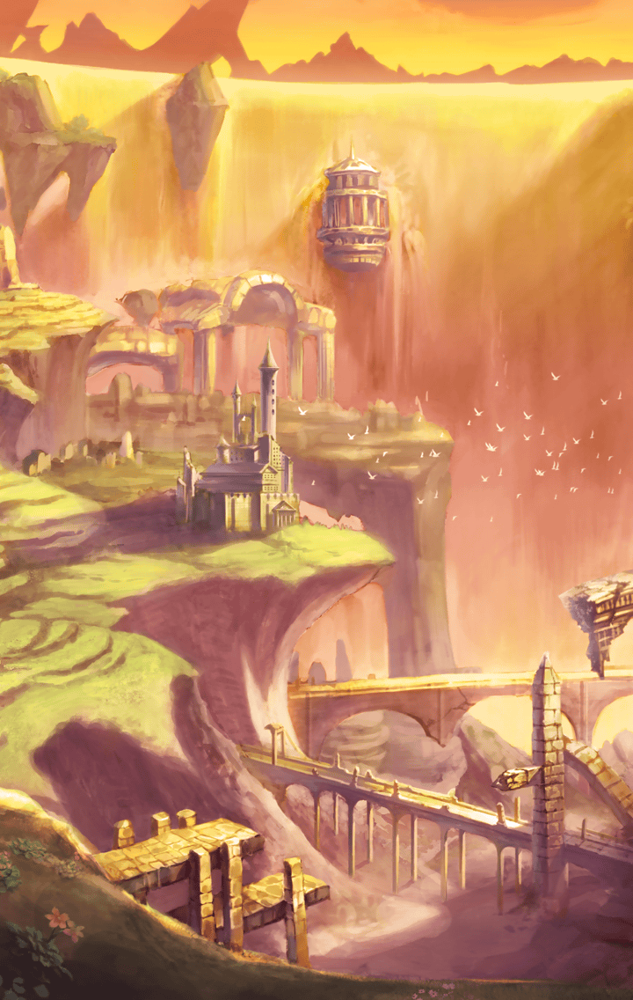

[View script in lisp](../scripts/510531213.txt)

その後もマスターとわらべは、
カードのコンプリートを目指して
こつこつと集め続けていた

そして…

【鬼灯わらべ】
ううん、ついに後1枚か

【鬼灯わらべ】
だがその1枚がどうやっても
見つからない～

最後のカードだけは、
一向に見つかる気配がなく
情報すら手に入らない

と、そこでマスターは
コレクターの老人を思い出す

彼なら何か知っているかもしれない

【鬼灯わらべ】
おおっ♪冴えとるねマスター様！
そうと決まれば善は急げじゃ♪

【鬼灯わらべ】
むむむ～最後のカードは、
山を登った記念品とは…

さっそく老人から
情報を聞いたふたり

どうやら最後のカードは
とある山の山頂でもらえる
景品とのことだった

【鬼灯わらべ】
ここにきて体力仕事とは…
ばあちゃんちょっとキツいかも

不安そうなわらべに対し、
もうやめようか？と尋ねる
マスター

だがわらべは即座に
頭を横に振る

【鬼灯わらべ】
いーや！ここまで来たら
なんとしても手に入れたい！

【鬼灯わらべ】
よし！次の休日じゃ！
ばあちゃんしっかり準備しとるから！
マスター様もよろしく頼むね～！ 

どうやらわらべは本気らしい
こうなった以上、自分も頑張らねば
とマスターも奮起する

【鬼灯わらべ】
おお～！凄い山ッ！
これは登り甲斐はありそう！

【鬼灯わらべ】
さあ行くぞマスター様！
目指すはてっぺんじゃ！

ついにやって来た登山の日
わらべの号令と共に、
マスターも登山を始める

【鬼灯わらべ】
しかしいい景色じゃな～♪
鳥のさえずる声も心地よい♪

実際有名な登山コースと言う
こともありそれは見事な景色だ

【鬼灯わらべ】
最後のカードをここにしたのも、
なかなか面白い考えやねえ～♪

余裕そうに山を登っていく
わらべを見てほっとするマスター

この調子であれば夕方には
山頂には着くだろう

【鬼灯わらべ】
ふう…ふう…
なんだか…足が重たいなあ

登り始めてから数時間後、
気付けば舗装された道はなくなり
どんどん険しい道のりになっていた

【鬼灯わらべ】
た…ただのカードじゃぞ？
手に入れるのにこんな…

辛そうに汗を滲ませるわらべ
マスターは無理せず休憩しよう、
と提案することにした

【鬼灯わらべ】
そうじゃな…
無理はダメじゃ…

【鬼灯わらべ】
山を登るのって大変
終わりが見えないっていうか

疲れた様子のわらべに対し
マスターは辛いならもう
辞めようか？と尋ねる

【鬼灯わらべ】
ふふっ…
見くびってもらっては
困るよマスター様

【鬼灯わらべ】
確かにカードを集めることも
山を登ることも意味なんてない

【鬼灯わらべ】
わざわざ辛い思いをしなくても
楽しいことなんてたくさんあるし

【鬼灯わらべ】
それでも何かを頑張ることには、
きっと何か意味があるかも…

【鬼灯わらべ】
なんて、マスター様を
見ている内に思ったんじゃ

【鬼灯わらべ】
マスター様はなんにでも
一生懸命でつい頑張り過ぎて

【鬼灯わらべ】
ばあちゃんそんな姿を見て
ちょっと憧れちゃったんじゃ

そう言って、立ち上がる
わらべの顔には笑顔が浮かんでいた

【鬼灯わらべ】
大丈夫、安心して！
無理はしないから！

【鬼灯わらべ】
さあ、気合い入れて行くよ！
マスター様！

わらべの言葉に頷くマスター
休憩を終えたふたりは再び
山を攻略するべく歩き出す

【鬼灯わらべ】
お…おお…！

【鬼灯わらべ】
頂上じゃ！頂上じゃ！
やったぞマスター様！

【鬼灯わらべ】
ばあちゃんたち
やったんじゃ！

見渡す限りの青空へ両手を伸ばし、
溢れんばかりの歓声を上げるわらべ

その光景に、マスターも
思わず感動してしまう

と…そんなふたりの元へ、
ひとりの人物がカードを持って
近付いて来た

【鬼灯わらべ】
こっこれが…！
最後のカード！

【鬼灯わらべ】
やったなあ、マスター様♪
これはばあちゃんとマスター様が
ふたりで成し遂げたことじゃ！

カードを握りしめるわらべに、
マスターは力強く頷く

【鬼灯わらべ】
いやあ、最初はただの散歩から
始まったんじゃがなあ～

【鬼灯わらべ】
それがこんなことに
なるなんて、ばあちゃん
本当にびっくりじゃ！

【鬼灯わらべ】
ははは♪どんなことも、
楽しんでやってみるもんじゃな！

それから数日後―

ふたりは集めたカードを、
コレクターの老人に全て渡し終えた

【鬼灯わらべ】
またたくさんお礼を
もらってしまったなあ

【鬼灯わらべ】
あのおじいさんの依頼と言うより、
ばあちゃんたちはただ楽しみたかった
だけなんじゃが…

【鬼灯わらべ】
ま！これはこれで、
良しとするか！

そう言って老人から貰った
お菓子を頬張るわらべ

だがその様子はどこか
寂しそうに見える

【鬼灯わらべ】
うう～ん…
なんだか終わってしまうと
それはそれでなんともなあ

【鬼灯わらべ】
楽しみがひとつ終わってしまって
どうも虚無感が…

わらべの言葉に同意するマスター

お礼やご褒美よりも、
集めている時間が一番の
楽しみであったのだ

【鬼灯わらべ】
うん？なあマスター様
また掲示板に何か貼られておるぞ

わらべに言われるまま
掲示板に目を通すマスター

【鬼灯わらべ】
ほほう、なんだか楽しそうな
顔をしてるなあ～？

【鬼灯わらべ】
ずるいぞマスター様、
ばあちゃんにも協力させな

【鬼灯わらべ】
もちろん、戦いでも歓迎じゃ！
マスター様と一緒なら、ばあちゃん
どんなことでも頑張れるし！

【鬼灯わらべ】
前にも言ったが、ばあちゃんも
マスター様みたいに
頑張りたいのじゃ！

【鬼灯わらべ】
この世界のために出来ること、
ばあちゃんにもまだまだ
ある気がするからな！

【鬼灯わらべ】
それに、マスター様についていくと
面白いことがあるに決まっている！

わらべの
マスターを信じる想いが――

新たなスキル
『ばあちゃんの1000年知恵』
として宿る

【鬼灯わらべ】
と言うわけで…
これからもよろしくね～！ 
マスター様！

マスターに対し、
元気いっぱいで笑うわらべであった

Next: [512019211](512019211.md)

[Back to index](index.md)
