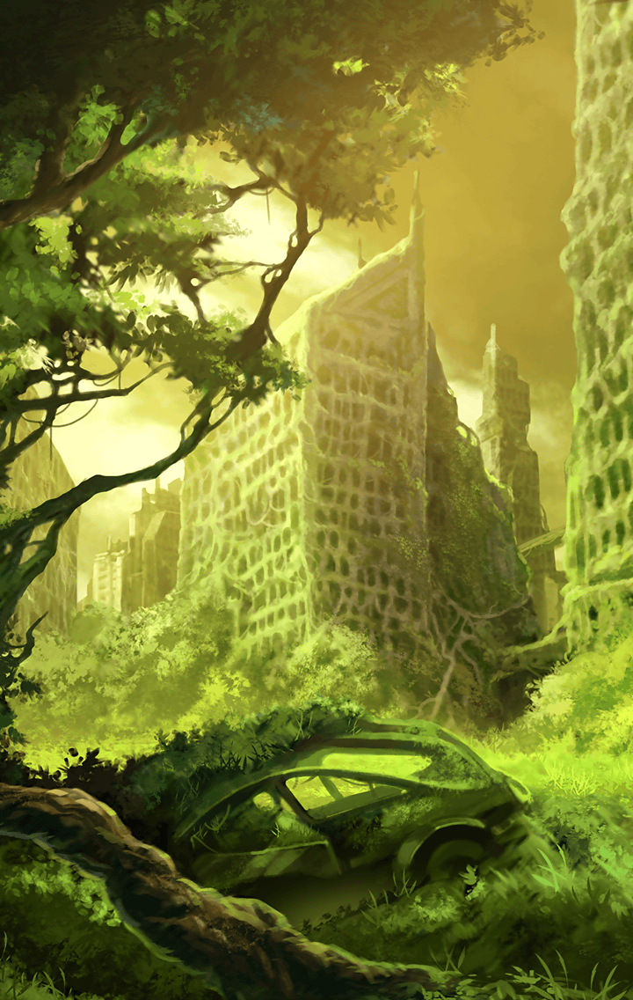

[View script in lisp](../scripts/513001211.txt)

街の朽ち果てた教会に住み
ひたすらストイックに修行に励む
キラーメイル、ロンギヌス

教会の外で
マスターはその様子を
じっと見ていた

**【ロンギヌス】**
…………

槍を振り続ける彼に
声を掛けてみる

昨日の戦いもすごかったね

**【ロンギヌス】**
…………

あんなにたくさんいた魔獣を
全部一人で倒すなんて

**【ロンギヌス】**
…………

さすがは“聖槍”ロンギヌスを
キラーズに持つだけあるね

**【ロンギヌス】**
…………

次の瞬間、ロンギヌスの槍が
マスターの口元で止められた

**【ロンギヌス】**
聖槍…だと？

汗を垂らし、うなずくマスター

**【ロンギヌス】**
聖槍と崇めるなッ！

**【ロンギヌス】**
槍など、“殺すため”
“命を奪うため”の道具
所詮は血に汚れた鉄の塊でしかない

**【ロンギヌス】**
そして、それは…
この俺も同じだ

どういうこと…？と
マスターが問う

**【ロンギヌス】**
戦って…
ただ奪うだけの存在…
価値のない命だ…

そんな…君の戦いによって
希望の光を得た人も…

**【ロンギヌス】**
笑止…
確かに民間人にとっては
俺達の戦いは希望だろう

**【ロンギヌス】**
しかし
当の本人に“光”が届かぬのだ
その戦いに光などあるはずもない

視力を失った右目を見せるロンギヌス
そして槍を引くと
再び修行に戻るのだった