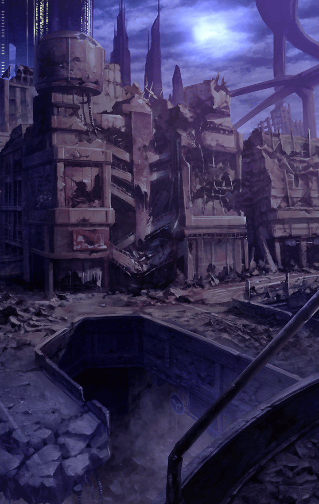

[View script in lisp](../scripts/514013111.txt)

旧市街における魔獣との戦闘

そこに、敵を殲滅する
１人のキラーメイルがいた

**【アルテミス】**
醜い者は…去れ

その男は、
怒りと悲しみに満ちた
目をしていた

夜─

**【アルテミス】**
…………

廃墟と化したビルで１人、
酒を飲んでいるアルテミス

そこに尋ねてくる者が…

わっ！！

マスターの足元に、
一本の矢が突き刺さる

**【アルテミス】**
…なんだ、お前か

**【アルテミス】**
無断で入るなよ
僕のお気に入りの場所を
汚されたくないんだ

こ…ここで何をしてたの？
マスターが尋ねる

**【アルテミス】**
………

**【アルテミス】**
言う必要はないだろ

素っ気ない態度で、
酒を口に運ぶアルテミス

き…綺麗な月だね
と、マスターは続ける

**【アルテミス】**
………

**【アルテミス】**
美しさが…分かるのか？

**【アルテミス】**
この荒廃しきった世界で…
月の美しさが

ここで…月を見ていたんだね？
マスターが尋ねる

**【アルテミス】**
…そうさ

**【アルテミス】**
月は美しい

**【アルテミス】**
この朽ちた世界で、
醜い魔獣どもと戦っていると、
余計そう感じるよ

美しいものが好きなの？
尚もマスターは尋ねる

**【アルテミス】**
ああ、普段から
お前のような美しくない者と
接しているとな

少し酔っているせいか、
いつもより口数が多い。
こんなにも彼と話したのは初めてだ

どうして美しいものが…
と、さらに続ける
マスターだったが…

わっ！！

足元に、また一本の矢が突き刺さった

**【アルテミス】**
さっきからうるさいぞ
美しい月夜が台無しだ

怒りと悲しみに満ちた目…
マスターはそれ以上、
彼に話し掛けるのをやめたのだった

Next: [514013112](514013112.md)

[Back to index](index.md)
