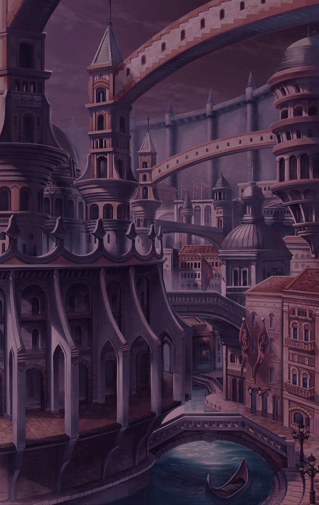

520061211 ユグドラシル・誓約・キラーズ 希望なる存在

[View script in lisp](../scripts/520061211.txt)

【ユグドラシル】
思い返せば、
この世界には絶え間なく
争いが起きていた…

【ユグドラシル】
これは、私自身である
“あなた”が生まれる
以前のお話――

【ユグドラシル】
ずっと観測してきた

【ユグドラシル】
この…
荒れ果てた世界を……

【ユグドラシル】
なぜ争いはなくならないの…？

【ユグドラシル】
そんなことを考えながら、
世界を見渡す私の目に、

【ユグドラシル】
悪魔と戦う“彼ら”の姿が
飛び込んできた

【ゼロ】
うおおおおおおおっ！！

【ゼロ】
お前らを…
叩き潰すっっ!!

【ユグドラシル】
………

【マサムネ】
絶望を叩き斬る！！
俺の刀で！

【デュランダル】
悪しき者ども…滅びよっ！！

【ユグドラシル】
………

【ユグドラシル】
……強い

【悪魔】
グオオオオオオオッ！！

【ユグドラシル】
しかし、いくらあの者たちが
力を持っていようと、
悪魔を倒すことは不可能でしょう…

【ユグドラシル】
この長き歴史の中で、

【ユグドラシル】
戦いの火が消えることはなかった…
まずは天使と悪魔の戦争が起こり…

【ユグドラシル】
それが終わると、
人間が天使や悪魔と戦い始めた…

【悪魔】
グオオオオオオオッ！！

【ゼロ】
くっ…！くそぉ…………！

【ユグドラシル】
だけど人間は、
天使や悪魔と比べて、
とても脆弱な存在だった

【ユグドラシル】
それでも、彼らは……

【ゼロ】
こんなところで……

【ユグドラシル】
滅びることはなかった

【マサムネ】
やられるわけにはいかない…！

【ユグドラシル】
彼らの武器とは、なんなのか……

【デュランダル】
何度でも立ち上がる…
騎士の道に懸けて…！

【ユグドラシル】
それは天使や悪魔には無い……

【ゼロ】
俺は…
俺たちは……

【ゼロ】
もっと強くなるっ！！

【ユグドラシル】
“強大な意思”……

【ゼロ】
たとえ可能性が０％だとしても
覆してやる！

【デュランダル】
何者にも虐げられず、
心穏やかに暮らせる日が来るまで！

【マサムネ】
動乱を鎮め、
この手に自由を
手に入れるまで！！

【ゼロ】
俺たちは…抗い続ける！！

【ユグドラシル】
人間たちの“強大な意思”…
それは……

【ユグドラシル】
希望を追い求める心

【悪魔】
グアアアアアアアッ！！

【ユグドラシル】
その心が、時には
天使や悪魔をも討つ力を
生み出す……

【ゼロ】
はぁ…はぁ…はぁ…！

【マサムネ】
はぁ…はぁ…
お……終わったのか……？

【デュランダル】
我らの…勝利だ

【ユグドラシル】
傷だらけになりながらも…
希望を捨てないその姿…

【ユグドラシル】
……美しい

【ユグドラシル】
勝利を掴んだ彼らを
心の中で祝福しながら、
私はその光景をただ眺めていた

【ユグドラシル】
かつて私は、
ひとりの人間と女神が生んだ
奇跡を目にした

【ユグドラシル】
運命の子
ティルフィング

【ユグドラシル】
父と母から希望を託された彼女は
地上世界へと降り立った

【ユグドラシル】
それから今後は
地上世界から天上世界へ
“世界をまたぐ者”が現れた

【ユグドラシル】
その命を捧げて
反逆の一手をもたらした者
リベリオン

【ユグドラシル】
使命を抱き天上世界へ向かった
キラープリンセス
…キル姫達

【ユグドラシル】
彼らの存在を通して、
私は人間に興味を持ち始めた

【ユグドラシル】
そして、今日…
悪魔と戦う者たちを見て、
また新たな興味が湧いた

【ユグドラシル】
なぜ人間は…
こうも運命に抗うのか…？

【ユグドラシル】
どんな絶望の中にいても…
希望を捨てずに……

【ユグドラシル】
知りたい…そのわけを……

【ユグドラシル】
この目で…確かめたい

【ユグドラシル】
そのためには……

【ユグドラシル】
私の化身である人間を…

【ユグドラシル】
そう強く念じたとき私は、
「[ユーザー名]」を
生み出していたのです

Next: [520061212](520061212.md)

[Back to index](index.md)
