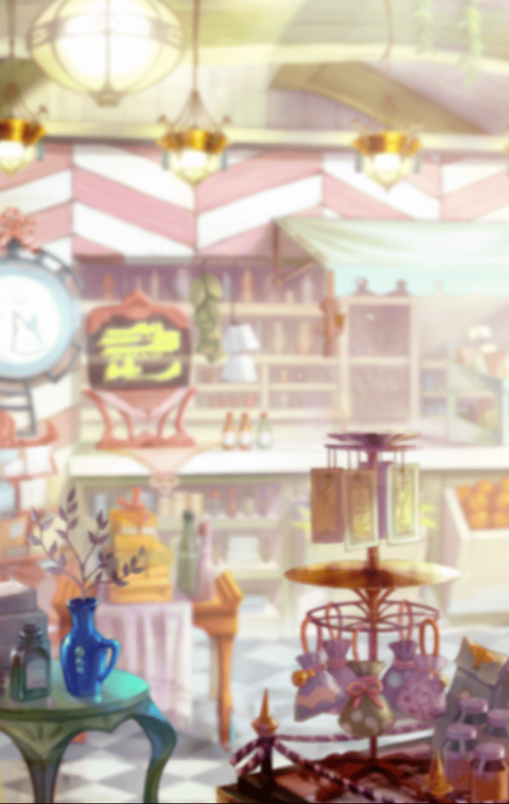

520331212

[View script in lisp](../scripts/520331212.txt)

【ぬりかべ】
マスターさん
次はあそこのお店でいいでしょうか？

ぬりかべと旅に出てしばらくして
二人はある街にたどり着き
そこに滞在していた

交易で栄えている街で
各地の食材が集まり
飲食店の種類も豊富だ

最初の数日
ぬりかべはお店を見て回った

【ぬりかべ】
夜叉ノ國にはない料理だ…
材料は、置き換えられそう
…覚えたい

そのあとぬりかべは
気に入ったお店を見つけると
そのお店に交渉

手伝う代わりに
料理を教わることになった

もちろん、ぬりかべ一人に
手伝わせるわけにもいかないので
マスターも一緒に手伝うことにする

【ぬりかべ】
ふぅ…今日も大変でした

【ぬりかべ】
でも、いっぱいお手伝いしたので
お料理もたくさん、
教えてもらいました

最初はぬりかべのことを
警戒していた人達も
すぐに彼女の良さに気づく

そうして近くの主婦達が
そろってぬりかべを構い
手ずから料理を教えていた

【ぬりかべ】
はい！このお野菜の面取りですね

【ぬりかべ】
…なるほど、このお野菜は
輪切りにしてから面取りなんですね

ぬりかべも素直に言葉を聞いて
異世界料理を学んでいく

【ぬりかべ】
えっと煮物用のお鍋は…

ただ、やはり異なる文化の
キッチンのせいか、扱う道具や
食材の種類で戸惑うこともある

【ぬりかべ】
あっ…このお鍋ですか
こういう形の、お鍋なんですね

【ぬりかべ】
マスターさん
ありがとうございます

そんな時、マスターが
さりげなくカバーしていた

【ぬりかべ】
うん…これでよしです

こうしてぬりかべとマスターは
有意義な日々を過ごしていた

夕食が終わったあと
マスターとぬりかべは
お茶を飲んでくつろいでいた

【ぬりかべ】
マスターさん…
これで、いいんでしょうか？

ぬりかべが
申し訳なさそうな声を出すので
どういうことか聞くと…

【ぬりかべ】
食材のこととかお料理のこと
たくさん教えてもらって…

【ぬりかべ】
みんなに
たくさん優しくしてもらって…

【ぬりかべ】
それなのに
私は何も、返せていないです

ぬりかべは、一方的に
恩恵を受けているように
感じているらしい

真面目な彼女は
その状態に申し訳なさを
感じているようだった

【ぬりかべ】
…お手伝いはしていますけど
それじゃ、足りないです

【ぬりかべ】
みんなにお礼をしたいのに
私には返せるものが
ありません…

お手伝いをしているのだから
気にすることはないと
マスターは言うが

【ぬりかべ】
異世界だからといって
恩知らずには、なれません

それならと、マスターは料理を
教えてくれた人達に
料理を振る舞ったらと提案する

【ぬりかべ】
すごくいい考えです！

【ぬりかべ】
教わったお料理だけじゃなくて
私の國のお料理を再現して
ごちそうします！

マスターは自分も手伝うと
申し出るが…

【ぬりかべ】
それはとてもありがたいのですが…

【ぬりかべ】
マスターさんにも
お世話になっていますから
お料理をごちそうしたいんです

ぬりかべの提案に
マスターは驚きながらも、
うなずいた

【ぬりかべ】
腕によりをかけて
お料理します！

【ぬりかべ】
明日は朝から
食材を集めないと

うきうきした様子で、
ぬりかべはがんばろうと
うなずいた

マスタ－は明日の
食事会の成功を祈った

【ぬりかべ】
えっと…お野菜は
これとこれと…

ぬりかべは朝から市場を回り
食材を買い集めていた

【ぬりかべ】
調味料はこっち…？
あれ？さっき来たお店…

【ぬりかべ】
こっちかな…

迷いつつも市場を
ちょこまか動き回るぬりかべ

【ぬりかべ】
きのこが売り切れてる…
どうしよう…

【ぬりかべ】
…市場になければ
採りに行けば、いいよね

【ぬりかべ】
運が良ければ
新鮮なお肉だって…

異世界から来た彼女が
街を歩き回っていることに
不快感を感じている者もいた

【ならず者】
ちっ…

市場を回るだけではなく
足りない食材を採りに
森にまで入るが…

【ぬりかべ】
あれ？えっと
どっちだっけ…

【ぬりかべ】
こっちから来たから
…こっちが街かな？

ぬりかべは森でも道に
迷っていたが

【ぬりかべ】
あ…きのこが落ちてる…
こっちにも…

【ぬりかべ】
私が落としたのかな？

【ぬりかべ】
…それなら拾っていけば、
元の場所に戻れる！

手伝いを断られたマスターだが
ぬりかべに気づかれないよう
密かに見守っていた

【ならず者】
森の中か…ちょうどいい…

ふと、ぬりかべのあとを
追っている者が、自分以外にも
いると気づいたマスター

【ならず者】
よそ者がちょろちょろ鬱陶しい
少し礼儀を教えてやる…

男がぬりかべに対して
よからぬことを
考えていると気づき…

【ならず者】
あっ？なんだお前は…

マスターは男の前に
立ち塞がった

【ぬりかべ】
材料は完璧
あとはお料理を…

【ぬりかべ】
あれ…マスターさんが、いない？
どこに…

ぬりかべが呟いた直後
マスターが彼らの宿に
戻ってくる

【ぬりかべ】
マスターさん…！？

【ぬりかべ】
その格好…怪我もしてる…

マスターはならず者を
追い払ったときに
取っ組み合いになった

そのせいで衣服は乱れ
軽く怪我もしていた

マスターは適当に
ごまかそうとするが

【ぬりかべ】
違います…転んだ怪我じゃなくて
争ったあとです

ぬりかべに
すぐに気づかれてしまい
マスターは本当のことを話す

【ぬりかべ】
…守ってくれて、
ありがとうございます

【ぬりかべ】
…………マスターさんは森で
道に迷ったときも、
助けてくれましたよね

【ぬりかべ】
私が、こちらの世界に来てから
ずっと…

【ぬりかべ】
どうしてそこまで、
してくれるんですか？

そう聞いてくるぬりかべに
マスターは不思議そうに聞き返す

困っている人がいれば
できる範囲で助けるのは
当然のことじゃないかと

【ぬりかべ】
…！？
そうです

【ぬりかべ】
みんなを助けたい
守りたいって、私も思います

マスターは、自分は戦う力がないから
姫達をできる方法で
サポートしたいと語る

【ぬりかべ】
マスターさんは…
私と、ちょっと似てる気がします

ぬりかべは嬉しそうに微笑む

マスターの考え方に、ぬりかべは
自分と重なるものを感じた

そのときぬりかべは
自分の中に新たな
力が目覚めたのを感じる

【ぬりかべ】
あ、でもやっぱり
内緒で無茶は、だめですよ

【ぬりかべ】
私だって、マスターさんを
守りたいですから…

【ぬりかべ】
無茶したいなら、私がそばに
いるときにしてください

ぬりかべがマスターを
叱るようなことを言うが
その顔には笑みがあった

もし同じことがあっても
今度は自分が守る
そう言っているようだった

Next: [520331213](520331213.md)

[Back to index](index.md)
