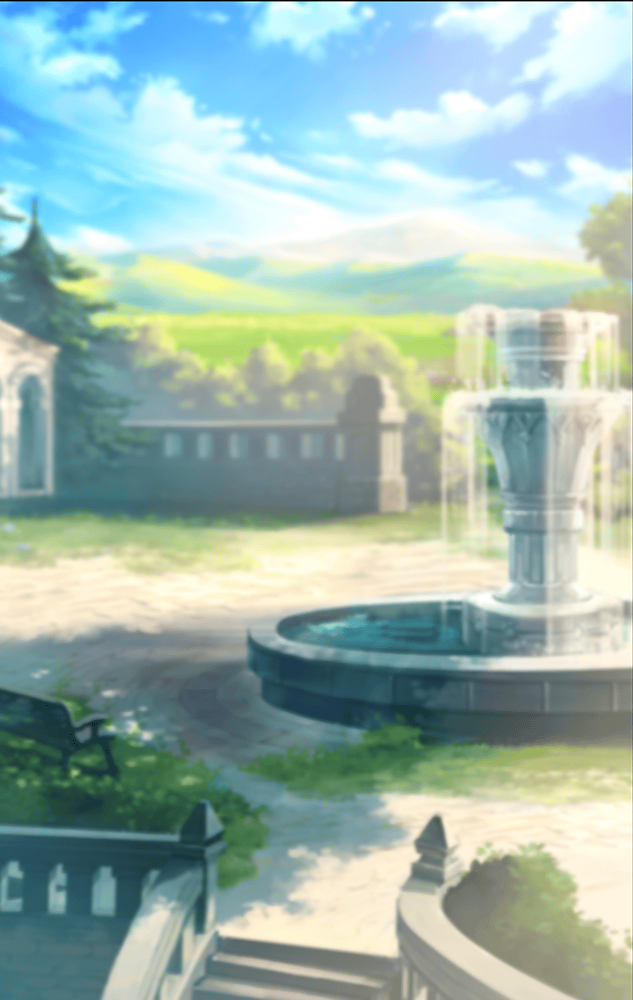

530331212

[View script in lisp](../scripts/530331212.txt)

浪白公園に到着するまでには
結構な時間を要したが、
なんとか一時間目が終わる前には、

僕は、広場のベンチに、
背中を丸めて小さくなって
腰掛けている、

羽川の前に、
アライバルすることができた

【阿良々木】
何があったんだ？
羽川
やっぱ、あの頭痛か？

【羽川】
うん――
頭痛……

【羽川】
……は、もう、ないんだけど
あの――阿良々木くん

【羽川】
ゴールデンウィークのこと、さ
私……思い出したんだけど

【阿良々木】
そう――なのか

【羽川】
いや、そうじゃないのかな
忘れてることがあるのを、
思い出したって感じだね……

【阿良々木】
そうか

【羽川】
猫
猫――なんだよね

【阿良々木】
……

【羽川】
そこは、思い出した――
阿良々木くんと一緒に
埋めてあげた――あの猫

【羽川】
……そこは、思い出した

【阿良々木】
でも、羽川
僕をこうして
呼び出したってことは、

【阿良々木】
思い出したってだけじゃ――
ないんだろう？

【羽川】
そうよ

【阿良々木】
怪異――か

【羽川】
そう……だから

【羽川】
阿良々木くんには、
忍野さんのところへ、
案内してもらおうと思って……

【羽川】
道案内、頼んでもいいかしら

【阿良々木】
そりゃ、勿論――
勿論だけど、その前に、二、三、
質問させてもらっていいか？

【羽川】
え……
いいけど、なんで？

【阿良々木】
怪異に関しちゃ、
忍野に頼りっぱなしだからな

【阿良々木】
最終的に丸投げにするにせよ、
話の骨子は整理しておかないと

【羽川】
あ……そうだね
いいよ
じゃあ、何でも訊いて

【阿良々木】
頭痛

【阿良々木】
最近よくあるみたいなことを
言ってたけれど、正確には
いつ頃からなんだ？

【羽川】
……一ヵ月くらい前――かな
一昨日と、昨日……両方、
阿良々木くんの前でだったけれど、

【羽川】
本屋さんと、学校の正門の
ところで、あった頭痛は……
実は、かなり酷かったの

【阿良々木】
言えよ
そのとき

【羽川】
ごめん
阿良々木くんに
心配かけたくなかったし

【阿良々木】
……まあ、いいけどさ

【阿良々木】
じゃあ……ゴールデンウィークが
終わって以来、猫に関する
エピソードってのはあるか？

【羽川】
猫に関するエピソード？

【阿良々木】
黒猫が目の前を横切ったとか、
そういうレベルでいいんだけど

【羽川】
五月二十七日、
夜頃に聞いていたラジオ番組で、
ラジオネーム『大熊猫大好き』さんの

【羽川】
葉書が読まれていたけれど、
それが何か関係あると思う？

【阿良々木】
……いや、ないと思う

【羽川】
ちなみに葉書の内容は
こうだったわ

【羽川】
『漫画やアニメなんかでは
気楽そうに
もてはやされていますけれど、

【羽川】
メイドってというのは、
意外と大変な仕事なんですよ

【羽川】
休む暇なんて
全然ないらしいですから

【羽川】
この間、合コンで
会ったときに
聞いたから間違いありません』

【阿良々木】
いや、そこまで
説明しなくてもいいから！

【羽川】
ところで、阿良々木くん
この葉書、何が面白いんだと思う？
私にはちょっとわからないんだけど

【阿良々木】
えーっと、だから、
メイドは休む暇なんて全然ないとか
言っておきながら、

【阿良々木】
ちゃっかりお気楽な合コンに
参加してるじゃんって
ところが笑える――

【阿良々木】
って、なんで僕が
そんな葉書のフォローを
しなくちゃならねえんだよ！

【羽川】
ああ、なるほど

【羽川】
でも、やっぱり、
一回聞いただけじゃ、
ちょっとわかりにくいかな

【阿良々木】
そもそも、
よく考えてみりゃ

【阿良々木】
大熊猫は猫じゃなくて
パンダだろうが

【羽川】
うん
そう言えばそうだね

【阿良々木】
他には？

【羽川】
ん？　他？　
えっとね、

【羽川】
同じ番組で、ラジオネーム
『すぶりをするそぶり』さん

【羽川】
『この間、友達三人とトランプで
大富豪していたときの話です

【羽川】
カードが配られたあとで、
そのうちの一人が
言い出しました

【羽川】
「あたしの中学校じゃ、
４が一番強いカードだっていうルール
だったんだけど」』

【羽川】
これはどこが面白いの？

【阿良々木】
いや、他にはっていうのは、
面白さがわかりにくかった葉書は
他にはなかったかって

【阿良々木】
意味で訊いたんじゃねえよ！

【阿良々木】
ちなみにその葉書は、
大富豪は８切りだったり
都落ちだったり、

【阿良々木】
ローカルルールが非常に多いから、
それをいいことに自分の手元に
配られたカードに都合のいいルールを

【阿良々木】
でっち上げた友達がいた
っていうのが笑いどころだ！

【羽川】
ああ、なるほど
さすが阿良々木くん

【阿良々木】
こんなことで感心されても
嬉しくない……

【阿良々木】
ああ、あと、
『すぶりをするそぶり』って
いうラジオネームも、

【阿良々木】
『すぶり』と『そぶり』が、
漢字で書いたら同じだっていう
細かい洒落になってるから

【羽川】
あ、でも、阿良々木くん
その番組、わかりにくい葉書
ばかりじゃないんだよ

【羽川】
ラジオネーム
『林檎をむいて歩こう』さん

【羽川】
『先日、友達と二人で
レンタルビデオ店に行きました

【羽川】
某連続ドラマのＤＶＤを
借りようとしたのですが、

【羽川】
全十三巻のうち八巻だけが他の人に
借りられていたので、七巻までしか
借りることができませんでした

【羽川】
「七並べで
八を止められている気分だよー」
と言うと、友達は言いました

【羽川】
「今頃、八巻を借りてる人は
ほくそ笑んでるんだろうね」』

【羽川】
あはは、

【羽川】
八巻を借りてる人の方は
七並べみたいだなんて
思ってないって

【阿良々木】
確かにそれは面白い話だけど、
ラジオの話はもういいんだよ！

Next: [530331213](530331213.md)

[Back to index](index.md)
