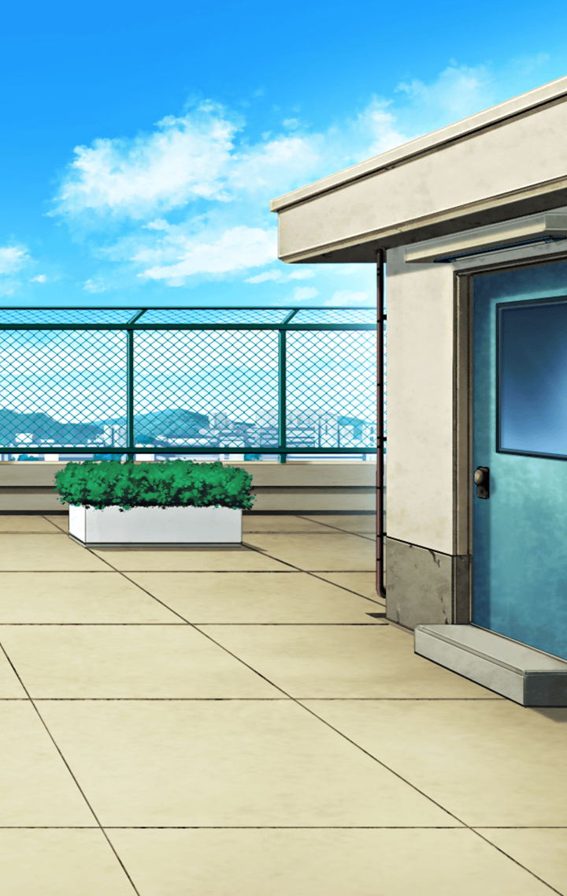

[View script in lisp](../scripts/6001071.txt)

**【フォルカス】**
マスター、
アロンダイトを見なかった！？

フォルカスは見るからに慌てていた

**【フォルカス】**
あの時の浴衣、
返そうと思って探してたの…

**【フォルカス】**
そうしたら、
暗い顔してどこかに行くのが見えて

**【フォルカス】**
…すごく、辛そうだった

**【マスター】**
僕も探していたんだ
一緒に探そう！

**【フォルカス】**
アロンダイト！

アロンダイトは屋上にいた

**【フォルカス】**
なにかあったの？

フォルカスの呼びかけは…
アロンダイトの耳には届いていない

**【アロンダイト】**
…私は会長を尊敬しています
気高く、美しく…いえ、なにもかも、
あの人のすべてが最高なんです

**【アロンダイト】**
その会長がおっしゃったんです
自分だけでなく、
他の人とも仲良くするように…と

**【アロンダイト】**
誰とでも分け隔てなく
接することができなければ、
業務に支障が出ますから…って

**【アロンダイト】**
でも、そんなのは
表面上の理由です

**【アロンダイト】**
本当は、いつもそばにいて、
離れようとしない私に
嫌気がさしたに決まっています！

その時、マスターは
エクスカリバーの言葉を思い出した

**【エクスカリバー】**
あの子はあれ以来、
体調を崩してしまっている…

**【エクスカリバー】**
彼女を
傷つけているのかも
しれない…

エクスカリバーは
異族を生み出すほどの
後悔を抱えていた…

**【マスター】**
アロンダイト、それは違うよ！

**【アロンダイト】**
違いません！私にはわかるんです！
だって、私が一番、
会長のそばにいたんですから…！

**【アロンダイト】**
私は会長がすべて！
それ以外、どうでもいい！

**【アロンダイト】**
それなのにさっき、
あなたに対して
言ってたじゃない…！！

**【アロンダイト】**
『私から離れて欲しい』
って、会長が！！！

**【アロンダイト】**
お慕いしている会長に
拒否されて…

**【アロンダイト】**
あまつさえ
他人に相談するほど
離れて欲しいと思われ！

**【アロンダイト】**
しかもそれが原因で
倒れてしまって…！！

**【アロンダイト】**
自分が慕っている人に
本気で突き放されたら
私は…どうすれば良いんですか！！

マスターはアロンダイトが
さっきのエクスカリバーとの会話を
部分だけ聞いてしまい、

勘違いをしていることに
気づいた

**【マスター】**
それも違うよ！
会長はあの時…

**【アロンダイト】**
うるさいっ！！！

アロンダイトから、今までにないほど
濃く黒い霧が噴き出し、
周囲の景色を塗りつぶしていく！
