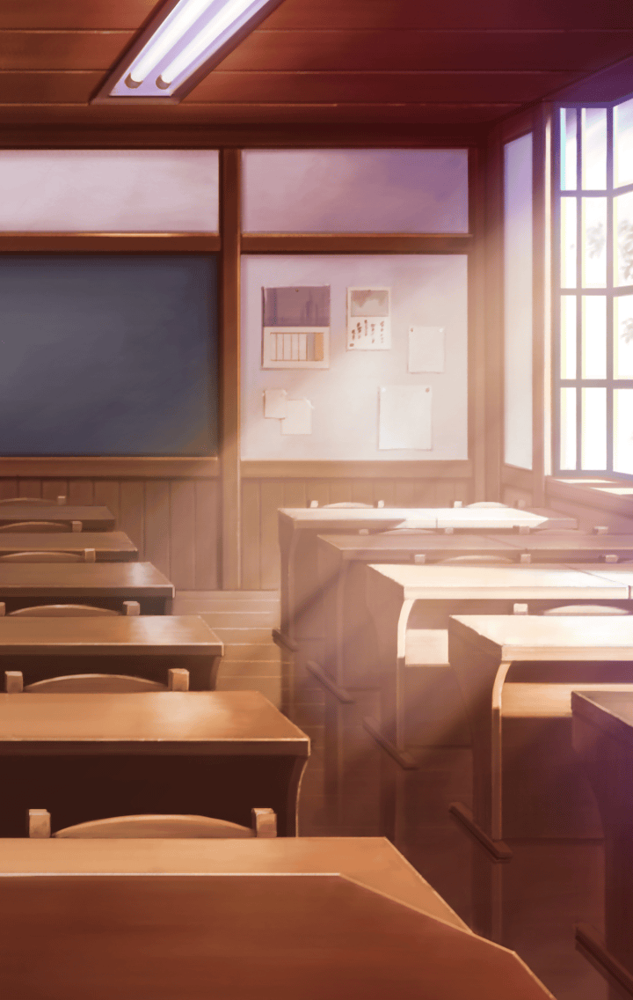

[View script in lisp](../scripts/6002061.txt)

ケラウノスと手分けして
ラブリュスを捜すマスター

しかし彼女の姿は
なかなか見つからなかった

**【マスター】**
ハア…ハア…
さすがにこんなところには
いないかな…？

**【マスター】**
あの背中はラブリュスっ？

**【ラブリュス】**
あっ…

**【ラブリュス】**
や～ん
心配かけちゃった？

**【ラブリュス】**
なんでもないんだよ～
学院のアイドル、
ラブリュスちゃんはいつも笑顔なの♪

**【ラブリュス】**
心配しなくて良いから
キミは先に戻ってて～

**【マスター】**
…そうはいかないよ

**【マスター】**
ラブリュス、
無理してるじゃないか

**【マスター】**
そんな嘘の笑顔じゃ
みんなを幸せになんかできないよっ

**【ラブリュス】**
そんな…
わたし嘘なんて…
嘘なんて…

**【マスター】**
ねえ、ラブリュス
この前も似たようなことが
あったよね？

**【マスター】**
さっきの生徒と昔、
なにかあったの？
良かったら聞かせて欲しい

**【マスター】**
キミが一生懸命努力してるのは
知ってるから、
力になりたいんだ！

**【ラブリュス】**
マスター…

**【ラブリュス】**
…………

**【ラブリュス】**
…あの子達の言う通りなんだ
わたし、昔は地味で目立たない
生徒だったの

**【ラブリュス】**
昔のわたしは地味で目立たなくて…
キラキラした世界に
憧れるだけの女の子だった…

**【ラブリュス】**
そんな自分を変えたくて
進学を機に
学院のアイドルを目指したの

**【ラブリュス】**
過去の自分と決別して、
昔の友達とも
つき合わないようにして

**【ラブリュス】**
アイドルとしての立ち居振る舞いとか
一生懸命練習した

**【ラブリュス】**
どんなときでも
笑顔を見せられるよう、
毎日、鏡の前で訓練して…

**【ラブリュス】**
そうして学院のアイドル
ラブリュスちゃんが生まれたの！

**【ラブリュス】**
アイドルになって、
すごく目立つようになったら、

**【ラブリュス】**
みんなが
チヤホヤしてくれるようになって

**【ラブリュス】**
毎日、
とっても楽しくて
充実してるの！

**【ラブリュス】**
昔の友達は、わたしが
避けるようになったのもあって
少しずつ離れていったけど…

**【ラブリュス】**
それでも全然寂しくない！
だって、わたしは
学院のアイドルだもん♪

**【ラブリュス】**
わたしの笑顔で
みんなが幸せになってくれるの♪
だからちっとも寂しくないんだ！

**【ラブリュス】**
ちっとも寂しくない

**【ラブリュス】**
孤独なんかじゃないっ

**【ラブリュス】**
それなのに…それなのにっ…

**【マスター】**
ラブリュス…？

**【ラブリュス】**
時々、
胸に穴が開いたような
気持ちになるの…

**【ラブリュス】**
無性に
悲しくなるときがあるのっ…

**【ラブリュス】**
なんで！？
こんな、こんなの違う！
こんなはずないっ！

**【ラブリュス】**
わたし…
寂しがってなんか
いないのにぃぃぃっ…！

ラブリュスの体から真っ黒な
霧が噴き出した
