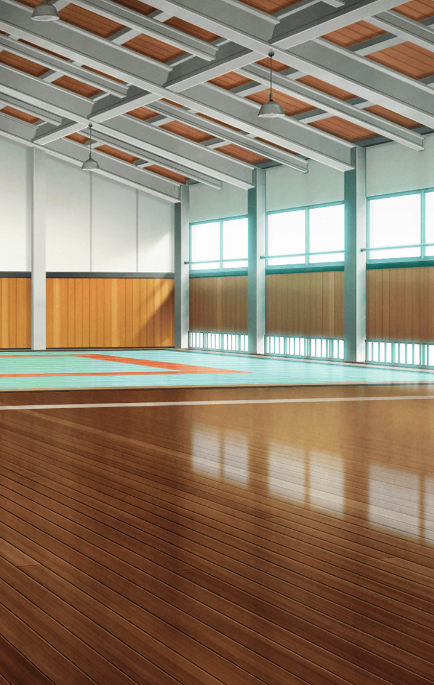

[View script in lisp](../scripts/6007013.txt)

**【マスター】**
ムラマサ…！
大丈夫！？

**【ムラマサ】**
はい…
申し訳ありません…

**【マスター】**
いったい、なにがあったの…？

**【ムラマサ】**
はい、先ほど…

**【マサムネ】**
さぁ！拙者から
一本取ってみるがいい

**【ムラマサ】**
…望むところ！！

間髪入れずにムラマサは
マサムネに踏み込んだ…！

しかしマサムネは
完全に読み切っていたかのように
後ろに下がり竹刀をかわした…

そして、目にも留まらぬ速さで
ムラマサの小手と面に竹刀を
叩き込む！！

**【ムラマサ】**
つぅぅぅ！！！

**【マサムネ】**
他愛もない…
そなた、勝つ気があるのか？

**【ムラマサ】**
それは…！

**【マサムネ】**
ないな
あるはずがない
その剣のどこに勝ち気があった

**【マサムネ】**
そなたの剣は
決して拙者には届かぬ
届くはずがないのだ

**【マサムネ】**
それは、なにゆえか？

**【ムラマサ】**
それは…拙者が未熟ゆえ…！

**【マサムネ】**
笑止…

**【マサムネ】**
…今のそなたでは
絶対に拙者を越えることは
できないと知れ

**【マサムネ】**
よし、拙者とお主で
果し合いを行おう

**【マサムネ】**
その間、
部活には顔を出さんでいい 

**【マスター】**
ちょうどそんなことが…

**【ムラマサ】**
主君…急なこととは存じますが
どうか一週間…
よろしくお願いいたします…

Next: [6007021](6007021.md)

[Back to index](index.md)
