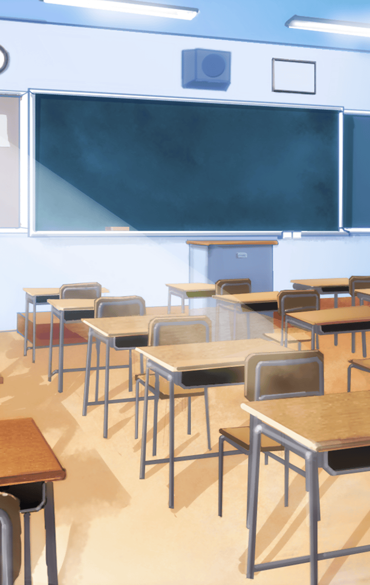

ある日のこと
マスター達のクラスで秋恒例の
学園内合同写生大会が告知された

**【ハルパー】**
というわけで、
写生大会の班決めをしますよ

**【ハルパー】**
一部を除いて強制的に班を
決定するつもりはありませんから、
みなさん好きな人と集まってください

**【ハルパー】**
ちなみにその『一部』というのは、
マスター、フライクーゲルさん、
あなた達ふたりのことですよ

**【フライクーゲル】**
一緒に写生コンテスト！
がんばろうね、マスター☆

**【マスター】**
うん、がんばろうね
って、それはいいけど、
はやく班を決めないと…

とはいえ、
他の子達はあっという間に
それぞれの班を決めてしまっていた

**【フライクーゲル】**
ティーチャーハルパー…
わたし達の班が少ないよ…

**【ハルパー】**
あら…仕方ないですね
どうしましょうか…
…ん？そういえば、あのふたりは――

**【トライデント】**
すみません！
遅刻しました！

**【与一】**
すみませぇえん！

**【ハルパー】**
あらあら、私の授業に遅刻ですか…
いえ、むしろちょうどいいですね

**【ハルパー】**
フライクーゲルさん達は、
トライデントさんと与一さんの
ふたりと組んでくださいね

**【トライデント】**
マスターとフライクーゲルと
一緒の班かぁ
よろしくねー

**【与一】**
よ、よろしくおねがいします

**【フライクーゲル】**
う、うん…！
よろしくね、トライデント！
与一！

ハルパーの粋な計らいで無事に
班決めが終わった

**【マスター】**
なんとかなったみたいだ
フライクーゲルも
喜んでくれているみたいだし…

**【マスター】**
ハルパー先生に感謝しないと
いけないな…

班決めが終わった後、
休み時間に芭蕉扇が訪ねてきた

**【芭蕉扇】**
あなた！フライクーゲル！

**【フライクーゲル】**
あ、ハァイ、芭蕉扇！

**【芭蕉扇】**
学園内合同写生大会のことで、
少し話があるのよ！

**【芭蕉扇】**
私はあなたの正妻として、
写生大会中も旦那と一緒に
いないといけないと思うのよね！

**【芭蕉扇】**
だからね！
私もあなた達の班に
混ざらせてもらうから！

**【マスター】**
聞いてないし…
というか、芭蕉扇は別のクラスじゃ…

**【与一】**
た、確かにその通りで…

**【ハルパー】**
へえ、いいんじゃないですか？

**【与一】**
ハルパー先生！

**【ハルパー】**
確かに芭蕉扇さんは
違うクラスですが…
そこは私がなんとかしましょう

**【芭蕉扇】**
やったわ！
写生大会はよろしくね、あなた♪

こうして別クラスである
芭蕉扇までもが
マスターと同じ班に決定した

**【ハルパー】**
それでは、
私は先生方に連絡をしてきますね

そこで、フライクーゲルが
いないことに気づいたマスター

**【トライデント】**
フライクーゲルなら、
さっき教室を出ていったよー

**【マスター】**
どこに行っちゃったんだろう？
ちょっと探してくるよ

**【芭蕉扇】**
え！？
ちょっとあなた！？

**【フライクーゲル】**
…………

**【マスター】**
やっぱり屋上にいたんだ
どうしたの、フライクーゲ――

**【マスター】**
この黒い霧…！
フライクーゲルから…！？

**【フライクーゲル】**
もう…放っておいて…

**【マスター】**
フライクーゲルから黒い霧…！？
なんとかしなくちゃ…！
