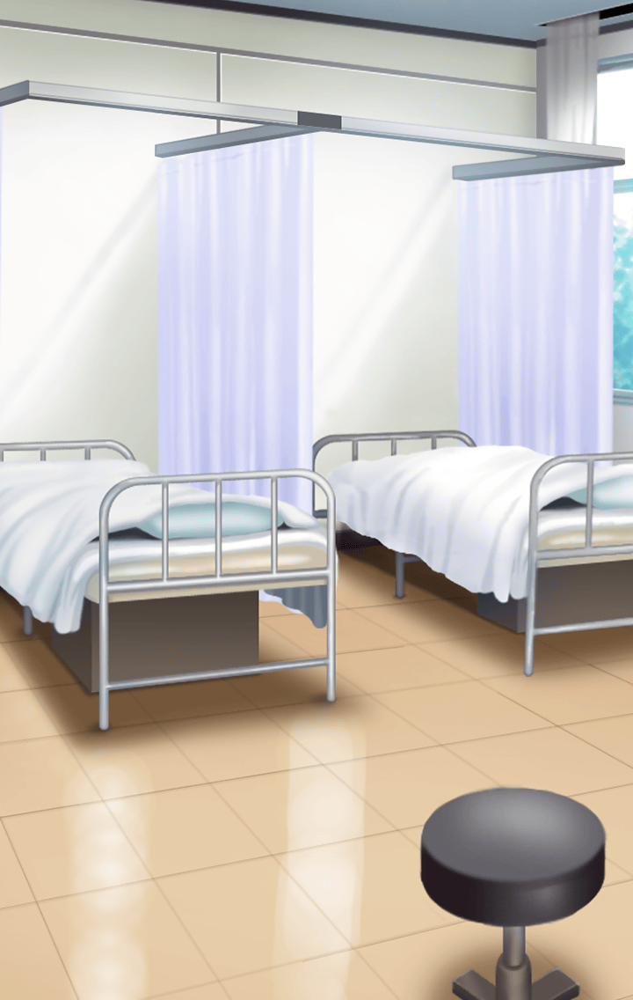

60231201

[View script in lisp](../scripts/60231201.txt)

それは学園で起こる事件を
解決して回っていた
ある日のこと…

【さくら】
あ……あれ？

【ケロちゃん】
やっと目ぇ覚ましたか

【ケロちゃん】
浄化が終わって
一件落着かと思ったら
いきなり倒れたんやで

【さくら】
ケロちゃん…

【ケロちゃん】
何時間も寝たままやから、
心配したで、ほんま

【さくら】
ケロちゃんがここまで
運んでくれたの…？

【ケロちゃん】
いや、それは…

大丈夫だった？

【さくら】
マ、マスターさん！

【さくら】
マスターさんがここまで
運んでくれたんだ…？

ビックリしたよ、
急に倒れたから

と、マスターが答える

【さくら】
ご、ごめんなさい…！
みんなに迷惑かけちゃって…

迷惑だなんて思ってないけど…
相当、疲れてるみたいだね？

心配そうに尋ねるマスター

【さくら】
そ、そんなことないよ！

と、ベッドから
起き上がろうとするが、
すぐさまふらついてしまう

【さくら】
うー、そうかも…

【ケロちゃん】
ほら？無理すんなや、さくら

【ケロちゃん】
慣れへん世界でのできごとに
体力的にも精神的にも相当
疲れとるはずやろ

【さくら】
うぅ～、情けない…

うぅん、
がんばってくれてるよ

マスターが彼女に
励ましの言葉をかける

【さくら】
………

…が、マスターの声にも無言のさくら

どうしたの？
マスターが尋ねると…

【さくら】
わたし…
もっと成長したい

【ケロちゃん】
どないしたんや、さくら…？

【さくら】
今のままじゃダメ…
学園のみんなを守るためには…

【さくら】
もっと成長しないと…！

布団を握り締める手に
力が入るさくらだった

Next: [60231202](60231202.md)

[Back to index](index.md)
