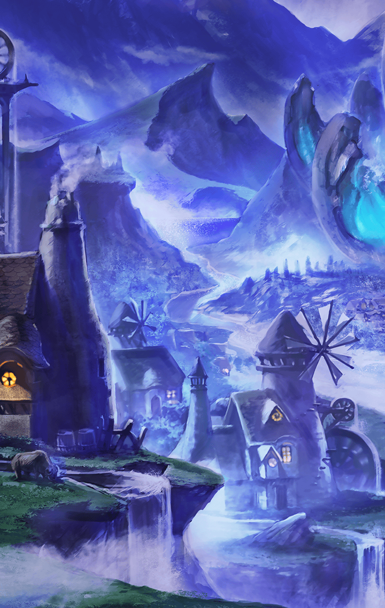

[View script in lisp](../scripts/6060102.txt)

**【黒奏官】**
…ずいぶん、
派手にやられたようだな

**【エンヴィ】**
すみません…
マスター…

**【プライド】**
アンビリィバボォだよ、マスター！
わたしが…こんなベァッドな
気分にさせられるなんてっ…

**【黒奏官】**
まさか復活してしまうとは…
初見でアレの相手は
分が悪かっただろう

**【黒奏官】**
ご苦労
下がって休んでいろ

**【プライド】**
リベンジするデス！
マスター、今度こそあいつらを
キルするから――

**【黒奏官】**
分かっている
そう、焦るな

**【プライド】**
ソォリー…

**【エンヴィ】**
し、失礼いたします…

**【ラース】**
お呼びでしょうか、主君

**【ラスト】**
エンヴィとプライドは
任務に失敗したようですね

**【黒奏官】**
起きなくて良い奇跡が起こって
しまったようだ
早急に手を打つ必要がある

**【黒奏官】**
ラース、ラスト
今から指定する地に向かい、
全てを破壊してこい

**【黒奏官】**
いいか“全て”だ
一つ残らず消し去ってこい

**【ラース】**
君命、しかと承りました！

**【ラスト】**
お任せ下さい
奇跡は二度も起きません

**【黒奏官】**
さすがに“奴ら”が
目覚めるのはまずいな…
なんとしても食い止めねば

**【古文書】**
――ラグナロクの下に案内して
もらえることになった私達は、
途中、ある村に立ち寄った

**【古文書】**
――そこで私達は、村人から
大変な歓待を受けた

**【村長】**
ようこそお出で下さいました！
ミネルヴァ様、フライシュッツ様
お連れの方も、ようこそ

**【村人１】**
どうぞ、こちらへ
すぐにお食事をお持ちいたしますので
くつろいでいてください

**【村の子ども達】**
おっぱいお姉ちゃんだ！
ちっちゃい姉ちゃんもいるぞーっ

**【フライシュッツ】**
うふふふふっ！
みんな元気だった～？
再会のハグしよ～♪

**【ミネルヴァ】**
私達に気遣いは
無用だと言っているのですが…
ありがたいことですね

**【フレンネル】**
すごいな…
村を挙げての歓待じゃないか

**【リベリオン】**
こいつらが大人気ってのは
本当だったんだな

**【村人２】**
そこのアンタ！
大人気だなんて言い方は
キラープリンセス様に失礼だろっ

**【村人３】**
キラープリンセス様は
私達を異族から守ってくださる
英雄なんですよ！

**【村人４】**
崇め敬うのが当然じゃないか！
口の利き方に気をつけろっ

**【リベリオン】**
おいおい…
この人気ぶりは異常だぞ

**【フレンネル】**
それだけ、彼女達が皆の希望に
なっているということだ

**【リベリオン】**
まあ、確かに実力は相当なもんだ
あいつらが“こっち”に来てくれたら
かなり助かるんだがな…

**【村長】**
さあさあ、お連れの方もどうぞ！
キラープリンセス様のご来訪に
乾杯いたしましょう

**【リベリオン】**
おい！
起きろ、フレンネルっ

**【フレンネル】**
どうした、こんな夜更けに…？

**【リベリオン】**
遠くで火の手が上がってやがる！
あの方角にはなにがあるんだ！？

**【フレンネル】**
あっちは…確か町があったはずだ！
異族の襲撃か！？
急いで彼女達を起こそうっ

**【ミネルヴァ】**
もう起きています
ほら、行きますよフライシュッツ

**【フライシュッツ】**
ん～…？
お肉美味し～♪

**【ミネルヴァ】**
寝ぼけて
私に噛みつかないでください！

**【リベリオン】**
ったく、大丈夫かよ！？
