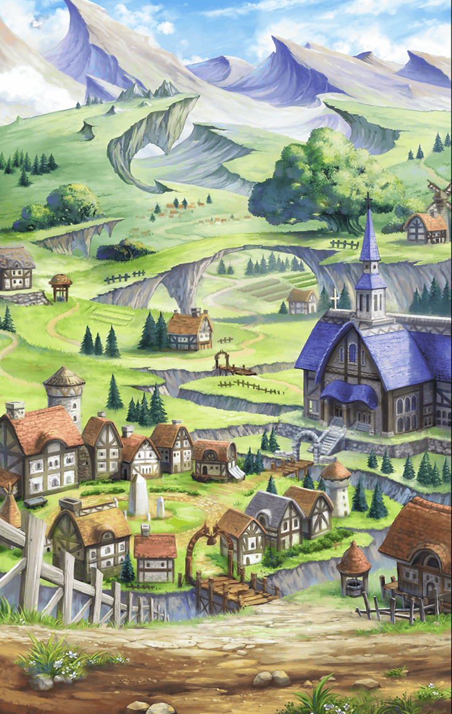

[View script in lisp](../scripts/6060110.txt)

【リベリオン】
いくぞ神とやら！
ウオオオオオオオオオオオ！！

【ガブリエル】
これは不思議なものを
見ることになりましたね
ですが…

【リベリオン】
ガハッ…！
やっぱ神ってのは、
伊達じゃねえな

【ラグナロク】
でも、十分よ
白き意志は、誰にも砕けはしない！

【ガブリエル】
甘いですよ

【リベリオン】
お前の相手は俺だ！
はぁああああああああ！

【ガブリエル】
…しつこいですね
こちらも少し本気でいきます
消滅なさい！！

【リベリオン】
来るぞ！

【ラグナロク】
分かってるわ

【ガブリエル】
…爆風に紛れて逃げましたか
まあ、いいでしょう
知りたいことは分かりました

【ガブリエル】
次に会ったときこそ
“終わり”にいたしましょう

【フレンネル】
みんな！二人が戻ってきたぞ！

【フライシュッツ】
良かった～♪
きゃっ…酷い怪我…
お姉ちゃん、心配だよぉ

【ダモクレス】
あはは
心配しても死ぬときは死ぬよ～

【ダモクレス】
でも、愛があれば問題ない！
クレス、救急箱もってくるね☆

【スイハ】
救急箱ならもって来ています

【ミネルヴァ】
さすがスイハですね
すぐに手当を

【ラグナロク】
この傷は…革命のための道標よ…
心配しなくて良いわ

【リベリオン】
…ちょっとだけ手こずったぜ

【フレンネル】
なにがちょっとだ！
戻ってきてくれて…本当に良かった…

【リベリオン】
泣いてんのか…？
なんで…お前が泣く

【フレンネル】
私は…私の不甲斐なさが悔しいんだっ
戦うことを君達に任せきっていた

【リベリオン】
仕方ねぇだろ…
お前は…戦う術を持たねえんだから

【フレンネル】
いや、私にも戦うことはできるんだ
私にしかできないやり方で

【フレンネル】
ラグナロク…敵の強大さは
身をもって知ったはずだ
倒すためには準備が必要なんだよ

【フレンネル】
頼む！
私達と手を組んでくれっ
未来の勝利のために！

【ラグナロク】
…リベリオン
いちおう、礼を言っておくわ…
あなた達と組むのもありかもね

【リベリオン】
へっ…
そういうところもアイツに似て
やがんな…

【フレンネル】
ありがとう、ラグナロク！
ここから反撃の狼煙を上げるぞっ

【古文書】
――神々を騙し、
キラープリンセスの
組織を作り上げる

【古文書】
私はフレンネル家の《使命》を
全うすべく全力で動き出した――

Next: [6070101](6070101.md)

[Back to index](index.md)
