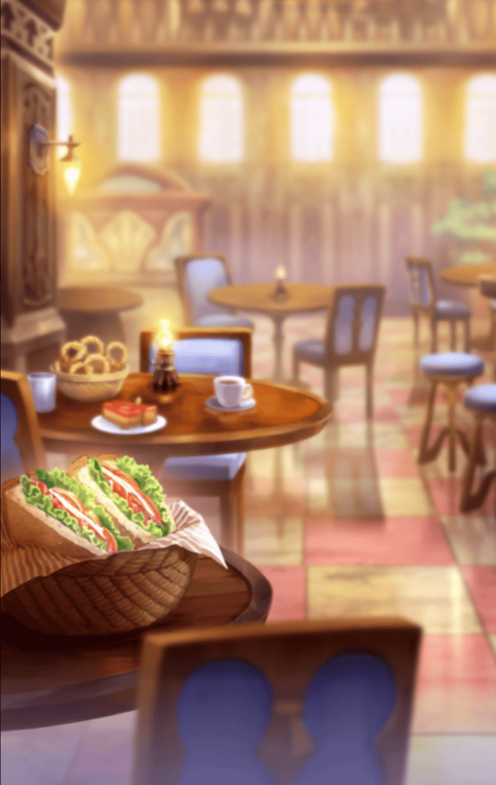

[View script in lisp](../scripts/620121212.txt)

**【ミーミル】**
……

マスターとティルフィングの後ろを、
神妙な面持ちで歩くミーミル

**【ミーミル】**
お買い物にお供すると言って
しまいましたが…

**【ミーミル】**
せっかくお二人で過ごすお時間に
私がいては邪魔にならないでしょうか…

そんなことを考えながら、
歩いていると――

**【ティルフィング】**
着きましたよ

**【ミーミル】**
…！

**【ミーミル】**
ここは……

彼女の目の前には、
街一番の品揃えを誇る
大きな文具屋が

**【ミーミル】**
ここで、一体どのようなものを？

**【ティルフィング】**
それは……

**【ティルフィング】**
ミーミル……
私とマスターから、
アナタへのプレゼントです

**【ミーミル】**
………

**【ミーミル】**
………

**【ミーミル】**
……え？

呆気に取られ過ぎだって
と、マスターが笑う

**【ティルフィング】**
ミーミル
これまでずっと
長旅ご苦労様でした

**【ティルフィング】**
アナタは立派にやり遂げました

**【ティルフィング】**
私たちは、
そんなアナタを
誇りに思います

**【ミーミル】**
……ティルフィング様

**【ティルフィング】**
なので、その想いを込めて、

**【ティルフィング】**
私たち二人から、
なにか贈り物をしようと
いうことになったのです

サプライズでね
と、マスターが優しい笑顔を見せる

**【ミーミル】**
………

**【ミーミル】**
……そんな…

**【ミーミル】**
……私には勿体ないです

**【ティルフィング】**
そのようなことはありません
私たちがアナタに
贈り物をしたいんです

**【ティルフィング】**
アナタは遠慮してしまうから
先に買っておこうかとも考えましたが

ミーミルに選んで欲しいんだ
と、マスターはティルフィングと
視線を交わして告げる

**【ティルフィング】**
ミーミル
アナタの欲しいものは何ですか？

**【ミーミル】**
私は……

それから――

買い物を終えた三人は、
街の食堂で食事を取っていた

**【ミーミル】**
本当によろしいのですか……？
このような素敵な品を

**【ティルフィング】**
遠慮はいりませんよ

**【ティルフィング】**
前から少し気になっていました

**【ティルフィング】**
アナタは、
いつも私たちの半歩後ろを
歩こうとしますが……

**【ティルフィング】**
私はミーミルとも
並んで歩きたいんですよ

**【ミーミル】**
……

**【ミーミル】**
……やっぱり

**【ミーミル】**
私には勿体ないですよ

――とか言いつつ、
笑みが溢れ出てるよ
とマスター

**【ミーミル】**
！！

**【ミーミル】**
も、申し訳ございません…！

頬を真っ赤に染めるミーミル

**【ティルフィング】**
ミーミル、
その日記帳に書き綴って
欲しいのです

**【ティルフィング】**
アナタの新しい日々を

――と、

お待たせしました
ミーミルの前に
料理が運ばれてきた

**【ミーミル】**
……！

**【ミーミル】**
これは…なんとも

彼女が目を奪われたもの

それは、
お子様ランチに刺さった旗だった

**【ミーミル】**
……今まで…
本当に色んなことがありました

旗を見つめながら、
ミーミルはこれまでの旅を回顧する

**【ミーミル】**
私とマスター様が旅立った日…
あの日もティルフィング様は
おっしゃいました

**【ミーミル】**
この世界は『美しい』と

**【ミーミル】**
今日、御二方に誘って頂き、
街を一緒に歩いて、
その一端を垣間見れた気がします

**【ミーミル】**
旅の最中は使命感に駆られ、
感じる余裕もありませんでしたが

**【ミーミル】**
日常とは、とても素敵な
ものなのですね

辺りを見渡しながら、
彼女は語り続ける

**【ミーミル】**
そして…

**【ミーミル】**
誰かと囲む食卓が…
こんなにも楽しく、温かいなんて

**【ミーミル】**
この感情も……
『美しい』に
繋がってゆくのでしょうか

微笑みながら尋ねるミーミル

そんな彼女に、マスターが答える
きっとミーミルがそう感じるのは、
「誰か」とだからじゃないよ

**【ミーミル】**
……え？

**【ティルフィング】**
マスター……

だって、僕たちは…
――と、マスターが
なにかを言いかけた時、

バシャッ！
とフラッシュが焚かれた

**【ミーミル】**
！

素晴らしい笑顔だね～！
街の写真家が、
三人の姿を撮ったのだ

どうぞ、お嬢ちゃん！
写真家から手渡された写真を見て、
ミーミルは呟く

**【ミーミル】**
……素敵な笑顔

写真家は答える
こんな最高の笑顔ができるのは
いい家族の証拠さ

**【ティルフィング・ミーミル】**
！！

**【ミーミル】**
……家族

**【ティルフィング】**
…まぁ

頬を赤くしながら
顔を見合わせるマスター、
ミーミル、ティルフィング

笑いながら去っていく写真家を
目で追いながら、マスターは言う
驚いたな、他の人にもそう見えるのか

**【ミーミル】**
どういうことです？

さっき、言い掛けた言葉
だって僕たちは……家族だから
そう伝えたかったんだ

**【ミーミル】**
……マスター様

**【ティルフィング】**
なるほど、私たちは……

**【ティルフィング】**
共に助け合った……
血よりも強い繋がりを持った
家族なのですね

**【ミーミル】**
…ティルフィング様

照れ臭そうに微笑み合う三人だった

その夜――

ミーミルは、
宿舎でマスターに語っていた

**【ミーミル】**
マスター様、世界は広いですね

**【ミーミル】**
今日だけでも、
たくさんの気づきがありました

**【ミーミル】**
ですから……

**【ミーミル】**
私はもっと、
この世界のことを識りたいと思います

**【ミーミル】**
ティルフィング様が『美しい』と
仰ったこの世界は、
きっと素晴らしい世界ですから

微笑んだ彼女の瞳は、
キラキラと輝いていた
