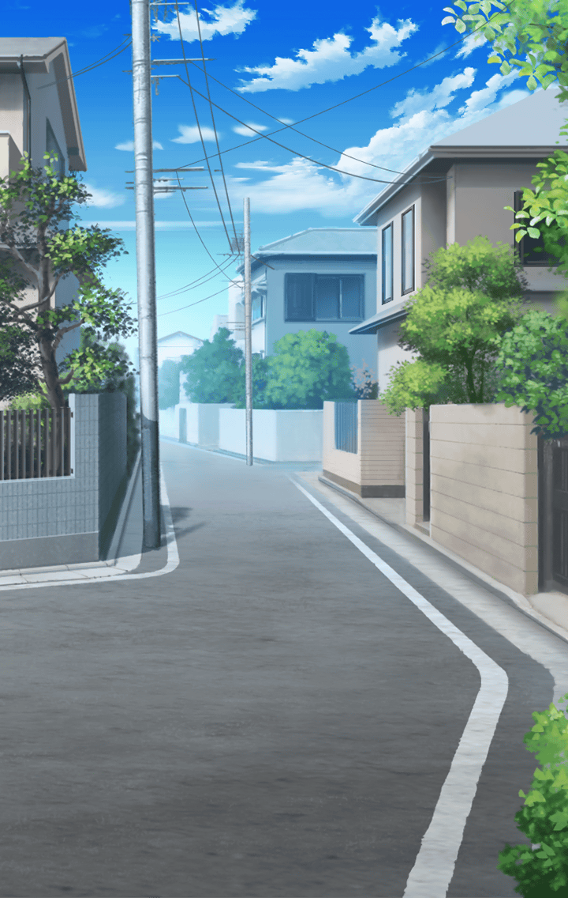

**【与一】**
みんな頑張ってるのにな

**【与一】**
裏方として、
みんな認めてくれてるけど…
本当にこれでいいのかな

**【与一】**
わたしも、みんなみたいに
力があれば…

**【与一】**
そうすれば、
もっとみんなの役に立てる

**【与一】**
本当の意味で日常を取り戻せる仲間に
なれるんじゃないかって…
思っちゃう

**【？？？】**
『もし、お嬢さん』

**【与一】**
えっ…

**【与一】**
だ、誰！？
って、露店？

**【与一】**
すみません
びっくりして大声を出してしまって

**【与一】**
あれ、いつもここを通って
登校してるけど
こんな店はあったかな？

**【露天商】**
『いいんだよ
　それよりお悩みかい？』

**【与一】**
え、いえ、その…
悩みなんて、ありません！

**【与一】**
どうしよう…
悩み、口にしちゃってたかな

**【与一】**
そっか…
こんな風だから、
わたしには力が宿らないのかも

**【露天商】**
『いいんだよ、隠さなくても
　そうだね、その悩みには
　これだね…』

**【与一】**
えっ？

それは独り言を頭の中で
呟いているうちに
いつの間にか手の中にあった

**【露天商】**
『お守りだよ
　ただの、お守り…』

**【露天商】**
『それを持っていれば、
　あなたの悩みも解決されるよ』

**【与一】**
悩みが解決される…

**【与一】**
…って、絶対怪しいよ！

**【与一】**
あの！
これ、お返ししま…
あれ、いない？

**【与一】**
来た方向にも、
向かう方向にもいない…

目の前にはぽつんと佇む、
薄汚れた露店のみ

**【与一】**
あっ、いけない
もうこんな時間！
集合時間に遅れちゃう！！

**【与一】**
これは今度、ちゃんと返そう
