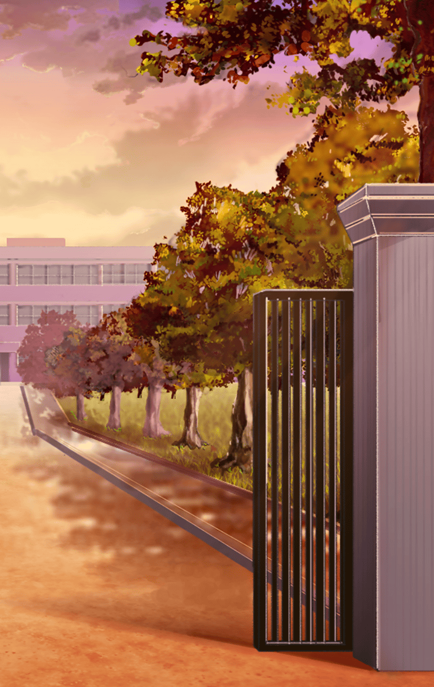
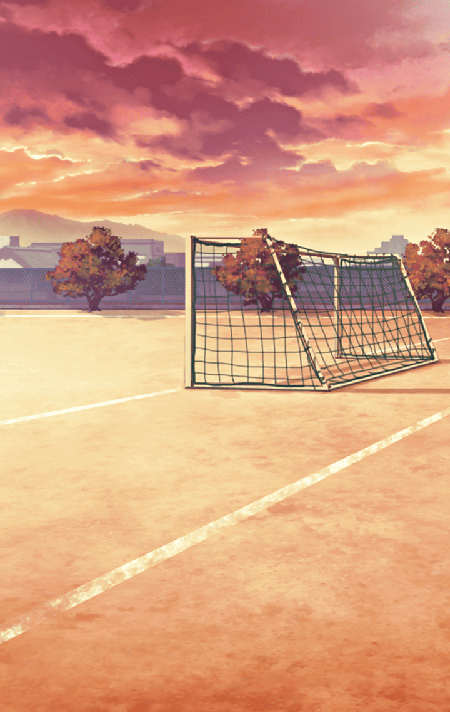

[View script in lisp](../scripts/710025073.txt)

[View source in markdown](710025073.md)

**【マスター】**
今日もみんなの頑張りで解決だね

**【与一】**
みんなの頑張りで、か…

**【ケロちゃん】**
よっしゃ！
あらかた浄化も終わったし
そろそろ切り上げ時やな

**【ロンギヌス】**
ふぅ、そうですね…

**【ナーゲルリング】**
さすがに疲れました
今日はゆっくり寝られそうです

**【さくら】**
なんだか
日に日に暴走しちゃう生徒さんが
増えてる気がするね…

**【与一】**
みんな、なんだかつらそう

**【ナーゲルリング】**
そうですね
起こるべき事件を未然に防ぐ
防いでいけばなくなる

**【ナーゲルリング】**
そうなると思っていたのですが…

**【マスター】**
根本的な何かを
僕たちは見落としてしまって
いるのかな？

**【ナーゲルリング】**
少し、考えなければいけないですね

**【ロンギヌス】**
さくらちゃん、
向こうの学校との両立は
大変じゃないですか？

**【ロンギヌス】**
最近、こちらの世界にいる時間も
事件に比例して長くなっている
気がします

**【さくら】**
そうかも…
でも、笑顔を守る部活って
すごく意味のあることだと思うの

**【さくら】**
変ないい方だけど
こうやってみんなと一緒の時間が
増えて

**【さくら】**
友達と一緒にいるっていいなって
すごくいいなって思ってるんだ

**【ロンギヌス】**
そっか、ならよかった！

**【与一】**
ごめんね
わたしもみんなみたいに
浄化のお手伝いできたらよかったのに

**【さくら】**
与一ちゃん？

**【与一】**
あ、ううん

**【与一】**
そうしたら、
ただみんなと過ごすだけの時間が
増えるのにって思っただけだよ

**【与一】**
ああ、失敗しちゃいました
変な雰囲気にしちゃいました

**【与一】**
こんなはずじゃなかったのにな

**【与一】**
でも、なんでさくらちゃんと
一緒にいるのに、わたしは新しい力、
得られないんだろう

**【与一】**
でも、くよくよしてちゃダメだよね
できること、できることを
やらなくちゃ

**【与一】**
よし、明日も…あれ？

**【与一】**
あの人、なんかフラフラ歩いて…

**【与一】**
ど、どうしよう！？
もしかすると、浄化しなきゃいけない
人かもしれない！

**【与一】**
さくらちゃん達を今から呼びに…

行きかけて与一の足は止まった

『できること、できることを
　やらなくちゃ』

**【与一】**
うん…

**【さくら】**
与一ちゃん、
大丈夫かな…

**【マスター】**
うん、最近元気がないんだ
思い当たる節はある

**【マスター】**
自分だけ、
新しい力を手に入れられてないのを
気にしてるんだと思う

**【さくら】**
与一ちゃんは与一ちゃんだよ
明るくて、前向きで…
みんなのためにいつも

**【マスター】**
うん
だから気にすることないって、
僕の口から言おうと思ってる

**【さくら】**
うん…

**【マスター】**
そういえばケロちゃんは？
こういう話をするとき、
いつも明るくしてくれるのに

**【ケロちゃん】**
はぁ、わかってないなぁ
わいもわいで忙しいんやで？

**【マスター】**
お、ずいぶんと考え込んでる様子だね
どうしたの？

**【ケロちゃん】**
どうしたもこうしたもあらへんがな
こっちの世界に来てからというもん
わいはずっと調べてるんやで

**【ケロちゃん】**
けど、
いまいちこのトンネルのメカニズムが
わからん

**【ケロちゃん】**
なんか日に日に
丈夫になってる気さえするし

**【ケロちゃん】**
そうや、
いっそ、一度壊してみるのも
いい手かもしれへんな！

**【さくら】**
ケロちゃん！
そんなひどいこと言ったら、
おやつ抜きだよ！！

**【ケロちゃん】**
そんな…！
わいの生きていく上での楽しみなのに
堪忍したってや…

**【さくら】**
もう！

**【ケロちゃん】**
ダメか…
マスターはんもそんな怖い顔せんで
なんとか言ってくれへんかな？

**【マスター】**
いや、別に怖い顔は
というかこれ…？
何か感じない？

**【さくら】**
わたしは何にも感じないよ

**【マスター】**
いや、これは…？

**【マスター】**
！？
二人とも急いで！

**【マスター】**
与一…

**【与一】**
見ましたか、マスター！
わたし、ついに力を手に入れました
みなさんを助けることができる力です

**【さくら】**
わあ、与一ちゃんすごい…

**【ケロちゃん】**
たいしたもんやな、一人で
必殺技でも隠しとったんかいな？

そこには浄化をおこなった
与一の姿があった
だけど…

**【ケロちゃん】**
なあ、さくら…
おかしないか？

**【さくら】**
うん…わたし、
いつもの気配なんて感じなかったよ

**【ケロちゃん】**
どないなっとんねん！
さくらが感知できへん新種の相手が
現れたってことかいな！？

**【マスター】**
いや、感じたよ
僕が感じた

**【ケロちゃん】**
なんやて、そいじゃあ…

**【マスター】**
あれは、
僕らがいつも浄化してた現象だ

だが与一の喜ぶ姿が映り
マスターは掛けるべき言葉を
うまく見つけられなかった