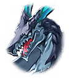

710025103 限定クエスト カードキャプターさくらコラボ さくらコラボ ストーリークエスト　後編 さくらコラボストーリー 後編 2 - 「真相」 さくらコラボ EP9 「真相」 戦闘後

[View script in lisp](../scripts/710025103.txt)

【イビルドレイク】
『何か大きな勘違いを
　しているようだな
　全てが我のせいだと？』

【イビルドレイク】
『我は摂理に反した存在を
　利用させてもらっただけのこと』

【イビルドレイク】
『貴様らは違和感を覚えなかったか？
　自分たちのもとに起こる現象の
　根幹にいる異質な存在を』

【マスター】
異質な存在…？

【マスター】
そっか…
実は僕も気になることがあって…

【ロンギヌス】
どうしたんですか？
すごく心細そうな顔をしてます

【マスター】
えっ、ロンギヌス…
その姿は？

【ロンギヌス】
えっ、ええっ！？

【さくら】
わたしたちは夢の中で
感じた気配を追ってきたの

【さくら】
そしたら、偶然あなた達を見つけたの

【マスター】
もしかしたら、あの、
暴走した生徒の気配がわかるのか？

【さくら】
はい、たぶん

【ナーゲルリング】
やはり他学園と同様の事件は
ここでは起きていないようですね
しかし、どういうことでしょう

【ロンギヌス】
うちの学園でも
聖ユグドラシル姫学院でも
起こってるのに

【マスター】
でも、なにも起きてないことは
いいことだよ

【ナーゲルリング】
緊急事態です
いってみましょう！

【生徒】
――――！

【ロンギヌス】
そんな…

【ナーゲルリング】
そういうこと…

【与一】
えっ、ええっ？

【マスター】
さくらちゃんしか予期できない
さくらちゃんがいるところで起こる
ということは…

【さくら】
そんな…

【イビルドレイク】
『異質な者の混入によって
　引き起こされた
　この世界を脅かす不具合…』

【イビルドレイク】
『根幹に自分がありながら
　それに立ち向かう姿は…
　ははは、ずいぶんと滑稽だった』

【イビルドレイク】
『現象は予期せぬことだったが、
　我は存分に利用させてもらった』

【さくら】
わたしたちのせいで
いろいろなことが
起こっていたってこと…

【ケロちゃん】
悪魔やな
わいらがやってたこと
陰から見てたちゅうことか

【イビルドレイク】
『悪魔結構…どうだ？
　自分たちの愚かさに
　さぞあきれたことだろう？』

【マスター】
……なことない

【イビルドレイク】
『んんん…？』

【マスター】
そんなことない

【イビルドレイク】
『では、なんだというんだ？』

【マスター】
友達を利用していたことに
怒ってるんだ！

【ロンギヌス】
わたしも同じ気持ちです
こんな気持ち抱いたことない

【ナーゲルリング】
そうです
私たちが築き上げてきたものは
こんなことで崩れたりしません

【与一】
ですよね
さくらちゃん？

【さくら】
みんな…うん！

【ケロちゃん】
さくら…
ええ、友達できてよかったな

【マスター】
ケロちゃんもだよ？

【ケロちゃん】
わかっとるがな
それじゃ、気を取り直して
いっちょう、いくで！！

Next: [710025111](710025111.md)

[Back to index](index.md)
