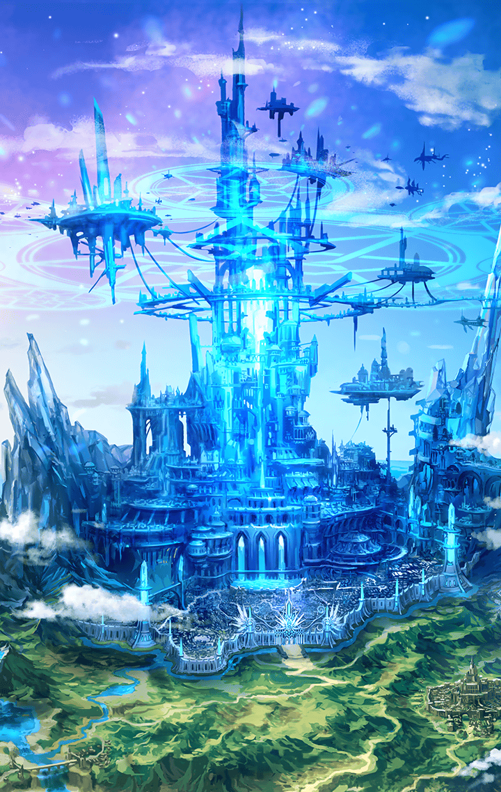

710026031 限定クエスト 未分類 クリユニコラボ「Phantom of RE:UNION」 「Phantom of RE:UNION」 3 - 「Phantom of RE:UNION」メルリヌス編 第3話 クリユニコラボ_EP3 クリユニコラボ_3話戦闘前

[View script in lisp](../scripts/710026031.txt)

【ダーインスレイヴ】
ふむ…
魔獣エキドナ…

【フォルカス】
私達の探している怪物と
メルリヌスの追っている魔獣…
それが、同一のものだと？

【メルリヌス】
そうに違いないわ
だって、わたしは…

【メルリヌス】
そう…わたしは
王様に仕える英雄として
魔獣討伐の任務にあたっていたの

【メルリヌス】
そして、あと一歩というところまで
エキドナを追い詰めた
ところが、どういうわけか…

【メルリヌス】
突然エキドナは『こちらの世界』に
飛ばされてしまった…
そして…

【メルリヌス】
エキドナを追いかけたわたしも
同じように『こちらの世界』…
この場所にたどり着いたのよ

【メルリヌス】
『こちらの世界』に着いてからも
わたしはエキドナを探し続けてたわ
でも…

【ダーインスレイヴ】
逃げられてしまったのか？

【メルリヌス】
まあ、残念ながら…ね

【メルリヌス】
…見て
そこにエキドナがいたの

メルリヌスが指し示した、丘の影…
茂る草の燃え焦げた跡には
紅い布の切れ端が落ちていた

【フォルカス】
なんです、この布は…
はためくように軽いのに
やけに頑丈な…

【ダーインスレイヴ】
見たことのない素材だ…
異世界の、魔獣の持ち物か？

【メルリヌス】
そういうことよ
倒しきれなかった魔獣は
次にいつ、どこに現れるか…

【ダーインスレイヴ】
さて、再び異族が迫ってきたぞ
話の続きはやつらを片付けてからだ

Next: [710026033](710026033.md)

[Back to index](index.md)
