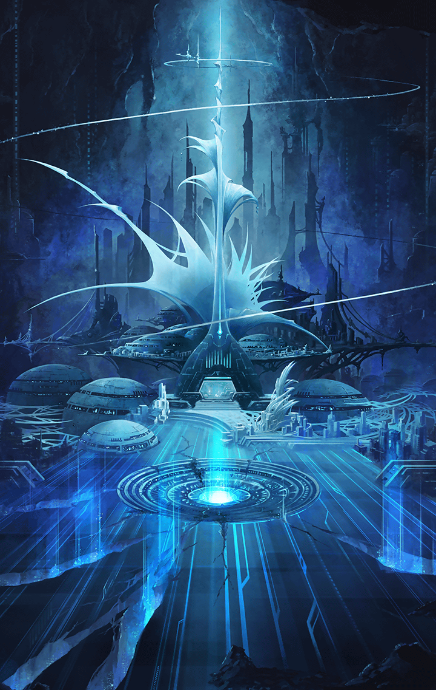

719052301 Event Play #143 mypage 2019-05-23 19:00:00 ~ 2019-05-30 23:59:59

[View script in lisp](../scripts/719052301.txt)

七人の
共鳴無き仮面の執行者

七人の
共鳴無き仮面の執行者

七人の
共鳴無き仮面の執行者

七人の
共鳴無き仮面の執行者

新たな仲間とともに

信念と信念がぶつかり合う

そして、もう一人の
「彼女」の存在とは――

新章15章
『[8A2BE2]ソリタリー・ホープ[-]』
開幕

ストーリーをクリアして称号
『ソリタリー・ホープ』を
手に入れよう！

また、パネルミッションを
コンプリートして
[FF0000]ギアネクトル[-]をGET!

詳しくはお知らせをチェック！

詳しくはお知らせをチェック！

クラスチェンジ開放ユニット
3体追加！

エロース・聖鎖・ハニエル

【フローズンマスター】
【ホークアイ】
【アサルトハンター】

ムラマサ・獣刻・ヤマタノオロチ

【ブラストマスター】
【ダークメシア】
【妖刀剣鬼】

シユウ・D. plug・ベルゼブブ

【シャドウマスター】
【バーサーカー】
【ランバージャック】

5/24～ピックアップガチャ開催！
クラスチェンジ素材をゲット！

5/24～ピックアップガチャ開催！
クラスチェンジ素材をゲット！

覚醒ユニット2体登場！

ゲイボルグ
[FF0000]覚醒！[-]

ゲイボルグ
[FF0000]覚醒！[-]

【ゲイボルグ】
魔槍に貫けぬものなし…

ミトゥム
[FF0000]覚醒！[-]

ミトゥム
[FF0000]覚醒！[-]

【ミトゥム】
へっ！こんなところで
止まってられるかよ！

イベントクエスト
「淘汰の彼方に」開催！
さらに…

オティヌス
神器登場！

神器探求
「無尽弩・オティヌス編」開催！

こちらも
お知らせを要チェック！

こちらも
お知らせを要チェック！

Next: [719052401](719052401.md)

[Back to index](index.md)
