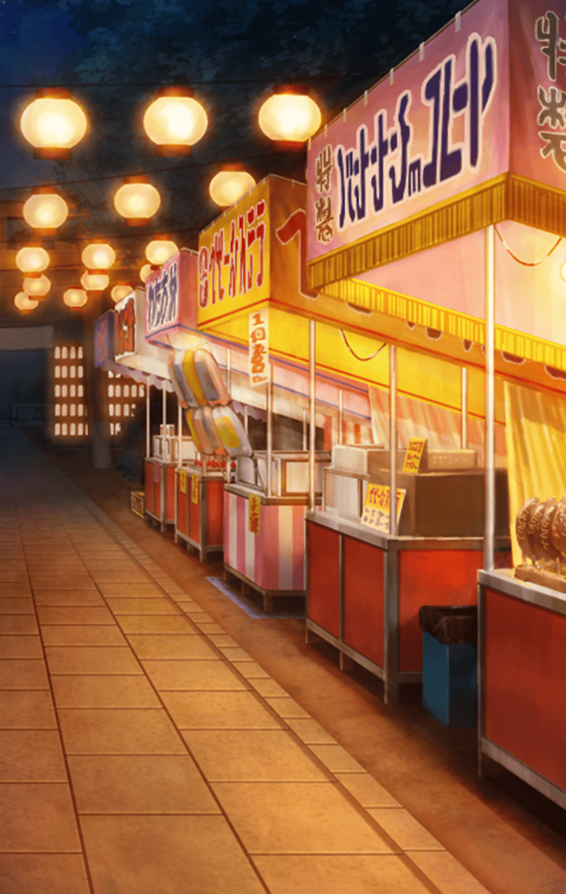

[View script in lisp](../scripts/777610142.txt)

お祭りをマスターと
まわっているティルフィング

【ティルフィング】
マスターは凄いですね
あんなに薄っぺらい紙で
金魚をすくうなんて

【ティルフィング】
私なんて、すぐに
破けてしまったのに

でも、射的は
ティルフィングに敵わないよ、
と笑うマスター

【ティルフィング】
お店の方には悪いことを
してしまいました
賞品を全部取ってしまうなんて

でも、結局は全部返したんだから
いいんじゃない、とマスターが言う

【ティルフィング】
そうですね
でも、本当に新鮮で楽しかったです

【ティルフィング】
あ、マスター
リンゴ飴ですよ
一緒に食べませんか？

【ティルフィング】
…残り一個でしたね
マスターが食べて下さい

いいよ、ティルフィングが
食べて、とマスターが
リンゴ飴を渡す

【ティルフィング】
えっと…あ、そうだ
それじゃ、一緒に食べましょう！

【ティルフィング】
マスター、どうぞ

Next: [777610143](777610143.md)

[Back to index](index.md)
