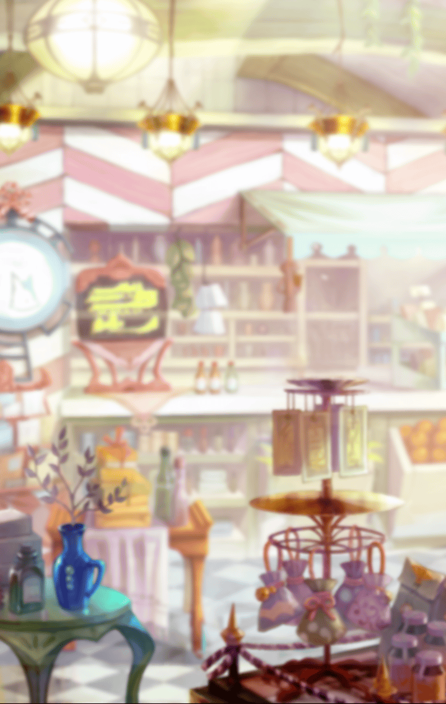

[View script in lisp](../scripts/777640071.txt)

[View source in markdown](777640071.md)

晴れ渡る空の下
シェキナーは友人と
町へ買い物に訪れていた

**【シェキナー】**
あら、見てください
こちらのアクセサリー
とても煌びやかで素敵ですね

**【シェキナー】**
この髪飾りも
差し色として映えそうです
もっと派手でも良いですが

**【シェキナー】**
……もう、
貴方も何か言ってください
気になる品はないのですか？

**【シェキナー】**
今日は貴方が着る服を
見に来たという目的も
あるのですから

**【シェキナー】**
貴方が選ばないのでしたら
私が選んで差し上げましょう
この服なんてどうですか？

**【シェキナー】**
え……？
私の服装が規律違反ですって？

**【シェキナー】**
も、もう…
何を言っているのですかっ
まったく……

**【シェキナー】**
これは戦化粧のようなものです
私には派手な格好が
よく似合いますから

**【シェキナー】**
煌びやかな宝石や衣装こそ
高貴なる私の輝きに相応しいのです

**【シェキナー】**
……それに、
もし、誰かの心が暗闇で迷った時
道を指し示す輝きが必要ですから

**【シェキナー】**
ふふふ、何でもありません
ところで、こちらはどうでしょう
似合っていますか？

試着した姿を見せるシェキナー
お洒落を楽しむ彼女の笑顔は
宝石のように綺麗で魅力的だった
