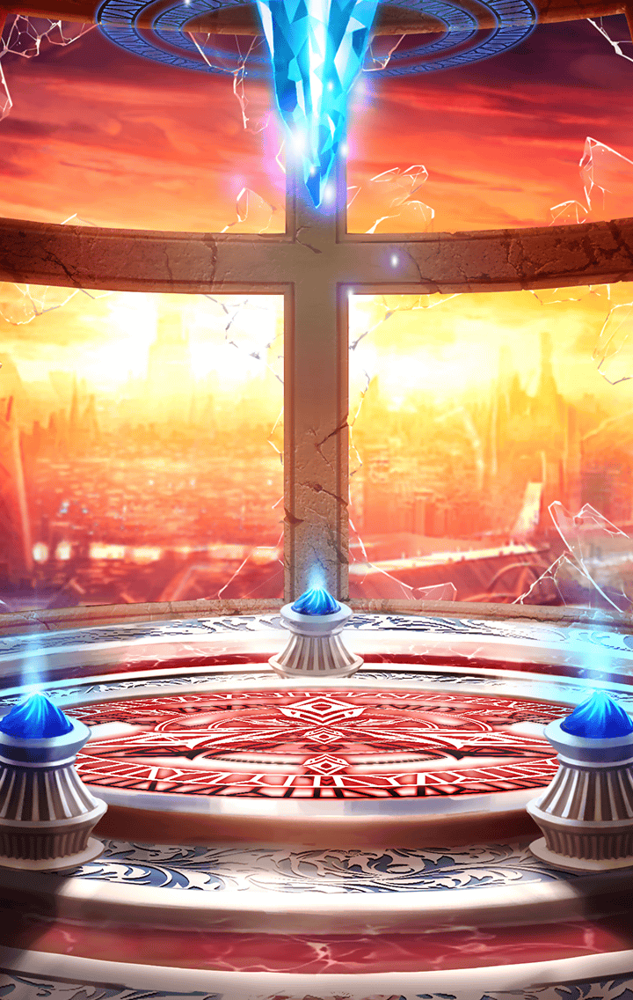

901060002 地上編 1章 大樹を目指して 第6話 予期せぬ援軍　終了後

[View script in lisp](../scripts/901060002.txt)

【ヴァリン】
ハア…ハア…
なんとか逃げ切ったわね…

【ティルフィング】
皆さん、ありがとうございます
危ないところでした

【ゼロ】
俺はまだやれた
コイツが止めたんだ…

【ヴァリン】
アンタねえ…そういえば、
アルンはどうして
助けが来るって分かったの？

【アルン】
あ、いえ…
なんとなく、そう感じただけで…

【ゼロ】
なんとなくだと！？
そんな曖昧な感覚で
俺を止めたのか！？

【ヴァリン】
でも、実際助かったわ

【ヴァリン】
…やっぱり、
アンタはマスターとしての
バイブスを持っているのね

【ヴァリン】
共鳴するキラーメイル達の
キラーズを感じられるなんて

【アルン】
あの…一旦、近くの町まで戻って
今後のことを話し合いませんか？

【ゼロ】
そうだな…

【ゼロ】
ベルフェゴールを放って
魔壁に向かうだと！？

【ヴァリン】
そういう選択肢もあるって話よ
今の私達じゃ、
ベルフェゴールに勝てないわ…

【ティルフィング】
あの異常な回復力の
正体を突き止めないと
勝機はありませんね

【アルン】
…でも、アスカと約束したんです
必ずお父さんを助け出すって

【ヴァリン】
その気持ちは分かる…
でも、このままじゃ手詰まりよ
わかるわよね？

【ゼロ】
マスター、お前が決めろ
指揮権はお前にあるんだ

選択肢:
- …魔壁に向かいましょう → [select_label_01](#select_label_01)へ
- …このまま戦うわけにはいきません → [select_label_02](#select_label_02)へ
- …決められません → [select_label_03](#select_label_03)へ

マスター、お前が決めろ
指揮権はお前にあるんだ

#### select_label_01:

【ゼロ】
…分かった

#### select_label_01:
 → [select_label_end](#select_label_end)へ

【ヴァリン】
アルン、よく決断したわ

#### select_label_02:

【ゼロ】
勝機を探しに
魔壁へ行くっていうんなら、賛成だ

#### select_label_02:
 → [select_label_end](#select_label_end)へ

【ヴァリン】
まあ、状況が
変わる可能性もあるわよね

#### select_label_03:

【ゼロ】
やれやれ…コイツもベルフェゴールに
“意思”を吸われたようだぜ？
聞くだけ無駄だったな

#### select_label_03:
 → [select_label_end](#select_label_end)へ

【ヴァリン】
やめなさい！
だったら私が決めるわ
魔壁に向かうわよ！

#### select_label_end:

【ティルフィング】
…決まりましたね
夜が明けたら出発しましょう

Next: [901070001](901070001.md)

[Back to index](index.md)
