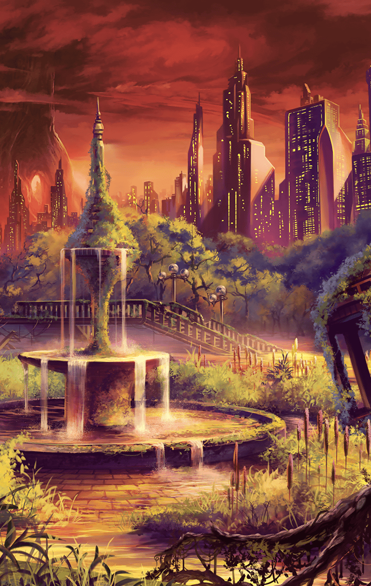

901090002 地上編 1章 大樹を目指して 第9話 魔獣化、そして暴走　終了後

[View script in lisp](../scripts/901090002.txt)

【ロンギヌス】
どうか…安らかな眠りを！

【ゼロ】
やったか…

【アスカ】
お兄ちゃん…
どうしてあんな風になっちゃったの…

【ヴァリン】
…アスカ…これが、
獣血を暴走させた
キラーメイルの末路よ

【ヴァリン】
人類を守るために
自分を犠牲にした戦士…

【ヴァリン】
彼はアスカを守ることで
彼の使命を果たしたのよ…

【アスカ】
お兄ちゃん…ありがとう…

【ゼロ】
どうやら、
感傷に浸ってる場合でもなさそうだぜ

【男２】
…あんた達、ラグナロクだよな？
さっきのアレはなんだったんだ？

【女１】
人間が、人間が魔獣化したわよ！
なんで！？どうなってるの！？

【男２】
お、お前らも
魔獣の仲間だったのか！？
俺達を騙していたのかよ！？

【アスカ】
ひ、ひどい！
お兄ちゃん達は
私達を助けてくれたのに…

【男２】
に…逃げろっ！
殺されるぞぉっ！

【女１】
ヒイイイイイッ…

【アスカ】
…なんで、なんでなの

【アスカ】
…キラーメイルは私達人類を
守ってくれる戦士なんでしょ…！？
なんで…

【ゼロ】
いいんだ、アスカ
とっくに覚悟していたことだ

【ダグダ】
しかし…
アスカを避難所に
帰し難くなってしまったな

【アスカ】
わたし、みんなといっしょに行く！

【ヴァリン】
ちょっと！
アスカ、なんてこと言ってんの！

【アルン】
…そうですね
お父さんを助け出すまで、
一緒に行動した方が良さそうです

【ヴァリン】
アンタまで！？

【ダグダ】
うむ。俺がこの子を守る
それでどうだろうか？

【ゼロ】
好きにすればいい
マスターも了承してるんだ
いいだろ、ヴァリン？

【ヴァリン】
ちょっと！
アンタ達は――

【ティルフィング】
はい、ヴァリン。チョコレートよ

【ヴァリン】
そんなんで騙されたり…
ふうむ、これはなかなか♪
…って、もう！

【アルン】
ベルフェゴールを倒さずして、
本当の解決はありません

【アルン】
皆さん、行きましょう…
これ以上、
悲劇を繰り返させぬために…！

Next: [902010001](902010001.md)

[Back to index](index.md)
