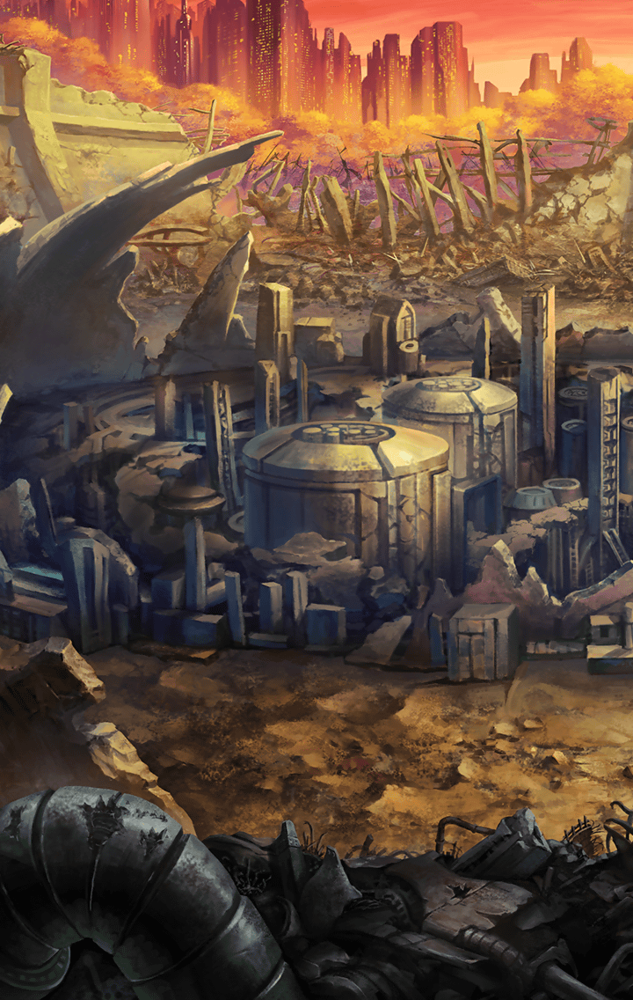

[View script in lisp](../scripts/902070002.txt)

**【ヴァリン】**
ゼロ！ゼロ、目を覚ましてっ！
こんな悪魔の罠に
負けてんじゃないわよ！

**【ベルフェゴール】**
無駄だって言ってるのにぃ、
お馬鹿なお嬢さんねぇ

**【ベルフェゴール】**
安心なさい
あなた達もすぐ、
『夢の国』に招待してあげるわぁ

**【ベルフェゴール】**
怠惰な夢に溺れて
幸せなまま死になさぁい

**【アルン】**
皆さん！ベルフェゴールを倒せば
ゼロにかけられた魔法も
解けるはずです！

**【アルン】**
あの悪魔を討ちましょうっ

**【ベルフェゴール】**
あらあら、まだ抗うつもりなのぉ？