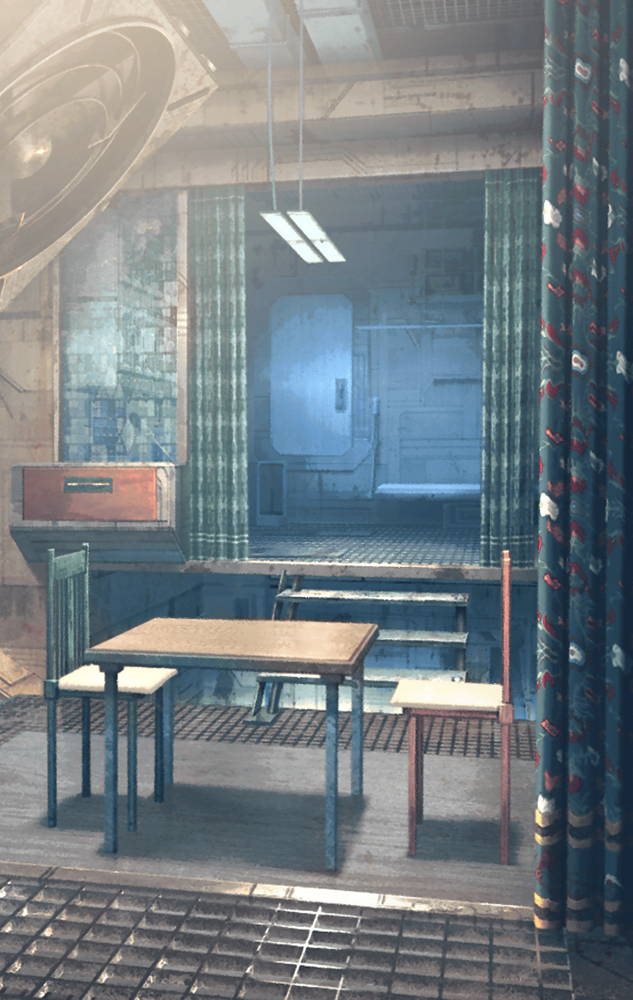

[View script in lisp](../scripts/902070003.txt)

**【アマネ】**
兄さん！
服を脱ぎっ放しにしないでって
言ってるでしょ

**【アマネ】**
本当、だらしないんだからっ
私がいないと
部屋も汚くなる一方だし…

**【ゼロ】**
悪かったよ
そんなに口うるさく言うな

**【アマネ】**
もうっ…兄さんは私がいなくなったらまともに生活
できなくなるんじゃないの？

**【ゼロ】**
アマネはずっと側に
いてくれるんだろ？
この前、そう言ってたじゃないか

**【アマネ】**
どうしよっかなー？アハハ！
冗談よっ…うん、ずっと側にいる

**【アマネ】**
だから兄さんも、
どこにも行かないでね
ずっと一緒にいて

**【ゼロ】**
ああ、もちろんだ
俺は…俺はっ…

**【アマネ】**
…どうしたの
兄さん？
…なんで、泣いてるの？

**【ゼロ】**
泣いてる？俺が…？
おかしいな…どうしたんだろうな？

**【ゼロ】**
なにも悲しいことなんてない
はずなのに…この世界はこんなにも
穏やかで…優しいのにっ…

**【アマネ】**
兄さん…もういいんだよ
苦しいことも辛いことも
なにもないから…

**【アマネ】**
兄さんはもう戦わなくていいの
痛い思いをすることなんてない

**【アマネ】**
兄さん、お願い
ずっと私の側にいて、
私のことを守ってね

**【ゼロ】**
！？
…ああ、そうだな
そうだったな、アマネ

**【アマネ】**
兄さん？

**【ゼロ】**
ったく…ほんの少しでも
忘れちまってた自分がイヤになる

**【ゼロ】**
…この世界は、本当に優しいな
いつまでも過ごしていたくなる

**【アマネ】**
兄さん、なにを言っているの？
これからもずっと一緒に――

**【ゼロ】**
だが、俺は
こんなところで寝ていられないんだ

**【ゼロ】**
アマネ…いや、
アマネの姿をした怠惰な幻影
てめえは妹じゃねえ…

**【ゼロ】**
消え失せろ！

Next: [902080001](902080001.md)

[Back to index](index.md)
