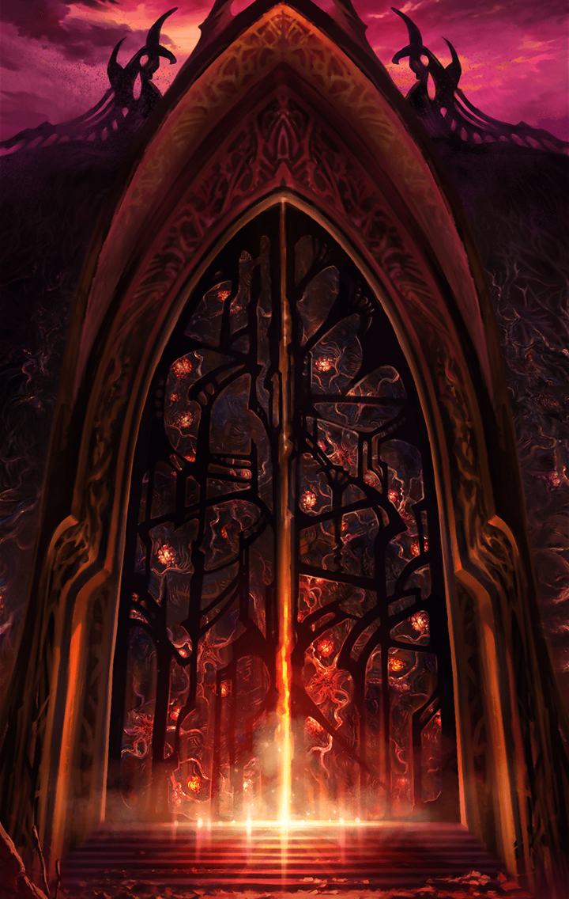

[View script in lisp](../scripts/902090003.txt)

**【ベルフェゴール】**
グウウウ…この私が…
木偶（でく）ごときにっ…
あり得ない…

**【ベルフェゴール】**
まだよぉ…まだ…貯蔵庫の
“意思”さえ取り込めば…
この程度の傷、すぐにぃっ…

**【ダグダ】**
その貯蔵庫というのは、
これのことか？
たった今、叩き潰してやったが

**【ダグダ】**
人々から吸い取った
“意思”は返してもらう

**【ベルフェゴール】**
なぁっ！？
…よくも、よくもぉっ
…私のっ、大切な養分をぉぉっ！

**【ゼロ＆ダグダ】**
ベルフェゴール
これで終わりだぁっ！

**【ベルフェゴール】**
ギャアアアアアアアアアアアアア！！

**【ヴァリン】**
やった！
ついにベルフェゴールを倒したわ！

**【ティルフィング】**
貯蔵庫にあった
“意思”を助け出した人達に
戻してあげましょう！

**【ティルフィング】**
この液体を飲ませれば良いと思います

**【ヴァリン】**
分かったわ
これで繭の中から抜け出した人達も
少しは持ち直すでしょっ

**【アルン】**
本当に良かった…
あぐっ？

**【ヴァリン】**
アルン！？どうしたのっ？
どこか怪我してたっ？

**【アルン】**
…いえ、もう大丈夫です
一瞬、痛みが走っただけで
…なんだったんでしょう？

**【ヴァリン】**
戦いの中で気づかないうちに
怪我してることもあるわ
あとで診てみましょう

**【アルン】**
…ごめんなさい

**【ベルフェゴール】**
アハッ…
アハハハハハハハハハハハハハ！

**【ゼロ】**
なにっ？
まだ生きてやがったのか！？

**【ヴァリン】**
そんなっ…

**【ベルフェゴール】**
安心なさい…私はもうダメよ…
だけどねぇ、可笑しくて仕方ないのぉ

**【ベルフェゴール】**
だってそうでしょう？

**【ベルフェゴール】**
あなた達、木偶（でく）に
未来なんてないのに、
必死になって抗い続けてぇ…

**【ベルフェゴール】**
きっと…
この先、思い知ることになるわぁ…

**【ベルフェゴール】**
私の『夢の国』が
どれだけ優しい世界だったのか…

**【ベルフェゴール】**
幸せな奴隷になれば…
絶望に苛まれながら
死ぬこともなかったというのにぃ…

**【ベルフェゴール】**
それじゃ、お先に失礼するわねぇ…
どうせ、すぐに
地獄で再会するでしょうけどぉ

**【ベルフェゴール】**
あなたたちが生き残る可能性なんて、
ゼロなんだからぁ

**【ゼロ】**
もし生き残る可能性がゼロだとしても
俺たちは一歩踏み出す
そして０を１に変えてみせる！

**【ベルフェゴール】**
本当に…お馬鹿な木偶（でく）ねぇ…
そんなに言うのなら…
試してみるといいわぁ

**【ベルフェゴール】**
あなた達がこの世界の理に…
適っているのかどうかぁ
魔壁の扉を開けておいてあげるぅ…

**【ベルフェゴール】**
私はせっかくだから地獄の底の底まで
堕ちてみることにするわぁ

**【ベルフェゴール】**
あなた達が絶望とともに
堕ちてくるのが楽しみねぇ…
アハハハハハハハハ――

**【アルン】**
…ベルフェゴールの体が、
崩れ去っていきます

**【ゼロ】**
俺たちの勝ちだ

**【ゼロ】**
…おい！魔壁を見てみろ！
一部が変化し始めてるぞっ…？

Next: [902100001](902100001.md)

[Back to index](index.md)
