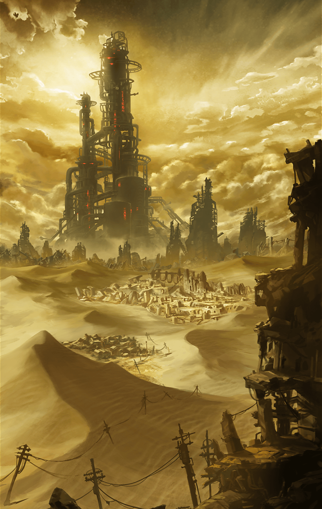

[View script in lisp](../scripts/903010001.txt)

[View source in markdown](903010001.md)

第六魔壁を越えたゼロ一行の前に
広がったのは広大な砂漠だった

あまりの変貌に戸惑いながらも、
大樹ユグドラシルを目指して
彼らは進む

**【ヴァリン】**
暑いわね…歩きにくいし、
靴に砂は入るし…
なんで砂漠になってるのよっ？

**【アルン】**
この地を支配している
悪魔の力でしょうか…

**【アルン】**
魔壁が出来る前は
町があったんですよね？

**【ゼロ】**
少なくとも砂漠ではなかったな
クソッ、喉が渇く…

**【ゼロ】**
さっさと悪魔をぶった切って
魔壁を越えるぞ！

**【ティルフィング】**
…この先は
水も食料も
貴重になりそうですね

**【アルン】**
ここで暮らす人達は
どんな生活を
強いられているんでしょう…

**【ゼロ】**
その疑問の答えはすぐに出そうだぜ
ようやく町が見えてきた

**【ヴァリン】**
本当！？
蜃気楼でしたって
オチはやめてよっ

**【ゼロ】**
大丈夫だ。人の姿もチラホラ見える
これまで素通りしてきた廃墟とは違…

**【ゼロ】**
おい！
向こうに誰かいるぞっ

**【アルン】**
えっ？
どこですか…

**【ティルフィング】**
町に向かって走ってる人がいます！
随分と焦っているみたい…

**【ティルフィング】**
後ろからなにかが…あれは！？
魔獣です！

**【ヴァリン】**
なんですって！？
早く助けないとっ

**【アルン】**
急ぎましょう、ゼロ！

**【ゼロ】**
言われるまでもねえっ！
