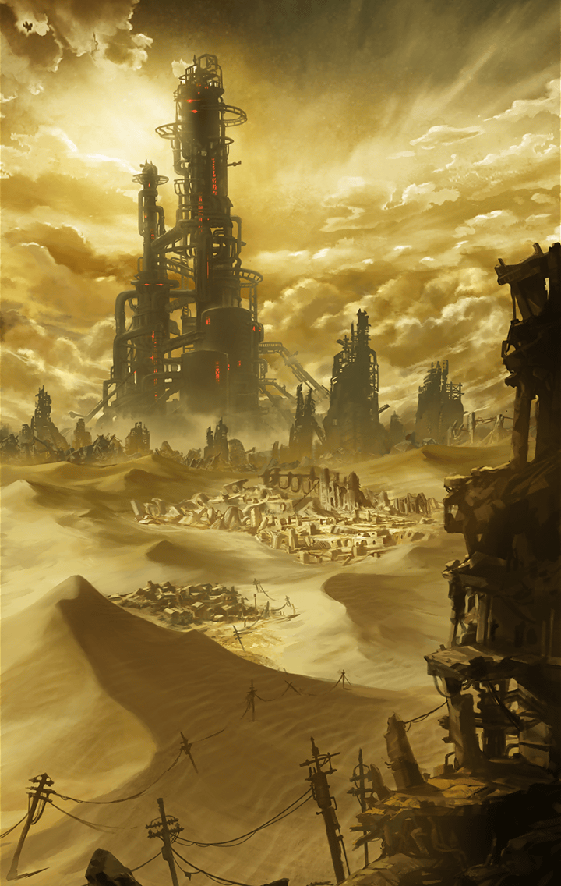

903010003 地上編 3章 人間の本質は強欲 第1話 干上がった世界 終了後

[View script in lisp](../scripts/903010003.txt)

【アルン】
大丈夫ですかっ？
…随分と重そうな荷物を
背負ってますね

【ゼロ】
そんなもん捨てれば
もっと速く走れたんじゃねえか？

【若者】
助けていただいて、
ありがとうございます…

【若者】
でも、これは大切なものなので
捨てるわけにはいかなかったんです…

【ヴァリン】
アンタ、ふらふらじゃない…
ゼロ、荷物を持ってあげなさいよ

【ゼロ】
はあっ？
なんで俺が…まあいい、貸せ
そこの町まで持っていってやるよ

【若者】
これに触るなぁっ！
これは…これは俺が命がけで
手に入れたんだ！

【若者】
…お前ら、まさか
初めからこれが目当てでっ
…絶対に渡さないぞぉっ！

【ゼロ】
あ、おい！
…なんなんだ、あいつ？
人を泥棒みたく言いやがって

【アルン】
とにかく、
あの人の向かっている町まで
行きましょう

【男】
水だ！水を寄越せ！
家にはもう一滴もないんだっ

【女】
食べ物をっ…この子に
食べ物をちょうだい！
もう何日もまともに食べてないのよ！

【男】
これは俺のものだ！
どきやがれっ！

【ヴァリン】
…なんなのよ、これ
町の人達が
さっきの荷物を奪い合ってる

【アルン】
あ！先程の人です
ちょっと待って下さい！

【若者】
あんたらか…
ご覧の通り、分けてやれる
水も食料もないよ

【若者】
他をあたってくれ
俺は、生き残っただけでも
儲けものだ…

【アルン】
ボク達が欲しいのは
水でも食料でもありません

【アルン】
少しでいいので
お話しを聞かせていただけませんか？

【ヴァリン】
アタシ達はラグナロクの者よ
魔壁を越えてきたばかりで、
この辺の状況がよく分からないの

【若者】
ラグナロク…
あんたら、レジスタンスなのか？

Next: [903020001](903020001.md)

[Back to index](index.md)
