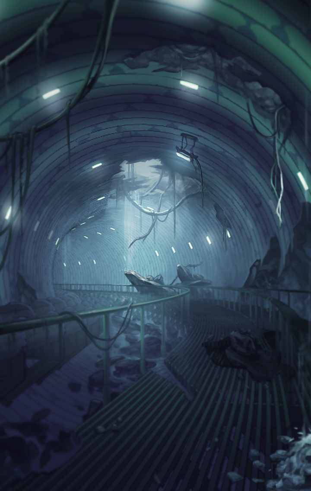

[View script in lisp](../scripts/904010001.txt)

マモンの支配する地から
地下通路に入ったゼロ一行

彼らは複雑に入り組んだ道を
大樹ユグドラシル目指して進んでいた

【ヴァリン】
あれから随分歩いてるけど、
出口はまだ見えてこないわね

【ゼロ】
くそっ
時間の感覚が
おかしくなってくるな…

【ゼロ】
そろそろユグドラシルの根元まで
辿り着いても良いんじゃないか？

【ティルフィング】
ここまで直進してきたわけでは
ありませんから…

【ティルフィング】
でも、
マナが強まっているのは感じます

【ティルフィング】
近づいているのは
間違いありません

【ヴァリン】
アルン、さっきから後ろを
振り返ってばかりいるけど、
どうしたの？

【アルン】
すみません…
誰かに見られているような
気がして…

【アルン】
気のせいだと思います

【ゼロ】
おい！
上から物音がするぞ

【ゼロ】
震動も…地上で魔獣が
暴れてやがるのかっ？

【ヴァリン】
今は気にしてられないわ
私達は一刻も早くユグドラシルに…
な、なにっ！？

【ゼロ】
ヴァリン、危ねえっ！

【ティルフィング】
危ないところでした…
みんな無事ですかっ？

【ゼロ】
ああ、なんとかな…
しかし地下通路が塞がれちまった

【ゼロ】
こっからはまた外を
行くしかなさそうだな

【ヴァリン】
ちょっと！
なんなのよ、この熱さ！
砂漠の次は炎に囲まれてるわよ！？

【アルン】
炎が…壁のようになっています…
とても越えられそうにありませんね…

【ゼロ】
ここを支配してる
悪魔の仕業だろうよ

【ゼロ】
…向こうから派手な銃声が
聞こえてくるな

【ゼロ】
誰かが魔獣と戦ってるのか
行くぞ！

【アルン】
ゼロ、炎に気をつけて下さい！
行く手を遮られているようなら、
遠回りするしかありません

Next: [904010003](904010003.md)

[Back to index](index.md)
