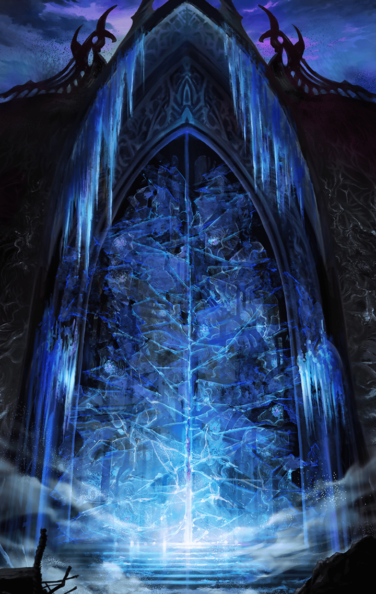

**【アルン】**
準備整いました！
いつでもいけます！

**【ゼロ】**
なんだ？
改良前のセフィロト・システム
なんか用意してなにをするつもりだ？

**【アルン】**
ゼロ、ティルフィングにも
天上世界に上がって
もらうことにしました

**【アルン】**
天上世界では
デュリンが導いてくれるはずですから

**【ゼロ】**
リベリオンもな

**【ゼロ】**
そうか…だったらいっそのこと、
上げられるだけ上げちまえ！
あと何人くらい、いけそうなんだ？

**【ティルフィング】**
そうですね。私を含めて…
４人が限度だと思います

**【ゼロ】**
４人か…誰に上がってもらう？

**【マサムネ】**
その任、拙者に命じてもらえぬか？

**【アルテミス】**
私も行くわ
仕切るのがデュリン一人だけだと
大変でしょうから

**【フライクーゲル】**
ハ～イ♪わたしもイクイク～！
天上世界でも
みんなをヘァピィにしちゃうよ～っ！

**【アルン】**
あっという間に揃いましたね…

**【ゼロ】**
最後の一人には不安も残るんだが…

**【ゼロ】**
まあ、いい
選り好みしてる場合じゃねえからな！

**【ゼロ】**
ティルフィング、
そっちも構わねえか？

**【ティルフィング】**
はい
皆さん、よろしくお願いしますね

**【ティルフィング】**
…アルン、ちょっと良いですか？

**【アルン】**
なんでしょう？
早くしないと特異点のマナが…

**【ティルフィング】**
すぐ済みます

**【アルン】**
ティルフィング！？
どうして髪を切ったんですかっ？

**【ティルフィング】**
これを持っていて下さい

**【ティルフィング】**
もし、
改良版セフィロト・システムを
修理できたら…

**【ティルフィング】**
天上世界への
座標を固定するのに使えると思います
それと、お守り代わりに

**【アルン】**
あ、ありがとうございますっ

**【ゼロ】**
…なにを照れてんだ？
ティルフィング、
天上世界の方は頼むぞ

**【ティルフィング】**
はい
アマネちゃんのことも
任せて下さい！

**【ゼロ】**
アマネ？
誰だ、そいつ？

**【ティルフィング】**
えっ…？
ゼロ、あなた…

**【マサムネ】**
急げ！
もう時間がない！

**【ゼロ】**
じゃあな！

**【ゼロ】**
帰ってくるのが遅かったら、
先に悪魔を
全滅させてるかもしれねえぞ！

**【ティルフィング】**
ゼロ…
アルン、彼を、
どうか守ってあげて下さい

**【アルン】**
はい、必ず…

ティルフィングを天上世界へと
送り出したゼロ一行は、
最後の魔壁、第一魔壁へと進軍した

ユグドラシル奪還に向けて
最初の難関と思われた
第一魔壁越えだったが

魔壁の前でゼロ達は
思いがけない光景を目にする

**【ゼロ】**
魔壁に扉が出来てやがる…
ベルフェゴールの
第六魔壁と同じなのか？

**【アルン】**
でも、あのときは
ベルフェゴール自身が
扉を開けました

**【アルン】**
近くに
ルシファーがいるんでしょうか？

**【ゼロ】**
分からん…
とにかく近づいてみるしか…
おい、アルン！？

**【アルン】**
えっ？あれ？
ボク、いつの間に扉の前に…
この扉、なんだか…

**【ゼロ】**
扉が…開いていくっ？

**【？？？】**
クフフフフ…
さあ、本当のお楽しみの始まりだよ
