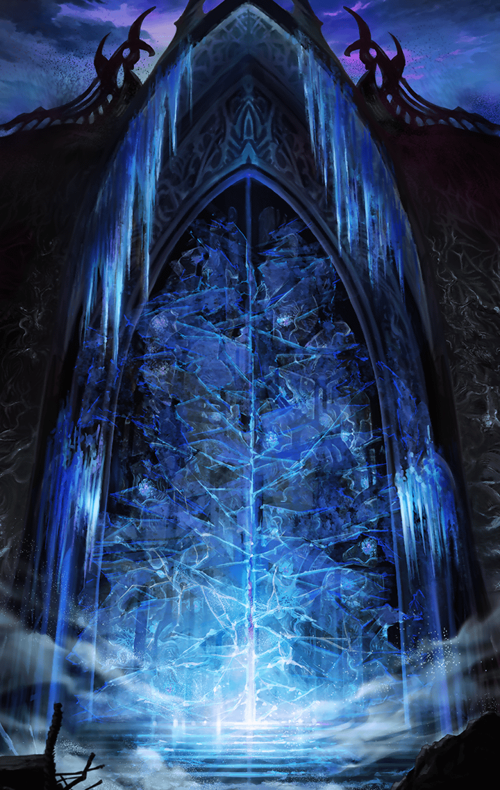

[View script in lisp](../scripts/907010001.txt)

[View source in markdown](907010001.md)

第一魔壁に現れた扉は
アルンの手によって
あっけなく開かれた

不可解なものを感じながらも、
ゼロ一行は魔壁を越え、

間近に迫った大樹、
ユグドラシルへと進んでいく

**【ゼロ】**
チッ
地面が凍ってやがる
ひどく寒いな

**【アスクレピオス（♂）】**
ここを支配している
魔王の影響だろうね

**【アスクレピオス（♂）】**
ユグドラシルは、
もう目と鼻の先だよ

**【ダグダ（♂）】**
わが君、
足を滑らせないよう気をつけてくれ

**【アルン】**
ありがとうございます、
ダグダ…

**【ゼロ】**
…………

**【アルン】**
…………
あのとき、ボクはなにをしたんだ？

**【ゼロ】**
アルン、ちょっといいか

**【アルン】**
あ、はい！
なんでしょう、ゼロ？

**【ゼロ】**
お前、第一魔壁の扉を――

**【ダグダ（♂）】**
皆、伏せろ！

**【ルシファー】**
全く、見るに堪えんな
まさかこんなところまで
木偶が入り込んでくるとは

**【ゼロ】**
ルシファー！
貴様、今度こそ逃がさねえ！！

**【ルシファー】**
なにを粋がっておる、
木偶如きが

**【ルシファー】**
サタンがおらぬから
第一魔壁を難なく越えたようだが、
所詮は地べたを這い回る塵芥よ

**【ルシファー】**
そのような者が我の領域を
侵すなど万死に値する
疾く死ね

**【魔獣】**
ガアアアアアアアアアアッ！！