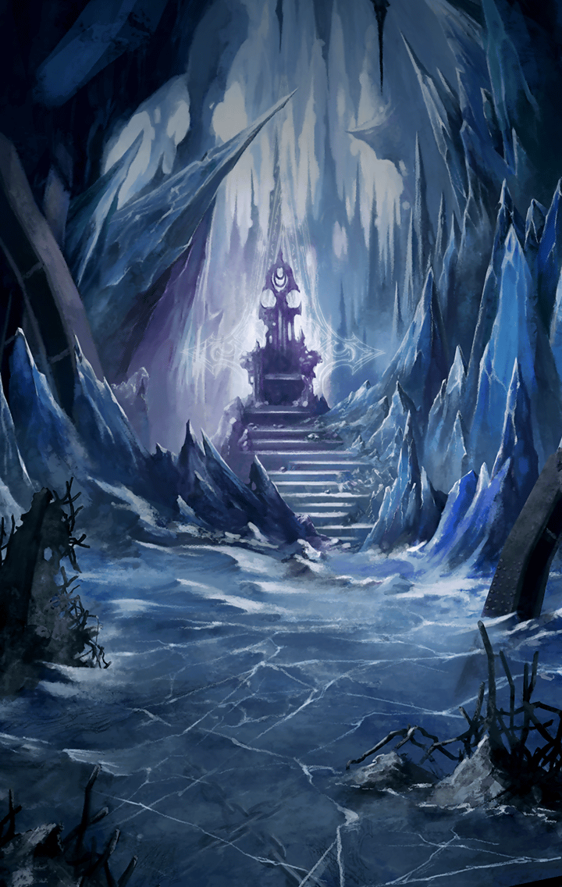

[View script in lisp](../scripts/907040003.txt)

【ゼロ】
これで、１１体目ェッ！
あと、１体ダアァッ！！

【ルシファー】
粋がるなよ、木偶共

【ゼロ】
チィッ！
逃げるんじゃねェッ！！

【ルシファー】
逃げる？
誰に向かって言っておるのだ
我は絶対なる支配者だぞ

【アルン】
そんな！？
ルシファーがまた増殖したっ…？

【ゼロ】
なにィ！？
グアアッ…！

【アスクレピオス】
また増殖するだなんて…
とんでもない再生能力だね…

【アルン】
ベルフェゴールのように、
どこかに魔力を
蓄えているんでしょうか？

【ルシファー】
ベルフェゴール？
あのような小物と
我を同列にするなど不遜だな

【ルシファー】
我は“傲慢”の悪魔ルシファー
この世で最も尊く、
全てを統べる絶対なる王

【ルシファー】
それはすなわち、
永遠不滅であるということだ

【ゼロ】
くそっ…
なにを言ってやがる…？

【ルシファー】
無知蒙昧な木偶共に
少しばかり教授してやろう

【ルシファー】
我ら七魔王は
“七つの大罪”そのものだ

【ルシファー】
そして悪魔は太古より人間達の
“罪”によって増殖を繰り返してきた

【アルン】
悪魔は…
人間の“罪”で増殖する…？

【ルシファー】
そもそも地上の支配権が
我らのものになったとき、

【ルシファー】
この地に姿を現した無数の魔獣達は
どこから湧いて出てきた？

【ルシファー】
考えたこともなかったか、
浅はかな者達よ

【ルシファー】
魔壁から際限なく魔獣が
湧き出してくるのも同じことよ

【ルシファー】
いくら魔壁が魔力の塊とはいえ、
養分もなしに魔獣を次々と
湧き出させられるものか

【ルシファー】
ならば、その養分とはなんだ？
一体、どこにある？

【アルン】
まさか…そんなっ…

【ルシファー】
そうだ！
人間の“中”だ！

【ルシファー】
養分は人間の中から
途切れることなく
湧き出し続けている

【ルシファー】
“傲慢”、“憤怒”、
“嫉妬”、“暴食”、
“色欲”、“強欲”、“怠惰”

【ルシファー】
“七つの大罪”が
我らの養分となり
我らを生かし続ける

【ゼロ】
くそっ…！ふざけるなよ！
人間の犯す“罪”が
貴様らの養分だと！

【ルシファー】
お前達にも
無関係な話ではないのだぞ、木偶

【ルシファー】
魔獣の細胞は“罪”によって
作り出されている

【ルシファー】
故に“罪”によって
増殖を繰り返していくのだ

【ルシファー】
人間の体内に魔獣の
血肉を埋め込む

【ルシファー】
穢らわしい行為だが、その手術の折、
魔獣の細胞はお前達の“罪”に触れて
爆発的に増殖したはずだ

【ルシファー】
お前達はイミテーションと
呼んでいたか？

【ルシファー】
全く同じ姿形の存在が数体、
手術後に生まれたはずだぞ
覚えておらんのか？

【アルン】
あっ！それじゃ、
第六魔壁の外で出会った
ロンギヌスは……

【アルン】
あれが…イミテーション…

【ルシファー】
そこの木偶は覚えがあるようだな

【アルン】
待てよ……
でも、だとすると……

Next: [907050001](907050001.md)

[Back to index](index.md)
