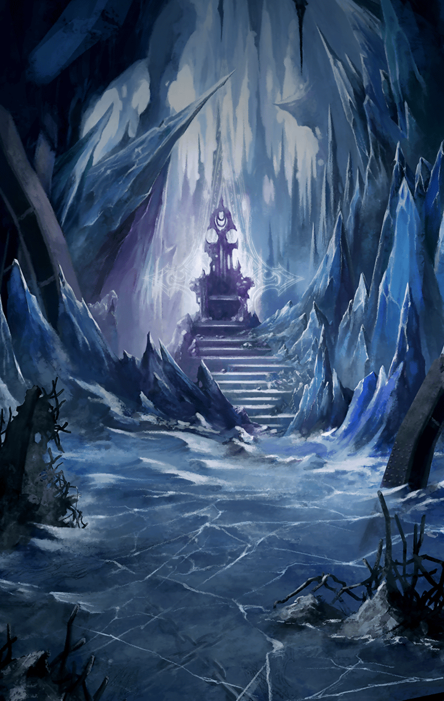

[View script in lisp](../scripts/907070001.txt)

[View source in markdown](907070001.md)

**【サタン】**
クフフフフ！
そうだよ！
怒れ！もっともっと怒れ！

**【サタン】**
キミの怒りは本当に素晴らしい！
その怒りこそボクの養分

**【サタン】**
“憤怒”の悪魔サタンに
力を与えてくれるんだ

**【ゼロ】**
黙りやがれえええっ！

**【サタン】**
ルシファーも言っていただろう？
人間達の“罪”が
ボク達の力になるって

**【サタン】**
“七つの大罪”はこの地上に
いつだって存在し続けてきた

**【サタン】**
その中でも、キミ達ラグナロクが
ボク達に対して抱き続けてきた感情は
なんだったかな？

**【サタン】**
ボク達、悪魔に抵抗する
原動力としてきたものは
なんだったかな？

**【サタン】**
虐げられる数多くの人間を見て、
キミ達が昂ぶらせてきた感情は
どんなものだったかな？

**【サタン】**
そう“怒り”だ
怒りが全てを支配する
怒りこそが最高の感情であり力

**【サタン】**
そして最悪の“罪”だよ

**【サタン】**
分かるかな？
キミ達がボクに抗うため
怒りを募らせれば募らせるほど、

**【サタン】**
ボクは強大になっていく
抗う力そのものが
キミ達の首を絞めるんだ

**【ゼロ】**
黙れ黙れ黙れ黙れ黙れえええっ！！

**【サタン】**
クフフフフ
これこそ真の絶望
逃れようのない負の連鎖

**【サタン】**
ほらぁ、もっと怒ってよ
キミの怒りってその程度なのかな

**【アルテミス】**
まずいな…
ゼロは我を失っている…

**【ダグダ】**
俺達が怒れば怒るほど、
サタンは強くなっていくというのか…

**【ダグダ】**
ならば、一体どうしろと言うのだ！？

**【アスクレピオス】**
頼む…マスター、
意識を取り戻してくれ…

**【サタン】**
そこで呑気に見物してる木偶達も
怒りの炎を燃やしなよ
ほら、お前達行け！

**【魔獣】**
ガアアアアアアア！