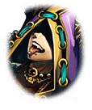

[View script in lisp](../scripts/907070003.txt)

【マサムネ】
なんだ、この魔獣の数はっ…？
倒しても倒してもきりがないぞ…

【ダグダ】
俺達の“怒り”を養分にして
魔獣を作り出しているのだろう

【ダグダ】
戦えば戦うほど、
敵の数が増えるとは厄介だ…

【ゼロ】
どけぇっ！
全て、斬り殺してやるゥゥゥッ！

【アルテミス】
ゼロ！やめるんだ！
魔獣化が進んでいる…

【アルテミス】
このままでは完全に
魔獣化してしまうぞ！

【マサムネ】
無駄だ
もうあいつの耳には届かん

【マサムネ】
こうなったら
俺も、サタンと差し違える覚悟でいく

【スラーンド】
マジそれな～あのウゼェガキ、
サクッとヤッちまおうぜ♪
憤怒上等！

【アルン】
待って…下さい…

【アルテミス】
マスター！
意識を取り戻したんだね
良かった…

【アスクレピオス】
傷は塞がったけれど…
決して良い状態じゃないよ
多分、長くは保たない…

【アルン】
でも、まだ動けます…
ゼロを止めないと…
ゼロっ…ゼロ…！

【ゼロ】
グルオオオオオオオ！！

【アルン】
ゼロおおおおおぉぉぉっ…！

【ゼロ】
！！

【ゼロ】
…アルン
お前、
大丈夫なのかっ？

【アルン】
大丈夫じゃないのは
…ゼロ…
君の方です…

【アルン】
このままじゃ
…魔獣化して…しまいます…

【ゼロ】
仕方ないだろっ…
もう、それしかないんだ！

【ゼロ】
サタンは
俺達の“怒り”を養分にして
強力になりやがる

【ゼロ】
だったら、それ以上の力で
押し潰すしかないだろうが！

【アルン】
ゼロ…それは違います…

【ゼロ】
なにが違うって言うんだ！？
サタンの言う通りだ…

【ゼロ】
俺達の原動力は
悪魔に対する“怒り”

【ゼロ】
奴らへの“怒り”を力に変えて
今まで戦ってきた

【ゼロ】
それがサタンを強化するとしても、
他に方法がない！！

【アルン】
あります
他に…ちゃんと、ありますよ…

【ゼロ】
なんだと？

【アルン】
思い出して…下さい…
ゼロ…

【アルン】
ちゃんと持っていたはずなんです…
怒りではない…戦う力を…理由を

【アルン】
今まで抗って…こられたのは…

【アルン】
“怒り”による力なんかじゃ…
ありませんでした…

Next: [907080001](907080001.md)

[Back to index](index.md)
