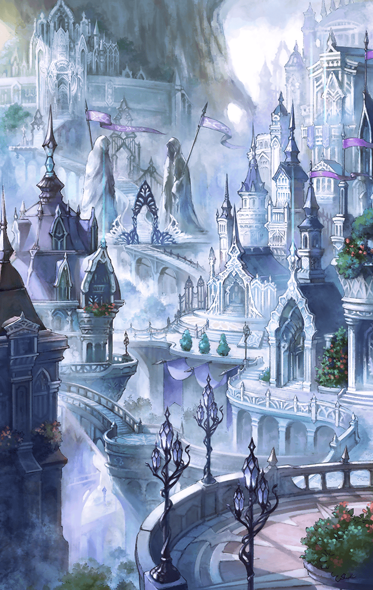

[View script in lisp](../scripts/91010203.txt)

王政府・空中庭園上空

**【ラファエル】**
『女神エイレーネ…
永き眠りから、
目を覚まされたのですね…』

**【ラファエル】**
『ですが…
眠りについていたその身は、
完全復活には程遠い…』

**【ラファエル】**
『…いずれ脅威となる前に、
事を済ませるべきですね』

**【ラファエル】**
『…さぁ
…ミカエル、ガブリエル！』

王都広場付近

**【市民】**
う、うぁ…！！
ま、まるで歯が立たねぇぞ…！？

**【ディーン】**
おい！
無理はするな！

**【ディーン】**
カミノツカイの相手は、
俺達がする！

**【ディーン】**
お前らは、
生き延びることだけを
考えろ！！

**【レーヴァテイン】**
って言っても…
私達でも、
相当手強いし…

**【ディーン】**
チッ…

**【ディーン】**
リベリオンの野郎…
こんなヤツらを、
どうやってぶった斬ったんだ！？

**【ミカエル】**
『！！
ここは任せましたよ、
我がしもべ達…』

**【フレンネル】**
！！
大天使が…
なにをする気だ…？

**【ミカエル】**
『…時が、
来たのですね』

大聖堂付近上空

**【ガブリエル】**
『…箱庭の再生が、
今ここより始まる』

**【ラファエル】**
『さぁ、始めましょう！
この世界の初期化を…！！！』

その頃…人外域ワスレナ

**【村人Ａ】**
お、おい…
どこまで行く気だよ！？

**【村人Ａ】**
人外域に入ったことを
王政府に知られたら…

**【村人Ｂ】**
うるせぇ！
嫌なら村に戻れよ！

**【村人Ｂ】**
あのカミノツカイ達に
ぶっ殺されるがいいさ！

**【村人Ａ】**
うっ…

**【村人Ａ】**
…クソッ！
いったい…
なにがどうなってやがるんだよ…！

**【村人Ｂ】**
！？
な、なんだ…！？

**【村人Ａ】**
！？
木が…
沈んでいく…！？

**【村人Ｂ】**
ち、違う！！
よく見ろ！！

**【村人Ａ】**
だ、大地が…
崩れていく…！？

**【村人Ｂ】**
に、逃げろーっ！！！

**【ティルフィング】**
ああ…！
あああ…！！

**【トト】**
！！
ティ、ティルフィング…！？

**【トト】**
デュリン、
ティルフィングが…！！

**【デュリン】**
…う！
ううう…！！

**【トト】**
え…！？
デュリンも…！？

**【ラース】**
う…うぐっ…
こ、これは…！？

**【黒奏官】**
グ…！？
な、なんだ、
この光景は…！？

**【黒奏官】**
う、うぐ…！！
うぁぁ…！！！

**【トト】**
み、みんな…
なんなの、これ！？

選択肢:
- これは！いったい、なにが…！？ → [select_label_01](#select_label_01)へ
- な、なにが起こってるんだ…！？ → [select_label_01](#select_label_01)へ

み、みんな…
なんなの、これ！？

#### select_label_01:

王都広場付近

**【レーヴァテイン】**
う…うう…！！！

**【ディーン】**
！？
レーヴァテイン！！
おい、どうした！？

**【エドガー】**
妙だ！
ウチのキラープリンセス達も！！

**【ディーン】**
クソッ…
大天使の攻撃なのか…！？

**【フレンネル】**
クッ…
とにかく、市民の誘導を
…急ぐのだ！！

**【ディーン】**
チッ…
いったい、
どうなってやがるんだ…！？

エルフレストの森深く

**【グリード】**
…！？

**【グリード】**
…グッ！
…な、なんだ、これは！？

エルフレストの泉

**【ティルフィング】**
ああ…！
あああ…！！

**【トト】**
な、なんなの、これ…！？
どうしちゃったの…！？

**【エイレーネ】**
『…案ずることはありません
彼女達は今、
失われた記憶の欠片を…』

**【エイレーネ】**
『忘れ去られていた使命を
取り戻しているのです』

**【トト】**
使命…！？

**【トト】**
！？
な、なに…！？

**【トト】**
！？
木が…沈んでいく…！？

**【エイレーネ】**
『ラファエルが…
この世界の初期化を
始めたのです…』

**【トト】**
しょ、初期化って…

選択肢:
- ！？あ、足元が…！！ → [select_label_02](#select_label_02)へ
- 逃げろ、トト！！！ → [select_label_02](#select_label_02)へ

しょ、初期化って…

#### select_label_02:

**【トト】**
え！？
…う、うわっ！！！

**【トト】**
しょ、初期化って…
大陸が崩れちゃうってこと！？

**【エイレーネ】**
『神々は…
この世界を、一度消失させる
つもりなのでしょう』

**【エイレーネ】**
『…坊や、
彼の近くへ』

**【トト】**
え…？
…あ、あれ？

選択肢:
- …？なぜだ…俺の周りだけが… → [select_label_03](#select_label_03)へ
- 俺の周りだけ、地面が崩れない…？ → [select_label_03](#select_label_03)へ

え…？
…あ、あれ？

#### select_label_03:

**【エイレーネ】**
『…アナタの周囲には、
結界が張られているのです』

選択肢:
- 結界…？ → [select_label_04](#select_label_04)へ
- なぜ、俺に結界が…？ → [select_label_04](#select_label_04)へ

『…アナタの周囲には、
結界が張られているのです』

#### select_label_04:

**【エイレーネ】**
『…のちほど、
お伝えしましょう』

**【エイレーネ】**
『今はまず…
この世界の消失を
食い止めることが先決です…』

**【トト】**
え…？
そんなことが…？

**【エイレーネ】**
『…アナタも、
それを望んでおられるはず』

**【エイレーネ】**
『…構いませんね？』

選択肢:
- …え…？ → [select_label_05](#select_label_05)へ
- 俺が…望んでる…？ → [select_label_05](#select_label_05)へ

『…構いませんね？』

#### select_label_05:

**【トト】**
！！

**【トト】**
な、なにこれ…！？

**【トト】**
光が、
空をつたってゆく…？

**【エイレーネ】**
『ラファエル…
アナタ達の思うようには
させません…』

**【トト】**
…！？
み、見て…
赤く染まった地面がっ…

選択肢:
- 赤く染まった地面が…金色に…！ → [select_label_06](#select_label_06)へ
- 地面の崩落が…止まった…！？ → [select_label_06](#select_label_06)へ

…！？
み、見て…
赤く染まった地面がっ…

#### select_label_06:

大聖堂付近上空

**【ガブリエル】**
『！！
これは…』

王都広場付近

**【ディーン】**
お、おい！
赤く染まった地面に踏み込むな！
飲み込まれるぞ！

**【ディーン】**
あ、あれ…？
金色に変わった…？

**【フレンネル】**
崩落が…
止まったのか…？

**【ミカエル】**
『これは…
女神エイレーネが
呼びかけで…？』

王政府・空中庭園上空

**【ラファエル】**
『エイレーネ…
やはり、妨げてきましたか…』

**【ラファエル】**
『彼女の呼びかけに
呼応したのですね…』

**【ラファエル】**
『まさか、
これほどまでの結界を
巡らすとは…』

**【ラファエル】**
『ですが…
今のエイレーネにできるのは、
せいぜいこの程度…』

**【ラファエル】**
『これ以上の妨げは
できぬはず…』

**【ラファエル】**
『…ならば
この世界を司る根本を、
叩くまでです』

エルフレストの泉

**【トト】**
光が、消えた…

**【トト】**
これは、
エイレーネ様が…？

**【エイレーネ】**
『私は、
呼びかけただけのこと…』

**【エイレーネ】**
『ともあれ、
大陸の崩落を
止めることができました…』

**【トト】**
呼びかけた…？

**【エイレーネ】**
『…ええ
ですが…我々にできることは、
もはや限られています』

**【エイレーネ】**
『次に、
ラファエルが
行動を起こした際には…』

**【エイレーネ】**
『人類の手で、
解決しなければなりません…』

**【トト】**
う、うん！！

**【ティルフィング】**
…ああ！
…あああ！！

**【トト】**
！！
そ、そうだ！

**【トト】**
ねぇ！！
記憶の欠片と…使命を
取り戻してるって言ったよね！？

**【トト】**
それって、
どういうことなの…！？

**【エイレーネ】**
『閉ざされたココロの扉を開き…
かつての記憶の欠片を、
垣間見ているのです…』

**【トト】**
でも…おじさんが…
この世界には、
異世界の記憶を持ち込めないって…

**【エイレーネ】**
『すべての記憶を
取り戻している
わけではありません…』

**【エイレーネ】**
『彼女達が見ているのは…
かつての記憶の断片…』

**【エイレーネ】**
『完全に記憶を取り戻すのは…
この世界を離れる時です…』

**【トト】**
この世界を離れるって…

**【トト】**
みんな、
異世界に行くってこと…！？

**【エイレーネ】**
『おそらく…
そうなることでしょう…』

**【エイレーネ】**
『彼女達は…
垣間見た記憶の断片から…
負うべき使命を取り戻すはずです…』

**【エイレーネ】**
『“地上世界”へ戻るという…
その使命を…』

**【トト】**
！！

**【トト】**
異世界へ行くことが…
みんなの使命なの…！？

**【黒奏官】**
グッ…
うぐぐ…！！

**【トト】**
！！
ね、ねぇ…！

**【トト】**
じゃあ、
あの黒奏官も
同じってこと…！？

**【トト】**
やっぱり…
おじさんが言ってた通り、
アイツも…

**【エイレーネ】**
『彼らもまた、
“地上世界”からやってきた
ということなのでしょう…』

選択肢:
- やはり…黒奏官は、異世界の人間！！ → [select_label_07](#select_label_07)へ
- 黒奏官は、神の使者ではないのか…？ → [select_label_07](#select_label_07)へ

『彼らもまた、
“地上世界”からやってきた
ということなのでしょう…』

#### select_label_07:

**【エイレーネ】**
『この者は…
実に複雑な変遷を
遂げてきたようです…』

**【エイレーネ】**
『その身には…
さまざまな力が
介在しています…』

**【エイレーネ】**
『そこには…
神々とは相容れぬ存在の力も…』

選択肢:
- 神々と、相容れぬ存在…？ → [select_label_08](#select_label_08)へ
- 神と敵対する存在…？…まさか…！？ → [select_label_08](#select_label_08)へ

『そこには…
神々とは相容れぬ存在の力も…』

#### select_label_08:

**【トト】**
…あれ？

**【トト】**
でも…
みんな、異世界の記憶を
取り戻してるんだよね…？

**【トト】**
それなのに…

選択肢:
- ！！…なぜ、俺は…？ → [select_label_09](#select_label_09)へ
- 俺の記憶は、なぜ戻らないんだ…？ → [select_label_09](#select_label_09)へ

それなのに…

#### select_label_09:

**【エイレーネ】**
『アナタには…
異世界の記憶が
存在しないからです…』

**【トト】**
え…？
どうして…？

選択肢:
- 俺は…異世界の人間じゃないのか…？ → [select_label_10](#select_label_10)へ
- 俺は…この世界の人間なのか…？ → [select_label_10](#select_label_10)へ

え…？
どうして…？

#### select_label_10:

**【エイレーネ】**
『アナタは…
どちらの世界にも属し、
どちらの世界にも属さぬ人間…』

**【エイレーネ】**
『世界の枠組みを
超えた存在なのです…』

**【トト】**
え…！？
ど、どういうこと…！？

**【ティルフィング】**
…う！
うぁ…！！

**【トト】**
！！
ティルフィング…！！

**【エイレーネ】**
『間もなく…
彼女達が、
戻ります…』

**【ティルフィング】**
…う！
うああ！！

**【ヴァリン】**
まだ息がある！
本部まで連れ帰って
治療すれば助かるかも！！

**【？？？】**
ティルフィング！！

**【ゼロ】**
絶対に死なせねえぞ…！！！

**【ティルフィング】**
！！

**【ティルフィング】**
！！！

**【トト】**
ティルフィング…！？

**【ティルフィング】**
…ゼロ！！

**【トト】**
え…？

**【ティルフィング】**
私達は…
こんなにも大事なことを、
忘れ去ってしまっていたの…？

**【トト】**
ティルフィング！
大丈夫！？

**【ティルフィング】**
こんなにも
多くの人々の
期待を！！

**【ティルフィング】**
なによりも
優先しなければならない、
大きな使命を！！

**【ティルフィング】**
今まさに、
消え果てようとしている
人々の叫びを…

**【ティルフィング】**
私達は、
忘れ去ってしまっていたの…！？

**【エイレーネ】**
『思い出したのですね、
アナタがなすべき使命を…』

**【ティルフィング】**
う…ううっ！！
…うあああああああああああーっ！！
