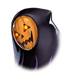

[View script in lisp](../scripts/9101220.txt)

**【ダモクレス】**
あはははは！
今度はあっちにいってみようよ！

いつしかふたりは
街の外れにある森へと
たどり着いた

**【ダモクレス】**
マスター！
木登りしよう、木登り！

ダモクレスはするするっと木を登り、
生い茂った枝の陰に消えていった

ダモクレスを見失ったマスターが
周囲を見回すと…

**【ダモクレス】**
…ばぁーっ！
あはははは！

突然目の前に、ダモクレスが
逆さづりで登場した

あわてて目をそらし、
まためくれてるよ、と注意をする

**【ダモクレス】**
あはははは！ほんとだ～！
ぺろ～ん♪

ぺろ～んじゃないよ、と
突っ込むマスター
早く服を直すように注意するが…

**【ダモクレス】**
大丈夫！
愛さえあれば問題ないよ～！
あはははは～！

と、めくれたままで笑っている
いつものように、それは問題あるので
逆さづりは禁止と強く言って聞かせる

**【ダモクレス】**
えー、じゃあ、どうやって
びっくりさせればいいの？

逆さづりよりは安全だと思い、
飛び降りて驚かす方法を提案してみる

**【ダモクレス】**
わかった、それならいいんだね？
あ、誰かきたよ！
さっそくやってみるね！

**【ダモクレス】**
…ばぁーっ！
あはははは、びっくりした？
ねぇ、びっくりした？

ダモクレスは木の上で待ち伏せし、
人が通るとその背後に飛び降りて
通行人をびっくりさせたが…

通行人のおじさんは
「うわぁ！な、なんだぁ！」と
驚いて逃げてしまった

『トリック・オア・トリート』を
忘れてるよ、とマスターが忠告する

**【ダモクレス】**
えへっ
愛さえあれば問題ない！

しかし、それでは逃げられてしまって
お菓子はもらえないのでは、と言うと

**【ダモクレス】**
あ、そうだった！
よーし、次はちゃんとやるよ～！

ダモクレスは気合いを入れると
再び木に登っていった
次の通行人を待つつもりらしい

わくわくした表情で
通行人を待つダモクレスを見ながら、
これでいいのかとマスターは考える

ダモクレスのやり方は少し違うかも
しれないが、彼女が楽しそうだから、
これでいいか！と、ひとりで納得した

**【ダモクレス】**
…ばぁーっ！
『トリック・オア・トリート』！
あはははは！

**【魔女のおばさん】**
あら！
かわいいコウモリさんだね！

**【魔女のおばさん】**
本当は子どもにしか
お菓子はあげないんだけど、
特別にプレゼントしちゃうよ！

**【ダモクレス】**
やったー！ありがとう！
おっきなカップケーキだ～！
魔女の帽子がのってるね！

**【魔女のおばさん】**
気に入ったかい？
あっはっは！
『ハッピーハロウィン』！

おばさんは高らかに笑うと
ダモクレスのお尻を
ペシッと叩いて去っていった

**【ダモクレス】**
マスター！
クレス、お菓子もらえたよ～！

ぴょんぴょん跳ねて
お菓子を喜ぶダモクレス

それにしても、おばさんはまったく
驚いた様子を見せなかった
肝が据ってる、というのだろうか

**【ダモクレス】**
次は、あの白いおばけの人達に
お菓子もらってくるね！

ダモクレスはそういうと、
少し離れた場所にいる
白い集団に向かって走り出した

お菓子をもらったことが嬉しすぎて
木登りのことも驚かすことも
どうでもよくなったらしい

**【ダモクレス】**
『トリック・オア・トリート』！
お菓子くれなきゃ
いたずらしちゃうぞー！

**【異族】**
グ…グギャ！

近づいてよく見ると、
それは白いおばけの仮装ではなく
異族の集団だった

**【ダモクレス】**
マスター！
この人達はお菓子くれないから
いたずらしてもいいんだよね！？

Next: [9101222](9101222.md)

[Back to index](index.md)
