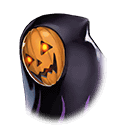

[View script in lisp](../scripts/9101240.txt)

【ネス】
きっと、あのおばさまは
今もどこかでお菓子を配っているはず

【ネス】
わたしは子どもじゃないとお伝えして
少しでもお菓子をお返ししなくては…

【ダモクレス】
せっかくもらったのに、返しちゃうの？

【ネス】
そうです！
そして正式に受け取る権利を持つ
子ども達に再配布していただきます

【ネス】
それがハロウィンのルールに則った
規律正しい行いなのです！

【ダモクレス】
ふーん…
ネスがそうしたいんなら
クレスはそれでもいいけどね～

ネスはお菓子を渡されることに不満が
あるようだが、見た目は子どもなので
みんなが渡したくなる気持ちはわかる

しかし、それを伝えたとしても
ネスはきっと納得しない

自分の心のなかにとどめておこう、と
マスターは思ったのだが…

【ダモクレス】
でもさ、ネスは小さくて可愛いから
子ども扱いされても仕方ないよね～！

ダモクレスが言ってしまった

【ダモクレス】
今日の格好だって似合ってるし
ハロウィンの街にぴったりって感じ！

【ダモクレス】
ねぇ、マスターもそう思うでしょ？
ネスって可愛いよね？

あ、ああ、そうだね、可愛いよね、と
うながされるまま相づちを打って、
おそるおそるネスを見ると…

【ネス】
…………

【ネス】
か、可愛いなんて…ハレンチです…

なにを言っているかは
よく聞き取れなかったが
怒ってはいないようだ

【ネス】
とにかく！
お菓子はお返しします！

【ネス】
どこかで、魔女のお姿をして
お菓子をたくさん持った
おばさまを見かけませんでした？

【ダモクレス】
さっき会ったおばさんかな？
クレスにもお菓子くれたよ！
ほら、これ！

ダモクレスが魔女の帽子がのった
大きなカップケーキを見せる

【ネス】
あ！わたしも同じカップケーキを
もらいました！
その方はどちらに行かれました？

【ダモクレス】
街外れの森で会ったんだけど
街に戻っていく感じだったよ

【ダモクレス】
あのね、
クレスは子どもじゃないから
ほんとはお菓子もらえないんだって

【ダモクレス】
でも、特別にってくれたんだ！
これって愛だよねー！

【ダモクレス】
あ！でもネスが一緒にいたら
もっとたくさんお菓子もらえたかな？

【ネス】
わたしだって、
子どもじゃありません！

【ネス】
もとはといえば、あなた達が
勝手にいなくなるから…

【ネス】
本当に、本当に
大変だったんですからね!

置いていかれたことを思い出し、
また怒りがこみ上げてきた様子のネス

本当にごめんね、悪かったよ、と
ネスをなだめるマスター

【ダモクレス】
ネス～、ごめんね！
愛してるよ～！

【ネス】
…………

ふたりがかりで謝っても
ネスの怒りはおさまらないらしい

ネス？と再び声をかけても返事はない
無反応なネスに、ダモクレスも
異変を感じたようだ

【ダモクレス】
ネス？
どうしたの？

【ネス】
そこ！また異族です！

マスター達が振り向くと、
ネスがもらったお菓子の山に
異族が集まっていた

【異族】
グギャ！

Next: [9101242](9101242.md)

[Back to index](index.md)
