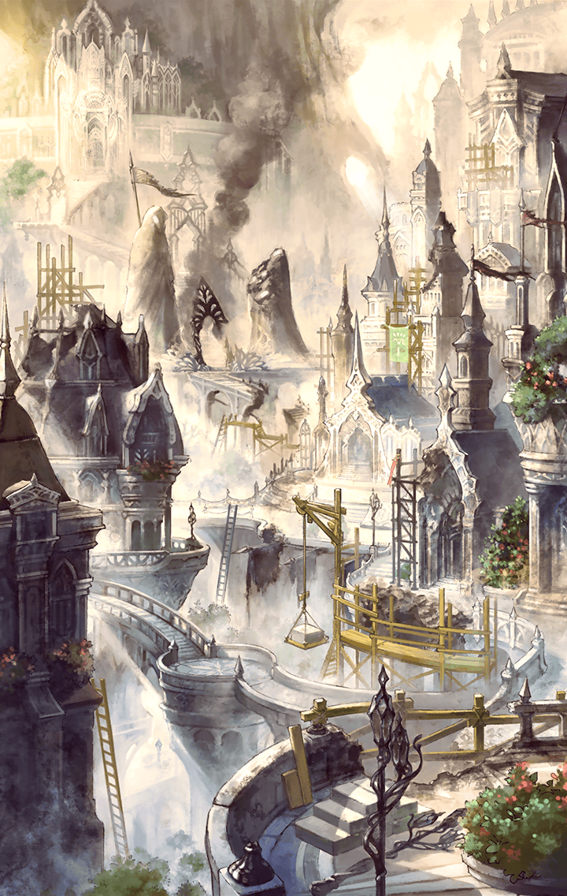

[View script in lisp](../scripts/91030402.txt)

**【ディーン】**
“天上世界”と“地上世界”を、
コイツが繋いでる…
エイレーネ様が、そう言ったのか？

**【ティルフィング】**
ええ

**【ディーン】**
マジかよ…
コイツが、そんな大それたことを？

**【ディーン】**
そもそも…
お前ホントに、
あのユグドラシルの化身なのかよ？

選択肢:
- …自覚はないけど → [select_label_01](#select_label_01)へ
- そうらしいな… → [select_label_01](#select_label_01)へ

そもそも…
お前ホントに、
あのユグドラシルの化身なのかよ？

#### select_label_01:

**【ディーン】**
ってことは…
お前、木なわけ？

**【ディーン】**
俺は、木と一緒に
旅してたってこと？

**【ディーン】**
つーか…
化身様って呼んだ方が
いいのか？

**【ティルフィング】**
！！
そんな言い方！

**【トト】**
なに、イラついてんだよ、
ディーン！

**【デュリン】**
ったく…
別に比較する必要もないでしょ？

**【デュリン】**
大聖堂の修復だって
立派な作業じゃない？

**【ディーン】**
バッ…バカ！
別に、ひがんでるわけじゃねぇ！！

**【トト】**
なーんだ
気にすることなんてないよ…

**【トト】**
ディーンの働きはすごいって、
フレンネル大公も褒めてたよ？

**【ディーン】**
うるせぇ、クソガキっ！

**【ディーン】**
んで…
結局のところ、
どうするつもりなんだよ…？

**【ティルフィング】**
キラープリンセス達は、
地上世界へ戻ることが使命…
すぐに旅立ちます

**【デュリン】**
もちろん、アタシもね…
…アンタはどうすんの？

**【ディーン】**
お、俺…？
俺は…ここに残るに
決まってんだろ…

**【トト】**
あれ…？
地上世界に興味が
あるのかと思ってた

**【ディーン】**
そりゃあ…
下の世界も、
ちょっとは見てみたいけどよ…

**【ディーン】**
異族がいなくなったとはいえ…
誰もいなくなっちゃ
マズいだろ？

**【トト】**
どういう意味？

**【ディーン】**
お前、バカか？
俺までいなくなっちまったら、
誰がこの天上世界を守るんだよ？

**【トト】**
アルン

**【ディーン】**
…アルン
…ハァ！？

**【ノーブル】**
アルン君…
君が、キラープリンセス達を
導いてゆくのではないのか？

**【アルン】**
いえ…
地上世界には、彼が…

**【アルン】**
ティルフィングのマスターは彼です

**【アルン】**
一行を導くのは、
誰より彼が適任ですから

**【ディーン】**
ちょちょ、ちょっと待て！？
お前は、どうすんだよ？

**【アルン】**
私は、
この天上世界の守護を
託された

**【アルン】**
彼らが戻ってくるまで、
私がこの世界を
守り通さなければならない

**【ディーン】**
ああん！？
なんでコイツに、
そんな重要な役目を託してんだよ！？

**【ディーン】**
守護を任せるなら、
俺だろ！？

**【デュリン】**
うっさいわね！

**【デュリン】**
万一、地上から
悪魔が入り込んできたら、

**【デュリン】**
その生態を知るアルンしか
対処できないでしょ！？

**【ディーン】**
うっ…
調子に乗りやがって…

**【ディーン】**
ともかく後で、
ゆっくり話をつけさせて
もらうからな！

**【アルン】**
まったく…

**【デュリン】**
それより…

**【デュリン】**
やっぱり、
ユグドラシルのルートは
機能していないわけ？

**【アルン】**
…ラファエルに破壊された損傷が
大きかったようだ

**【アルン】**
やはり…
地上へ向かうには、
あそこから行くしかない

**【ティルフィング】**
“海”…

**【アルン】**
ああ…

**【アルン】**
次元が繋がった今…
海から地上世界へと、
直接繋がっている

**【ティルフィング】**
…その先に
…私達の帰りを待つ人達が
いるんですね

**【アルン】**
…そうだ
なんにせよ、
急がねばならない

**【ティルフィング】**
はい…

**【？？？】**
あらよっと

**【ティルフィング】**
キャッ…！？

**【学者さま】**
ホッホッホ！
なんじゃい、
可愛らしい声で鳴く異族じゃの！

**【トト】**
え…！？
爺ちゃん…！？

**【ディーン】**
じ、じ、じ、爺ぃ！！
テメェ！！

**【ディーン】**
ティルフィングの…
その…
ヒップを！！

**【学者さま】**
湿布…？

**【オルト】**
父さん…！！

**【ティルフィング】**
！！
オルトさん！

**【オルト】**
すまない、オヤジが…

**【オルト】**
…まったく、
なにをやってるんだ！！

**【学者さま】**
む…！？
むむむ…？

**【ティルフィング】**
…あ
…お、お久しぶりです

**【オルト】**
父さん！

**【学者さま】**
おお！
思い出したぞい！

**【学者さま】**
おぬし、
いつぞやの
スラッとした異族ではないか！

**【トト】**
もう！
今、思い出したの…！？

**【トト】**
まさか、
僕のことも忘れてるってことは…

**【学者さま】**
なんじゃい、豆粒！
引っ込んどれ！！

**【学者さま】**
…むむむ
やはり、おぬし…
相変わらずスラッとしとるのう

**【ティルフィング】**
あ…あは…

**【トト】**
もう！
なんだよ、それ！？

**【フレンネル】**
まったく…
相変わらずだな、
ルステンシュタインは

**【ノーブル】**
ええ…

**【オルト】**
これは、大公！
ご無事でなによりです…
安心いたしました

**【フレンネル】**
呼び立ててすまない

**【フレンネル】**
復興作業に追われていて、
王都を離れることができんのだ

**【オルト】**
いえ…
この被害状況じゃ、
仕方ありません

**【オルト】**
…すみません、ノーブル教授

**【オルト】**
ついでに眼科の先生に
挨拶だけでもと、
父を連れてきてしまいました

**【ノーブル】**
なに、構わんよ
話は通してある…

**【ノーブル】**
すぐにでも、診てもらった方がいい
私が案内しよう

**【オルト】**
ありがとうございます
では、お言葉に甘えて…
ティバルト団長がお待ちですので

**【フレンネル】**
ティバルトが…？

**【オルト】**
ええ
第1師団が、ともに“海”まで
送り届けると…

**【ノーブル】**
確かに…
道のりは長いので、心強い

**【フレンネル】**
フッ…
彼なりの感謝の形
というわけだな

**【レン】**
ちょっと！
いつまで、のんびりやってんのよ？

**【レン】**
エドガーも門のところで、
一時間も前から待機してんのよ？

選択肢:
- そうだな…急いで行こう… → [select_label_02](#select_label_02)へ
- 日が暮れる前に出るべきだ…行こう → [select_label_02](#select_label_02)へ

エドガーも門のところで、
一時間も前から待機してんのよ？

#### select_label_02:

**【ティルフィング】**
マスター！
大丈夫ですか…！？

**【デュリン】**
ちょっと…
フラついてるじゃない！？

**【アルン】**
…ユグドラシルの化身である
君がいるからこそ、
我々は地上へと行き来できる

**【アルン】**
だが…それは裏を返せば、
それだけの負担が
君にかかっているということなんだ

選択肢:
- 心配ない…行くぞ、ティルフィング → [select_label_03](#select_label_03)へ
- 時間がないんだ…さぁ、行こう → [select_label_03](#select_label_03)へ

だが…それは裏を返せば、
それだけの負担が
君にかかっているということなんだ

#### select_label_03:

**【ティルフィング】**
は、はい！！

**【デュリン】**
もう…
じゃあ、行くとしますか

**【レン】**
アンタ達…
また、新たな闘いが始まるのね…

**【レン】**
まったく…
ヘマして、
死ぬんじゃないわよ？

**【デュリン】**
なに言ってるのよ？

**【デュリン】**
こっちの世界だって…
また新たな秩序を、
一から築かなきゃいけないんだもの

**【デュリン】**
大変なのはどっちも同じよ

**【ノーブル】**
大丈夫だ
我々が、新たな体制を
しっかりと築き上げる

**【ノーブル】**
なに…
フレンネル大公がいらっしゃるんだ、
心配はいらんよ

**【ティルフィング】**
ええ…
フレンネル大公…

**【フレンネル】**
…よそよそしい挨拶は
抜きにしよう

**【フレンネル】**
いつでも安心して
帰って来るのだぞ？

**【フレンネル】**
大丈夫…いつだってエイレーネと
エルライトが、君のことを
見守っているのだから

**【ティルフィング】**
はい！
必ず、無事に戻ってきます！

**【ディーン】**
チッ、仕方ねぇな…
その…心配だから、
海まで送って行ってやるよ

**【デュリン】**
ホント素直じゃないわね、
アンタ…

**【トト】**
あ、あの…

**【フレンネル】**
…遠慮せず、
物を言えと言っているだろう？

**【フレンネル】**
長きにわたり、
ともに旅してきた仲間だ…
ちゃんと見送ってきなさい

**【トト】**
…うん！！

Next: [91030403](91030403.md)

[Back to index](index.md)
