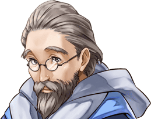

91030402

[View script in lisp](../scripts/91030402.txt)

【ディーン】
“天上世界”と“地上世界”を、
コイツが繋いでる…
エイレーネ様が、そう言ったのか？

【ティルフィング】
ええ

【ディーン】
マジかよ…
コイツが、そんな大それたことを？

【ディーン】
そもそも…
お前ホントに、
あのユグドラシルの化身なのかよ？

選択肢:
- …自覚はないけど → [select_label_01](#select_label_01)へ
- そうらしいな… → [select_label_01](#select_label_01)へ

そもそも…
お前ホントに、
あのユグドラシルの化身なのかよ？

#### select_label_01:

【ディーン】
ってことは…
お前、木なわけ？

【ディーン】
俺は、木と一緒に
旅してたってこと？

【ディーン】
つーか…
化身様って呼んだ方が
いいのか？

【ティルフィング】
！！
そんな言い方！

【トト】
なに、イラついてんだよ、
ディーン！

【デュリン】
ったく…
別に比較する必要もないでしょ？

【デュリン】
大聖堂の修復だって
立派な作業じゃない？

【ディーン】
バッ…バカ！
別に、ひがんでるわけじゃねぇ！！

【トト】
なーんだ
気にすることなんてないよ…

【トト】
ディーンの働きはすごいって、
フレンネル大公も褒めてたよ？

【ディーン】
うるせぇ、クソガキっ！

【ディーン】
んで…
結局のところ、
どうするつもりなんだよ…？

【ティルフィング】
キラープリンセス達は、
地上世界へ戻ることが使命…
すぐに旅立ちます

【デュリン】
もちろん、アタシもね…
…アンタはどうすんの？

【ディーン】
お、俺…？
俺は…ここに残るに
決まってんだろ…

【トト】
あれ…？
地上世界に興味が
あるのかと思ってた

【ディーン】
そりゃあ…
下の世界も、
ちょっとは見てみたいけどよ…

【ディーン】
異族がいなくなったとはいえ…
誰もいなくなっちゃ
マズいだろ？

【トト】
どういう意味？

【ディーン】
お前、バカか？
俺までいなくなっちまったら、
誰がこの天上世界を守るんだよ？

【トト】
アルン

【ディーン】
…アルン
…ハァ！？

【ノーブル】
アルン君…
君が、キラープリンセス達を
導いてゆくのではないのか？

【アルン】
いえ…
地上世界には、彼が…

【アルン】
ティルフィングのマスターは彼です

【アルン】
一行を導くのは、
誰より彼が適任ですから

【ディーン】
ちょちょ、ちょっと待て！？
お前は、どうすんだよ？

【アルン】
私は、
この天上世界の守護を
託された

【アルン】
彼らが戻ってくるまで、
私がこの世界を
守り通さなければならない

【ディーン】
ああん！？
なんでコイツに、
そんな重要な役目を託してんだよ！？

【ディーン】
守護を任せるなら、
俺だろ！？

【デュリン】
うっさいわね！

【デュリン】
万一、地上から
悪魔が入り込んできたら、

【デュリン】
その生態を知るアルンしか
対処できないでしょ！？

【ディーン】
うっ…
調子に乗りやがって…

【ディーン】
ともかく後で、
ゆっくり話をつけさせて
もらうからな！

【アルン】
まったく…

【デュリン】
それより…

【デュリン】
やっぱり、
ユグドラシルのルートは
機能していないわけ？

【アルン】
…ラファエルに破壊された損傷が
大きかったようだ

【アルン】
やはり…
地上へ向かうには、
あそこから行くしかない

【ティルフィング】
“海”…

【アルン】
ああ…

【アルン】
次元が繋がった今…
海から地上世界へと、
直接繋がっている

【ティルフィング】
…その先に
…私達の帰りを待つ人達が
いるんですね

【アルン】
…そうだ
なんにせよ、
急がねばならない

【ティルフィング】
はい…

【？？？】
あらよっと

【ティルフィング】
キャッ…！？

【学者さま】
ホッホッホ！
なんじゃい、
可愛らしい声で鳴く異族じゃの！

【トト】
え…！？
爺ちゃん…！？

【ディーン】
じ、じ、じ、爺ぃ！！
テメェ！！

【ディーン】
ティルフィングの…
その…
ヒップを！！

【学者さま】
湿布…？

【オルト】
父さん…！！

【ティルフィング】
！！
オルトさん！

【オルト】
すまない、オヤジが…

【オルト】
…まったく、
なにをやってるんだ！！

【学者さま】
む…！？
むむむ…？

【ティルフィング】
…あ
…お、お久しぶりです

【オルト】
父さん！

【学者さま】
おお！
思い出したぞい！

【学者さま】
おぬし、
いつぞやの
スラッとした異族ではないか！

【トト】
もう！
今、思い出したの…！？

【トト】
まさか、
僕のことも忘れてるってことは…

【学者さま】
なんじゃい、豆粒！
引っ込んどれ！！

【学者さま】
…むむむ
やはり、おぬし…
相変わらずスラッとしとるのう

【ティルフィング】
あ…あは…

【トト】
もう！
なんだよ、それ！？

【フレンネル】
まったく…
相変わらずだな、
ルステンシュタインは

【ノーブル】
ええ…

【オルト】
これは、大公！
ご無事でなによりです…
安心いたしました

【フレンネル】
呼び立ててすまない

【フレンネル】
復興作業に追われていて、
王都を離れることができんのだ

【オルト】
いえ…
この被害状況じゃ、
仕方ありません

【オルト】
…すみません、ノーブル教授

【オルト】
ついでに眼科の先生に
挨拶だけでもと、
父を連れてきてしまいました

【ノーブル】
なに、構わんよ
話は通してある…

【ノーブル】
すぐにでも、診てもらった方がいい
私が案内しよう

【オルト】
ありがとうございます
では、お言葉に甘えて…
ティバルト団長がお待ちですので

【フレンネル】
ティバルトが…？

【オルト】
ええ
第1師団が、ともに“海”まで
送り届けると…

【ノーブル】
確かに…
道のりは長いので、心強い

【フレンネル】
フッ…
彼なりの感謝の形
というわけだな

【レン】
ちょっと！
いつまで、のんびりやってんのよ？

【レン】
エドガーも門のところで、
一時間も前から待機してんのよ？

選択肢:
- そうだな…急いで行こう… → [select_label_02](#select_label_02)へ
- 日が暮れる前に出るべきだ…行こう → [select_label_02](#select_label_02)へ

エドガーも門のところで、
一時間も前から待機してんのよ？

#### select_label_02:

【ティルフィング】
マスター！
大丈夫ですか…！？

【デュリン】
ちょっと…
フラついてるじゃない！？

【アルン】
…ユグドラシルの化身である
君がいるからこそ、
我々は地上へと行き来できる

【アルン】
だが…それは裏を返せば、
それだけの負担が
君にかかっているということなんだ

選択肢:
- 心配ない…行くぞ、ティルフィング → [select_label_03](#select_label_03)へ
- 時間がないんだ…さぁ、行こう → [select_label_03](#select_label_03)へ

だが…それは裏を返せば、
それだけの負担が
君にかかっているということなんだ

#### select_label_03:

【ティルフィング】
は、はい！！

【デュリン】
もう…
じゃあ、行くとしますか

【レン】
アンタ達…
また、新たな闘いが始まるのね…

【レン】
まったく…
ヘマして、
死ぬんじゃないわよ？

【デュリン】
なに言ってるのよ？

【デュリン】
こっちの世界だって…
また新たな秩序を、
一から築かなきゃいけないんだもの

【デュリン】
大変なのはどっちも同じよ

【ノーブル】
大丈夫だ
我々が、新たな体制を
しっかりと築き上げる

【ノーブル】
なに…
フレンネル大公がいらっしゃるんだ、
心配はいらんよ

【ティルフィング】
ええ…
フレンネル大公…

【フレンネル】
…よそよそしい挨拶は
抜きにしよう

【フレンネル】
いつでも安心して
帰って来るのだぞ？

【フレンネル】
大丈夫…いつだってエイレーネと
エルライトが、君のことを
見守っているのだから

【ティルフィング】
はい！
必ず、無事に戻ってきます！

【ディーン】
チッ、仕方ねぇな…
その…心配だから、
海まで送って行ってやるよ

【デュリン】
ホント素直じゃないわね、
アンタ…

【トト】
あ、あの…

【フレンネル】
…遠慮せず、
物を言えと言っているだろう？

【フレンネル】
長きにわたり、
ともに旅してきた仲間だ…
ちゃんと見送ってきなさい

【トト】
…うん！！

Next: [91030403](91030403.md)

[Back to index](index.md)
